## SUPPLEMENTARY INFORMATION

## Brain-Charting Autism and Attention-Deficit/Hyperactivity Disorder Reveals Distinct and Overlapping Neurobiology

## Bedford et al.

| Supplementary methods                                                                               |   4 |
|-----------------------------------------------------------------------------------------------------|-----|
| 1. Dataset characteristics                                                                          |   4 |
| 1.1 Study and site details and parameters                                                           |   4 |
| 1.2 Sample demographics and N before and after quality control (QC)                                 |   6 |
| Table S1.2.1: Participant demographics by study (before QC)                                         |   6 |
| Table S1.2.2: Participant demographics by study (post QC)                                           |   9 |
| Table S1.2.3: Participant numbers by site (before QC)                                               |  11 |
| Table S1.2.4: Participant numbers by site (post QC)                                                 |  13 |
| Table S1.2.5: Characteristics of, and significant differences between, diagnostic groups  (post QC) |  16 |
| 2. Generation of out-of-sample centile scores using GAMLSS                                          |  16 |
| 3. Sensitivity analysis: comparison with non-ComBat harmonised centiles                             |  19 |
| 4. Spin permutation testing methods                                                                 |  19 |
| 5. Regional overlap of participants with 'extreme' centile scores                                   |  20 |
| 6. Sensitivity analysis: controlling for GMV, total SA and mean CT                                  |  20 |
| 7. Sensitivity analyses: different QC methods                                                       |  20 |
| 8. Sensitivity analysis on subsample of matched male data                                           |  21 |
| 9. Multimodality of distributions by diagnostic group                                               |  21 |
| 10. Dimensional analyses of autistic and ADHD traits                                                |  22 |
| 10.1 Descriptions of each measure                                                                   |  22 |
| 10.2 Subsample demographic details                                                                  |  24 |
| 10.3 Sensitivity analysis using SRS T-scores                                                        |  24 |
| 11. Age interaction on subsample of age matched controls                                            |  25 |

| 12. Autism+ADHD comparison and replication analyses                                                                                       | 25                                                                                                                                   |
|-------------------------------------------------------------------------------------------------------------------------------------------|--------------------------------------------------------------------------------------------------------------------------------------|
| 12.1 Autism+ADHD subsample demographics and sites                                                                                         | 25                                                                                                                                   |
| 12.2 Correlation and overlap of brain maps between diagnostic groups                                                                      | 26                                                                                                                                   |
| 12.3 Sensitivity analysis controlling for GMV, total SA and mean CT                                                                       | 26                                                                                                                                   |
| 12.4 Replication in subset based on dimensional clinical measures                                                                         | 27                                                                                                                                   |
| Supplementary results                                                                                                                     | 27                                                                                                                                   |
| 1. Comparison with in-sample centile scores and non-ComBat harmonised centiles                                                            | 27                                                                                                                                   |
| 1.1 Comparison of in-sample and out-of-sample centiles                                                                                    | 27                                                                                                                                   |
| 1.2 Comparison with non-ComBat harmonised centiles                                                                                        | 28_Toc173834608                                                                                                                      |
| 2. Regional overlap of participants with 'extreme' centile scores                                                                         | 35                                                                                                                                   |
| 3. Controlling for GMV, total SA and mean CT                                                                                              | 36                                                                                                                                   |
| 4. Sensitivity analysis with different QC methods                                                                                         | 38                                                                                                                                   |
| 5. Spatial comparison of male and female diagnosis effect size maps                                                                       | 41                                                                                                                                   |
| 6. Sensitivity analysis on subsample of matched male data                                                                                 | 42                                                                                                                                   |
| 7. Multimodality of data                                                                                                                  | 46                                                                                                                                   |
| 8. Dimensional analyses of autistic traits                                                                                                | 50                                                                                                                                   |
| 8.1 Distribution of scores by group                                                                                                       | 50                                                                                                                                   |
| 8.2 Associations between autistic/ADHD traits and cortical measures                                                                       | 52                                                                                                                                   |
| Associations with autistic traits                                                                                                         | 52                                                                                                                                   |
| Associations with ADHD traits                                                                                                             | 52                                                                                                                                   |
| 8.3 Associations between autistic/ADHD traits and cortical measures controlling for global                                                | 8.3 Associations between autistic/ADHD traits and cortical measures controlling for global                                           |
| brain measures                                                                                                                            | 53                                                                                                                                   |
| 8.4 Relationship by group in significant regions                                                                                          | 54                                                                                                                                   |
| 8.5 Sensitivity analysis using SRS T-scores                                                                                               | 56                                                                                                                                   |
| 9. Age interaction on full sample of controls                                                                                             | 57                                                                                                                                   |
| 10. Autism+ADHD comparison and replication analysis                                                                                       | 57                                                                                                                                   |
| 10.1 Correlation and overlap of brain maps between diagnostic groups                                                                      | 57                                                                                                                                   |
| 10.2 Autism+ADHD analysis controlling for global measures                                                                                 | 59                                                                                                                                   |
| 10.3 Replication using SWAN subscale cut-off                                                                                              | 59                                                                                                                                   |
| 11. Effect size tables                                                                                                                    | 60                                                                                                                                   |
| Table S11.1. Cohen's d effect sizes and FDR corrected p-values for regional main effects  and sex interaction effects for autism and ADHD | 60                                                                                                                                   |
| Table S11.2. Cohen's d effect sizes and FDR corrected p values for sex stratified regional  main effects and for autism and ADHD  63      | Table S11.2. Cohen's d effect sizes and FDR corrected p values for sex stratified regional  main effects and for autism and ADHD  63 |

Table S11.3. Cohen's d effect sizes and FDR corrected p values for regional main effects and age interaction effects for autism and ADHD 65

Table S11.4. Cohen's d effect sizes and FDR corrected p values for regional main effects and sex interaction effects for the autism+ADHD group 67

## Supplementary methods

## 1. Dataset characteristics

## 1.1 Study and site details and parameters

## The Autism Brain Imaging Data Exchange (ABIDE)

The ABIDE dataset (Di Martino et al, 2014) is a large, publicly available neuroimaging dataset of individuals with autism and controls, collected at multiple sites across Europe and North America. ABIDE contains two data releases (ABIDE I and II), amounting to a total of 2145 participants (1017 individuals with ASD (137 female/880 male) and 1128 controls (274 female/854 male)), aged 5-64 years. For more information about individual sites and imaging protocols, please see: http://fcon\_1000.projects.nitrc.org/indi/abide/.

## The Province of Ontario Neurodevelopmental (POND) Network

POND is an integrated discovery program based in Ontario, Canada aimed at improving our understanding  of  neurodevelopmental  disorders  and  their  underlying  neurobiology.  POND includes  neuroimaging,  clinical,  behavioural  and  genetic  data  across  multiple  time  points  in children  with  neurodevelopmental  diagnoses,  including  ADHD,  autism,  intellectual  disability, obsessive compulsive disorder and Tourette syndrome, amongst others, from five sites across Ontario (Holland Bloorview Kids Rehabilitation Hospital, Toronto; The Hospital for Sick Children, Toronto;  McMaster  Children's  Hospital,  Hamilton;  Queen's  University,  Kingston;  and  Lawson Health Research Institute, London). The majority of scans were collected on a 3T Siemens Trio TIM scanner, with a hardware upgrade to the Siemens Prisma scanner affecting the rest of the data. For the current project, data from participants with a diagnosis of autism and ADHD, as well as  controls,  were  used.  Neuroimaging  data  was  available  for  736  of  these  participants  (179 TD/244 ADHD/313 autistic). Initially, the different POND data collection sites were treated as separate sites for the purposes of this study. However, some of these sites did not have any control  participants,  which  is  a  necessity  for  running  the  out-of-sample  centile  models.  Thus, ComBat was run on all data with the sites separated, and they were recombined after ComBat harmonisation and treated as one POND site for the out-of-sample centile estimation. For more details on the POND network, please see: https://pond-network.ca/.

## The Healthy Brain Network (HBN) at the Child Mind Institute (CMI)

The HBN is an initiative based at the Child Mind Institute, in New York City, USA, aiming to create a biobank of data from children and adolescents, with the goal of advancing our understanding of childhood  and  adolescent  psychiatric  and  neurodevelopmental  disorders.  Participants  are referred by clinicians in the community, and thus are primarily children presenting with psychiatric symptoms or concerns, but may not all have an official diagnosis. Data collected includes clinical, behavioural and cognitive measures, as well as genetic information and neuroimaging, collected at  three  sites  in  and  around  New  York  City.  Data  included  in  the  current  project  includes participants diagnosed with autism and ADHD, and controls. Neuroimaging data is available from

1592 participants (308 autism/149 ADHD/100 controls). Data from the HBN comes from three sites: (Rutgers University Brain Imaging Center (RU), Staten Island (SI), CitiGroup Cornell Brain Imaging Center (CBIC)), and were treated as three separate sites at every stage of analysis. Imaging data was collected using Siemens 3T TrioTim scanner with a 32-channel head coil at RU and SI, and a Siemens 3T Prisma scanner with a 32-channel head coil at CBIC, all using an MPRAGE sequence. For more details please see: http://fcon\_1000.projects.nitrc.org/indi/cmi\_healthy\_brain\_network/.

## The ADHD200 Consortium

The publicly available ADHD200 Consortium consists of neuroimaging and phenotypic data from individuals  with  ADHD  and  controls  across  8 sites internationally.  A  total  of  947  children  and adolescents are included in the dataset (362 ADHD/585 controls). For more information about individual sites and imaging protocols, please see: http://fcon\_1000.projects.nitrc.org/indi/adhd200/.

## Multimodal Developmental Neurogenetics of Females with ASD (Female ASD)

The Female ASD dataset, publicly available as part of the NIMH NDAR initiative (ID 2021), is the product  of  a  collaboration  between  Yale  University,  the  University  of  California  Los  Angeles, Harvard University, and the University of Washington, which aims specifically to investigate the underlying neurobiology and genetics of autism in females. The dataset comprises phenotypic, clinical,  neuroimaging  and  genetic  data  from  397  children  and  adolescents  with  autism  and controls (183 autism/ 214 control) with a good representation of female participants. Imaging data was collected on a Siemens 3T TrioTim or Prisma scanner at all sites. At two sites, scanners were upgraded to Prisma part way through data collection; these have thus been split up and counted as separate sites per scanner.

## University of California San Diego (UCSD): Biomarkers of Autism at 12 Months: From Brain Overgrowth to Genes

The UCSD biomarkers of autism dataset, publicly available as part of the NIMH NDAR initiative, includes phenotypic, clinical and neuroimaging data from infants age 12-36 months who are at risk of developing autism, language delay, or developmental delay, as well as typical controls. Data is collected at multiple time points, with diagnoses tracked across visits. Here, we used only the first time point for each participant. Imaging data was collected on a General Electric Signa HDxt 1.5T scanner while the infants were sleeping.

## The UK Medical Research Council (MRC) Autism Imaging Multi-centre Study (AIMS)

The  UK  MRC-AIMS  dataset  is  a  multi-site  initiative  aiming  to  improve  our  understanding  of females with autism. The dataset consists of clinical and neuroimaging data from a sex balanced sample of autistic and non-autistic adults, collected at the University of Cambridge, the University of Oxford and the Institute of Psychiatry, Psychology and Neuroscience (IoPPN) at King's College London. In the current study, only data from the University of Cambridge site was used, which included 61 autistic adults (31 female/30 male) and 63 controls (31 female/32 male), aged 18-52. Imaging data was collected using a 3T General Electrical Medical Systems HDx scanner with an 8-channel receive-only head coil. For details see [1-3].

## 1.2 Sample demographics and N before and after quality control (QC)

Before quality control, our sample included data from 4736 participants (2006 typically developing (TD) controls [1289 male/717 female], 1103 individuals with ADHD [809 male; 294 female], and 1627 autistic individuals [1296 male; 331 female]), with an age range of 2-64 (mean age = 13.67; median age = 11.98).

Table S1.2.1: Participant demographics by study (before QC)

| Study      | Group           |   N |   Median age | Age range   |
|------------|-----------------|-----|--------------|-------------|
| ADHD200    | ADHD Female     |  72 |          9.7 | 7.3-19.7    |
| ADHD200    | ADHD Male       | 230 |         11.3 | 7.2-20.9    |
| ADHD200    | TD Female       | 230 |         11.6 | 7.1-21.8    |
| ADHD200    | TD Male         | 263 |         11.8 | 7.2-25      |
| CMI HBN    | ADHD Female     | 189 |          9.4 | 5-21.7      |
| CMI HBN    | ADHD Male       | 460 |          9.7 | 5.1-20.3    |
| CMI HBN    | Autistic Female |  19 |         10.4 | 5.7-16      |
| CMI HBN    | Autistic Male   |  86 |         10.7 | 5.7-20.4    |
| CMI HBN    | TD Female       |  73 |          9.6 | 5.5-19.5    |
| CMI HBN    | TD Male         |  72 |          9.1 | 5-21.2      |
| Female ASD | Autistic Female |  85 |         11.9 | 8-18        |
| Female ASD | Autistic Male   |  98 |         12   | 8-17.9      |
| Female ASD | TD Female       | 113 |         12.4 | 8.1-17.9    |

|         | TD Male         |   101 |   13 | 8-17.8    |
|---------|-----------------|-------|------|-----------|
| POND    | ADHD Female     |    72 | 11.1 | 6.2-21.5  |
| POND    | ADHD Male       |   208 | 11.2 | 5.8-21.9  |
| POND    | Autistic Female |    82 | 11.5 | 2.6-22    |
| POND    | Autistic Male   |   316 | 11.3 | 2.2-22    |
| POND    | TD Female       |    88 | 12.7 | 3.6-21.4  |
| POND    | TD Male         |    99 | 11.2 | 3.7-21.7  |
| UCSD    | Autistic Female |    18 |  3.4 | 3.1-4.5   |
| UCSD    | Autistic Male   |    76 |  3.3 | 3-5.2     |
| UCSD    | TD Female       |    15 |  3.4 | 3-3.8     |
| UCSD    | TD Male         |    32 |  3.4 | 3-5       |
| UK AIMS | Autistic Female |    31 | 24.7 | 18.1-49.5 |
| UK AIMS | Autistic Male   |    30 | 24.5 | 18-41     |
| UK AIMS | TD Female       |    31 | 25.8 | 19-45.1   |
| UK AIMS | TD Male         |    32 | 26   | 18-42     |
| ABIDE I | Autistic Female |    62 | 14   | 8.1-45    |
| ABIDE I | Autistic Male   |   448 | 15   | 7-64      |
| ABIDE I | TD Female       |    99 | 13.8 | 7.8-46    |

|          | TD Male         |   461 |   15.3 | 6.5-56.2   |
|----------|-----------------|-------|--------|------------|
| ABIDE II | Autistic Female |    56 |   11.7 | 5.2-54     |
| ABIDE II | Autistic Male   |   328 |   12.7 | 5.1-62     |
| ABIDE II | TD Female       |   113 |   11   | 5.9-46.6   |
| ABIDE II | TD Male         |   278 |   13.8 | 5.9-64     |

8

## Table S1.2.2: Participant demographics by study (post QC)

| Study       | Group           |   N |   Median  age | Age range   |   Attrition (% lost  to QC) |
|-------------|-----------------|-----|---------------|-------------|-----------------------------|
| ADHD200     | ADHD Female     |  61 |           9.8 | 7.3-19.7    |                       15.28 |
| ADHD200     | ADHD Male       | 198 |          11.3 | 7.2-20.9    |                       13.91 |
| ADHD200     | TD Female       | 197 |          11.5 | 7.1-21.8    |                       14.35 |
| ADHD200     | TD Male         | 231 |          11.8 | 7.2-25      |                       12.17 |
| CMI HBN     | ADHD Female     | 147 |          10   | 5-21.7      |                       22.22 |
| CMI HBN     | ADHD Male       | 337 |          10.1 | 5.3-20.3    |                       26.74 |
| CMI HBN     | Autistic Female |  14 |          11.7 | 5.7-16      |                       26.32 |
| CMI HBN     | Autistic Male   |  67 |          11.2 | 5.7-20.4    |                       22.09 |
| CMI HBN     | TD Female       |  66 |           9.7 | 5.6-19.5    |                        9.59 |
| CMI HBN     | TD Male         |  63 |          10.2 | 5-21.2      |                       12.5  |
| Female  ASD | Autistic Female |  75 |          12.5 | 8.2-18      |                       11.76 |
| Female  ASD | Autistic Male   |  78 |          13.1 | 8.3-17.9    |                       20.41 |
| Female  ASD | TD Female       | 109 |          12.6 | 8.1-17.9    |                        3.54 |
| Female  ASD | TD Male         |  92 |          13   | 8-17.8      |                        8.91 |
| POND        | ADHD Female     |  62 |          11.2 | 6.2-21.5    |                       13.89 |
| POND        | ADHD Male       | 182 |          11.3 | 6.4-21.9    |                       12.5  |

|          | Autistic Female   |   67 |   11.9 | 2.6-22    |   18.29 |
|----------|-------------------|------|--------|-----------|---------|
|          | Autistic Male     |  246 |   11.6 | 2.2-22    |   22.15 |
|          | TD Female         |   87 |   12.8 | 3.6-22    |    1.14 |
|          | TD Male           |   92 |   11.5 | 3.7-21.7  |    7.07 |
| UCSD     | Autistic Female   |   18 |    3.4 | 3.1-4.5   |    0    |
|          | Autistic Male     |   76 |    3.3 | 3-5.2     |    0    |
|          | TD Female         |   15 |    3.4 | 3-3.8     |    0    |
|          | TD Male           |   31 |    3.4 | 3-5       |    0    |
| UK AIMS  | Autistic Female   |   30 |   25.9 | 18.1-49.5 |    3.23 |
|          | Autistic Male     |   28 |   25   | 18-41     |    6.67 |
|          | TD Female         |   28 |   26   | 19-45.1   |    9.68 |
|          | TD Male           |   32 |   26   | 18-42     |    0    |
| ABIDE I  | Autistic Female   |   39 |   16.5 | 9.3-45    |   37.1  |
|          | Autistic Male     |  333 |   16.9 | 7.1-64    |   25.67 |
|          | TD Female         |   80 |   14.2 | 8-46      |   19.19 |
|          | TD Male           |  392 |   16.1 | 6.5-56.2  |   14.97 |
| ABIDE II | Autistic Female   |   45 |   12   | 5.2-54    |   19.64 |
|          | Autistic Male     |  283 |   13   | 5.1-62    |   13.72 |

| TD Female   |   105 |   12 | 5.9-46.6   |   7.08 |
|-------------|-------|------|------------|--------|
| TD Male     |   249 |   15 | 5.9-64     |  10.43 |

Table S1.2.3: Participant numbers by site (before QC)

| Site                | N   | TD  Female   |   TD  Male | ADHD  Female   | ADHD  Male   | Autistic  Female   | Autistic  Male   |
|---------------------|-----|--------------|------------|----------------|--------------|--------------------|------------------|
| ADHD200 brown       | 24  | 15           |          9 | NA             | NA           | NA                 | NA               |
| ADHD200 kki         | 67  | 21           |         27 | 9              | 10           | NA                 | NA               |
| ADHD200  neuroimage | 45  | 13           |          8 | 5              | 19           | NA                 | NA               |
| ADHD200 nyu         | 225 | 42           |         48 | 33             | 102          | NA                 | NA               |
| ADHD200 ohsu        | 105 | 37           |         28 | 12             | 28           | NA                 | NA               |
| ADHD200  peking1    | 87  | 39           |         22 | 11             | 15           | NA                 | NA               |
| ADHD200  peking2    | 66  | 1            |         30 | NA             | 35           | NA                 | NA               |
| ADHD200  peking3    | 39  | NA           |         22 | NA             | 17           | NA                 | NA               |
| ADHD200 pitt        | 90  | 40           |         44 | 2              | 4            | NA                 | NA               |
| ADHD200 washu  47   |     | 22           |         25 | NA             | NA           | NA                 | NA               |
| CMI CBIC            | 239 | 11           |          8 | 51             | 133          | 3                  | 33               |
| CMI RU              | 440 | 31           |         36 | 93             | 237          | 8                  | 35               |
| CMI SI              | 220 | 31           |         28 | 45             | 90           | 8                  | 18               |
| Cambridge           | 124 | 31           |         32 | NA             | NA           | 31                 | 30               |

| Female ASD Site  1   |   67 | 17   |   15 | NA   | NA   | 11   |   24 |
|----------------------|------|------|------|------|------|------|------|
| Female ASD Site  2   |   85 | 29   |   24 | NA   | NA   | 11   |   21 |
| Female ASD Site  2   |   41 | 12   |    6 | NA   | NA   | 15   |    8 |
| Female ASD Site  3   |   36 | 11   |   11 | NA   | NA   | 7    |    7 |
| Female ASD Site  3   |   81 | 18   |   21 | NA   | NA   | 18   |   24 |
| Female ASD Site  4   |   87 | 26   |   24 | NA   | NA   | 23   |   14 |
| POND Bloorview       |   31 | 2    |    2 | NA   | NA   | 3    |   24 |
| POND Queens          |  205 | 37   |   45 | 26   | 54   | 8    |   35 |
| POND SickKids        |  629 | 49   |   52 | 46   | 154  | 71   |  257 |
| UCSD                 |  141 | 15   |   32 | NA   | NA   | 18   |   76 |
| abide BNI            |   58 | NA   |   29 | NA   | NA   | NA   |   29 |
| abide CALTECH        |   38 | 4    |   15 | NA   | NA   | 4    |   15 |
| abide CMU            |   27 | 3    |   10 | NA   | NA   | 3    |   11 |
| abide EMC            |   51 | 5    |   22 | NA   | NA   | 5    |   19 |
| abide ETH            |   36 | NA   |   24 | NA   | NA   | NA   |   12 |
| abide GU             |   96 | 26   |   26 | NA   | NA   | 8    |   36 |
| abide IP             |   52 | 19   |   11 | NA   | NA   | 8    |   14 |
| abide IU             |   39 | 5    |   15 | NA   | NA   | 4    |   15 |
| abide KKI            |   55 | 9    |   24 | NA   | NA   | 4    |   18 |
| abide LEUVEN         |   64 | 5    |   30 | NA   | NA   | 3    |   26 |
| abide MAX MUN        |   53 | 4    |   27 | NA   | NA   | 3    |   19 |

| abide NYU       |   289 | 28   |   107 | NA   | NA   | 19   |   135 |
|-----------------|-------|------|-------|------|------|------|-------|
| abide OHSU      |   120 | 28   |    42 | NA   | NA   | 7    |    43 |
| abide OLIN      |    35 | 2    |    14 | NA   | NA   | 3    |    16 |
| abide ONRC      |    50 | 14   |    19 | NA   | NA   | 2    |    15 |
| abide PITT      |    56 | 4    |    23 | NA   | NA   | 4    |    25 |
| abide SBL       |    29 | NA   |    14 | NA   | NA   | NA   |    15 |
| abide SDSU      |    89 | 8    |    37 | NA   | NA   | 7    |    37 |
| abide  STANFORD |    37 | 4    |    15 | NA   | NA   | 4    |    14 |
| abide TCD       |    42 | NA   |    21 | NA   | NA   | NA   |    21 |
| abide TRINITY   |    48 | NA   |    24 | NA   | NA   | NA   |    24 |
| abide UCD       |    31 | 4    |     9 | NA   | NA   | 4    |    14 |
| abide UCLA      |   129 | 11   |    50 | NA   | NA   | 7    |    61 |
| abide UM        |   131 | 18   |    55 | NA   | NA   | 9    |    49 |
| abide USM       |   134 | 3    |    56 | NA   | NA   | 2    |    73 |
| abide YALE      |    56 | 8    |    20 | NA   | NA   | 8    |    20 |

Table S1.2.4: Participant numbers by site (post QC)

| Site                |   N |   TD  Female |   TD  Male | ADHD  Female   | ADHD  Male   | Autistic  Female   | Autistic  Male   |
|---------------------|-----|--------------|------------|----------------|--------------|--------------------|------------------|
| ADHD200 brown       |  14 |            9 |          5 | NA             | NA           | NA                 | NA               |
| ADHD200 kki         |  59 |           18 |         23 | 8              | 10           | NA                 | NA               |
| ADHD200  neuroimage |  41 |           11 |          7 | 5              | 18           | NA                 | NA               |

| ADHD200 nyu       |   175 | 31   |   41 | 25   | 78   | NA   | NA   |
|-------------------|-------|------|------|------|------|------|------|
| ADHD200 ohsu      |    95 | 33   |   23 | 12   | 27   | NA   | NA   |
| ADHD200 peking1   |    79 | 36   |   20 | 9    | 14   | NA   | NA   |
| ADHD200 peking2   |    63 | 1    |   30 | NA   | 32   | NA   | NA   |
| ADHD200 peking3   |    34 | NA   |   19 | NA   | 15   | NA   | NA   |
| ADHD200 pitt      |    85 | 38   |   41 | 2    | 4    | NA   | NA   |
| ADHD200 washu     |    42 | 20   |   22 | NA   | NA   | NA   | NA   |
| CMI CBIC          |   182 | 11   |    7 | 41   | 94   | 2    | 27   |
| CMI RU            |   317 | 25   |   29 | 69   | 165  | 6    | 23   |
| CMI SI            |   195 | 30   |   27 | 37   | 78   | 6    | 17   |
| Cambridge         |   118 | 28   |   32 | NA   | NA   | 30   | 28   |
| Female ASD Site 1 |    58 | 16   |   14 | NA   | NA   | 10   | 18   |
| Female ASD Site 2 |    83 | 29   |   24 | NA   | NA   | 10   | 20   |
| Female ASD Site 2 |    39 | 12   |    6 | NA   | NA   | 15   | 6    |
| Female ASD Site 3 |    34 | 11   |   10 | NA   | NA   | 6    | 7    |
| Female ASD Site 3 |    69 | 17   |   21 | NA   | NA   | 16   | 15   |
| Female ASD Site 4 |    71 | 24   |   17 | NA   | NA   | 18   | 12   |
| POND Bloorview    |    24 | 2    |    2 | NA   | NA   | 3    | 17   |
| POND Queens       |   187 | 37   |   41 | 25   | 48   | 7    | 29   |
| POND SickKids     |   525 | 48   |   49 | 37   | 134  | 57   | 200  |
| UCSD              |   140 | 15   |   31 | NA   | NA   | 18   | 76   |
| abide BNI         |    58 | NA   |   29 | NA   | NA   | NA   | 29   |
| abide CALTECH     |    36 | 4    |   15 | NA   | NA   | 4    | 13   |

| abide CMU     |   27 | 3   |   10 | NA   | NA   | 3   |   11 |
|---------------|------|-----|------|------|------|-----|------|
| abide EMC     |   32 | 3   |   12 | NA   | NA   | 3   |   14 |
| abide ETH     |   30 | NA  |   22 | NA   | NA   | NA  |    8 |
| abide GU      |   78 | 22  |   24 | NA   | NA   | 5   |   27 |
| abide IP      |   45 | 18  |   10 | NA   | NA   | 5   |   12 |
| abide IU      |   38 | 5   |   15 | NA   | NA   | 4   |   14 |
| abide KKI     |   37 | 5   |   18 | NA   | NA   | 2   |   12 |
| abide LEUVEN  |   58 | 4   |   28 | NA   | NA   | 2   |   24 |
| abide MAX MUN |   48 | 4   |   26 | NA   | NA   | 3   |   15 |
| abide NYU     |  258 | 27  |  102 | NA   | NA   | 16  |  113 |
| abide OHSU    |  118 | 28  |   41 | NA   | NA   | 6   |   43 |
| abide OLIN    |   26 | 2   |   10 | NA   | NA   | 3   |   11 |
| abide ONRC    |   47 | 14  |   16 | NA   | NA   | 2   |   15 |
| abide PITT    |   53 | 3   |   22 | NA   | NA   | 4   |   24 |
| abide SBL     |   29 | NA  |   14 | NA   | NA   | NA  |   15 |
| abide SDSU    |   69 | 7   |   31 | NA   | NA   | 7   |   24 |
| abide TCD     |   34 | NA  |   19 | NA   | NA   | NA  |   15 |
| abide TRINITY |   47 | NA  |   24 | NA   | NA   | NA  |   23 |
| abide UCD     |   27 | 4   |    8 | NA   | NA   | 3   |   12 |
| abide UCLA    |   99 | 9   |   39 | NA   | NA   | 4   |   47 |
| abide UM      |   85 | 16  |   42 | NA   | NA   | 4   |   23 |
| abide USM     |  128 | 3   |   55 | NA   | NA   | 2   |   68 |
| abide YALE    |   19 | 4   |    9 | NA   | NA   | 2   |    4 |

Table S1.2.5: Characteristics of, and significant differences between, diagnostic groups (post QC)

|                      | Autism       | ADHD          | TD                       | Test statistic with  df (p-value)  Autism vs TD   | Test statistic  with df (p-value)  ADHD vs TD   | Test statistic with  df (p-value)  Autism vs ADHD   |
|----------------------|--------------|---------------|--------------------------|---------------------------------------------------|-------------------------------------------------|-----------------------------------------------------|
| FSQC , mean (sd)     | 1.25 (0.37)  |               | 1.27 (0.40)  1.23 (0.36) | t (df = 2987.3) = - 1.5  (p = 0.13)               | t (df = 1841.9) =  -2.7  (p = 0.006) *          | t (df = 2007.8) =  1.4  (p = 0.16)                  |
| Euler , mean (sd)    | 125.0 (95.0) | 114.3  (71.2) | 108.8  (79.6)            | t (df = 2693.8) = - 5.2  (p < 0.0001) *           | t (df = 2208.1) = - 1.9  (p = 0.07)             | t (df = 2375.6) = - 3.13  (p = 0.002) *             |
| % Excluded           | 19.4 %       | 19.8 %        |                          | 11 %  -                                           | 11 %  -                                         | 11 %  -                                             |
| Sex:      Female (%) | 20.6%        | 27.4%         | 36.8%                    | 𝜒𝜒 2  (df =1) = 100.0  (p < 0.0001) *             | 𝜒𝜒 2  (df =1) = 25.6  (p < 0.0001) *            | 𝜒𝜒 2  (df =1) = 14.8  (p < 0.001) *                 |
| FIQ , mean (sd)      | 103.6 (18.9) | 100.5  (15.9) | 113.1  (13.2)            | t (df = 1823.7) =  14.4  (p < 0.0001) *           | t (df = 1014.5) =  17.7  (p < 0.0001) *         | t (df = 1524.1) = - 3.58  (p < 0.001) *             |
| Age , mean (sd)      | 14.8 (8.9)   | 11.1 (3.1)    | 15.0 (7.9)               | t (df = 2809.1) =  0.60  (p = 0.55)               | t (df = 2692.3) =  18.7  (p < 0.0001) *         | t (df = 1852.5) = - 14.5  (p < 0.0001) *            |

We also examined associations between centile scores and IQ, and found only a few significant but weak correlations, for GMV, WMV, and total SA, all rho = 0.12-0.14. Mean CT and ventricular volume were not significantly correlated with IQ ( rho = 0.01-0.02, p&gt;0.05). IQ tends to be highly collinear with neurodevelopmental conditions and closely related to diagnostic status, in particular autism, as well as with sex differences (Loomes et al., 2017). Thus, controlling for IQ may remove biological variation related to the conditions themselves or confound results. As argued by Dennis and colleagues (Dennis et al., 2009), covarying for IQ can result in overcorrected or spurious outcomes. Additionally, we did not have IQ from every site, and those that we did have IQ for all used differing measures. Finally, many of the IQ measures used are likely not optimal for use in children with neurodevelopmental conditions and thus may not adequately capture the nuances of intellectual ability differences, for example, the spiky profile (i.e. pronounced areas of strength as well as difficulty) in these populations. Therefore, we did not feel that including IQ as a covariate in our analyses was optimal.

## 2. Generation of out-of-sample centile scores using GAMLSS

Our group previously aimed to map average brain development and ageing across the lifespan using  the  largest  combined  neuroimaging  dataset  to  date.  Generalised  Additive  Models  for

Location Scale and Shape (GAMLSS) (Mikis Stasinopoulos &amp; Rigby, 2008) was used to estimate cross-sectional age-related trends from 100 studies, incorporating a reference dataset with over 75,000 scans of typically developing individuals. GAMLSS model specification and parameterisation was optimised to estimate non-linear growth curves, their confidence intervals and first derivatives, separately for males and females, allowing for random effects on the mean and higher-order moments of the outcome distributions. Model reliability was evaluated through cross-validation and bootstrap resampling procedures. Individualised centile scores (ranging from 0 to 1) were computed which benchmarked each scan in relation to average age-related trends, quantified  in  terms  of  relative  distance  from  the  median  of  age-normed  and  sex-stratified distributions  provided  by  the  reference  model.  This  approach  is  analogous  to  traditional anthropometric  growth  charts,  where  the  divergence  from  the  population  'norm'  of  each phenotype in each scan is quantified by its score on the distribution of phenotypic parameters in the  reference  sample  of  scans,  with  more  extreme  centile  scores  (close  to  0  or  1)  indicating greater divergence from the sample average (0.5).

Adopting a sex-stratified approach, the GAMLSS model included age, preprocessing pipeline, and  study  in  estimating  firstorder  (μ)  and  second -order  (σ)  distribution  parameters  of  a generalised gamma distribution using fractional polynomials to model nonlinear trends.

The final models for normative trajectories of all MRI phenotypes were specified as illustrated below for GMV:

<!-- formula-not-decoded -->

For any new study or sample not included in the original dataset, random-effects estimates must be obtained. Using the likelihood as defined by the main model fit, maximum likelihood estimates (MLEs) are obtained from the random-effects conditional on the fitted fixed-effects. To assess uncertainty within the novel random-effects, bootstrap replications are utilised (each with their own  fixed-effects  estimates)  to  obtain  uncertainty  within  the  novel  estimates.  This  approach avoids having to refit the entire model.

For  a  'new'  dataset,  we  require  inference  on  its  study-specific  random-effects  parameters. However, we condition on the fixed-effects parameters the original model, and we can obtain these estimates from a conditional maximum likelihood estimator (MLE).

<!-- formula-not-decoded -->

Where 𝛾𝛾 represents the study specific random-effects, 𝛽𝛽 the fixed-effects, and 𝐷𝐷 the combined reference dataset.

Combining the out of sample estimate of random-effects for each study using the fixed-effects allows centile scores to be derived for the new studies in the same way as those in the original dataset.

Robustness analyses, including jack-knife and leave-one-study-out, indicated that a study size of N &gt; 100 scans was adequate for stable and unbiased estimation of out -of-sample centile scores, which demonstrated high reliability across multiple test-retest datasets and remained robust to variations in image processing pipelines.

For more details, see supplementary methods section 1.8 of Bethlehem et al (Bethlehem et al. 2022).

We note that some of the datasets included in our sample were also included in the original BrainCharts sample. We nonetheless generated out-of-sample centiles for our whole dataset, as the original openly available BrainCharts models did not separate individual sites in some of the large, combined datasets such as ABIDE and ADHD200, instead treating them as a single study. Thus,  using  the  original  centiles  for  these  studies  would  not  include  any  site  correction  or harmonisation. Instead, we first used ComBat and then GAMLSS, correcting for each site within these  datasets.  The  original  paper  (Bethlehem  et  al.  2022)  conducted  a  leave-one-study-out analysis, demonstrating that when removing a study from the sample and re-fitting the GAMLSS model, the new out-of-sample centiles for the removed study are essentially unchanged from the original in-sample centile scores ( r = ~0.99). We also calculated correlation values, using ABIDE as an example, between our out-of-sample centile scores and the in-sample centiles originally calculated, and found very high correlation values for the four main global phenotypes: r = 0.88 for GMV, r = 0.91 for WMV, r = 0.93 for sGMV, and r = 0.97 for ventricular volume. These are slightly lower than the ~0.99 correlation values reported in the original paper, likely due to the fact that in our out-of-sample calculations, we treated every ABIDE site as an individual study, and some of these sites were quite small, whereas the original Brain Chart models only treated ABIDE 1 and ABIDE 2 each as one site.

To further compare the original and out-of-sample centiles and downstream effects, we conducted a sensitivity analysis in which we re-ran the main analyses using the original model ('in-sample') centiles for any sites that were included in the original BrainCharts sample, and out-of-sample centiles only for those that are new. We then explored correlations between these results with the originally presented results (which used all out-of-sample centiles).

## 3. Sensitivity analysis: comparison with non-ComBat harmonised centiles

Before using GAMLSS to generate centile scores, we harmonised data using ComBat. This is more effective than other techniques such as controlling for site or scanner for several reasons. First,  ComBat  is  specifically  designed  to  effectively  remove  systematic  variations  in  data introduced by factors like different imaging sites or scanners, whereas controlling for site in a statistical  model  might  not  fully  capture  and  remove  these  batch  effects.  More  importantly, ComBat is known for its  ability  to  remove  unwanted  technical  variability  (batch  effects)  while preserving biological variability. This is important because variation from site and demographic or clinical effects due to cohort are difficult to disentangle; thus, controlling for site in a statistical model might inadvertently remove some genuine biological variations along with the site effects. ComBat is also more effective at controlling for non-linear batch effects, and has less risk of overfitting (Bayer, Dinga, et al., 2022; Bayer, Thompson, et al., 2022; Fortin et al., 2018).

Due to concerns about the impact of ComBat harmonisation on data variability in heterogeneous populations,  and  combining  this  with  the  normative  modelling  methods,  we  also  conducted  a sensitivity analysis to assess the impact of ComBat harmonisation. To do this, we derived out-ofsample centile scores on all raw, instead of ComBat harmonised, cortical measures, and re-ran the  main  analyses  using  these  measures.  This  included  linear  models  examining  main  and interaction effects of autism and ADHD, as well as sex-stratified analyses. Models were identical to  the  original  analyses.  Correlations  between  pairs  of  maps  (ComBat  and  non-Combat harmonised) were calculated for each analysis and cortical measure.

Because some groups (e.g., autistic females) had small Ns at some sites, and ComBat aims to retain biological variation due to diagnosis and sex, we also conducted a sensitivity analysis in which at any sites with &lt;5 participants in a group, we excluded participants from that group at that site, and re-ran the main analyses (new N = 4156).

## 4. Spin permutation testing methods

Spin  permutation  tests  appropriately  control  for  the  potentially  confounding  effect  of  spatial autocorrelation  within  each  brain  map  in  evaluating  the  probability  of  non-random  spatial correlation  between  brain    maps.  This  is  done  by  randomly  rotating,  or  'spinning',  spherical representations  of  the  cortical  surface  1000  times,  allowing  for  repeated  permutations  while preserving the spatial autocorrelation or patterning of each map  (Alexander-Bloch et al., 2018). Statistics from the permutations can then be used to generate a null distribution against which to test the significance of the observed spatial co-location of two cortical surface maps.

## 5. Regional overlap of participants with 'extreme' centile scores

We next wanted to  further  explore  individual  patterns  of  variation  and  the  degree  of  overlap between participants with more extreme divergences in neuroanatomy, as has been employed in previous studies  using  similar  modelling  techniques  (Segal  et  al.,  2023;  Wolfers  et  al.,  2020; Zabihi  et  al.,  2019).  To  do  this,  we  used  a  similar  method  to  those  employed  by  Segal  and colleagues (Segal et al., 2023). We first identified individuals who had centile scores in the top or bottom percentile; i.e. a centile score of &gt;0.99, or &lt;0.01 for each cortical region and measure; then, for each diagnostic group, we calculated the percentage of individuals above/below this threshold at each cortical region. This resulted in a map of the percentage of overlap at each region, for each group. We then subtracted the overlap maps for autism and ADHD from the TD overlap map, resulting in an overlap difference map, displaying the difference in proportion of overlap between each clinical group and the controls.

## 6. Sensitivity analysis: controlling for GMV, total SA and mean CT

In the principal analyses, we chose not to control for total brain volume or global brain measures, so as to capture absolute differences between groups, and show global as well as local changes. Controlling  for  global  measures  can  yield  results  that  are  difficult  to  interpret,  changing  the apparent direction of the effect due to correlations between regional and global measures ( LoNG: Methods ,  2020; Voevodskaya et al., 2014). Furthermore, there is evidence that controlling for global measures differentially influences results depending on sex and measure of interest, and can introduce bias (Dhamala et al., 2022). It has been argued that analyses controlling and not controlling  for  global  measures  answer  fundamentally  different  questions,  both  providing complementary information, and thus perhaps both results should be reported (O'Brien et al., 2011). Therefore, in light of a lack of consensus about whether to control for total brain volume or global measures in analyses or regional cortical measures, we have also re-run these analyses while controlling for the respective global measure. Analyses were identical to the main analyses for  group differences, sex by diagnosis interaction, and sex-stratified analyses, other than the addition of these measures in the model.

## 7. Sensitivity analyses: different QC methods

In previous work, our group has demonstrated that applying a threshold of FSQC &gt; 2.5 (as we have  done  in  the  principal  analyses)  substantially  attenuates  associations  between  regional cortical  measures  and  QC,  such  that  remaining  associations  are  very  small  and  far  less widespread, and that controlling for Euler number (as we have also done) further reduces these associations. We also demonstrate that case-control comparisons appear to be more reliable after either controlling for FSQC or Euler number, and that both FSQC and Euler number are highly correlated with specific measures of motion. However, to ensure that our analyses were not biassed by our specific methods of QC, we have also rerun all interaction and main effect analyses using various combinations and methods of accounting for QC, including using FSQC only as a cut off (N = 4255; without controlling for Euler number), using Euler number only as a cut off (N = 4367), and using both FSQC and Euler number as a cut off (N = 4015). The main

analyses were run in exactly the same way with the exception of these changes in QC method, to assess the impact of QC procedure on results. The cut off point for the Euler number was at 2 median absolute deviations, which was equivalent to a Euler number of 254. The cut off point for FSQC was 2.5, as in the main analyses.

We also examined differences in both FSQC and Euler between diagnostic groups, both before and after excluding participants with FSQC &gt; 2.5, and examined correlations between QC metrics with measures of RRBs and ADHD traits, as per the RBS-R and the SWAN.

## 8. Sensitivity analysis on subsample of matched male data

Due to the imbalance in sample size between males and females, we wanted to assess the extent to  which  apparent  sex  differences  in  cortical  alterations  related  to  autism  and  ADHD  in  the interaction and sex stratified analyses may be attributable to differences in power. Thus, we reran these analyses using a subset of the male data, that was equal in size and matched to the female sample. To do this, we used the MatchIt package in R for propensity matching between the male and female samples, based on age, diagnostic group and site. This resulted in a total sample of 2896, with 1448 each of males (754 TD/330 ADHD/364 autistic) and females (762 TD/333 ADHD/353 autistic). The main analyses were then re-run on this sample, including main effect of diagnosis, interaction with sex, and the sex stratified analyses. Correlations were run on the subthreshold effect size maps between these and the original analyses on the full sample to assess consistency of results.

To assess the stability of these results, we also conducted multiple rounds of rematching the sample and re-running these analyses. Because the MatchIt package selects the best matched sample, we used custom code in R to select random samples of male data, matched to the same number as the females within each diagnostic category (not taking site into account). We first created five subsamples, and ran the same analyses for main effects of diagnosis in the whole sample, as well as the male-only sample (female-only results were not examined as the female sample  remained  identical  to  the  original  analyses).  We  then  computed  correlation  values between maps for each analysis and each cortical measure, displayed in a correlation matrix. Next, we created 100 random subsamples, conducted the same analyses, and computed the mean Cohen's d effect size across samples for each cortical region. These mean effect sizes were displayed on cortical effect size maps for comparison with the original analyses.

## 9. Multimodality of distributions by diagnostic group

To account for the fact that neurodevelopmental conditions are heterogeneous and may comprise multiple subgroups, we assessed multimodality of the centile scores in each diagnostic group. Multimodality refers to the possibility of multiple peaks existing in the distribution of data (here, centile scores), which could suggest the existence of multiple, distinct subgroups within diagnostic conditions. We explored the number of peaks in each probability density function using the density function in R [4] using a Gaussian smoothing kernel. The number of peaks was derived from the

inflection points of the density curves. Multimodality was tested using Hartigan's dip test [5], which provides  a  p-value  for  the  alternate  hypothesis  that  the  data  are  multimodal,  as  well  as  the numbers of peaks, which could correspond to distinct subgroups. Distributions were examined separately  for  each  diagnostic  group,  and  for  each  cortical  phenotype  and  region  separately. Significance and number of peaks for each parcellation were displayed using ggseg in R [6]. Density plots were generated using the geom\_flat\_violin option in the PupillometryR package [7].

To assess whether the multimodality observed was simply due to uncertainty in the model fit of the centiles, we calculated the range of the confidence interval (upper - lower bound) for each individual and each region, and averaged the range of CI across participants for each region. We then assessed the correlation between CI range (as a measure of uncertainty and thus poor model fit) and degree of multimodality. Degree of multimodality was estimated using the qnorm function in R to convert the p-value of the dip test at each region to a z-score, indicating the 'strength' or degree of multimodality at a given region.

Next, we assessed the existence of subgroups based on this multimodality by dividing the autistic participants into subgroups based on the peaks and dips of the distributions identified (based on a few individual regional measures), and examining whether there were any significant phenotypic differences between the subgroups that might account for this. We chose one region each for CT, CV and SA which exhibited a significant, high degree of multimodality, and identified the dips in the data, and used these to divide participants into subgroups around the peaks. We then used t tests to compare clinical and demographic variables between the subgroups.

## 10. Dimensional analyses of autistic and ADHD traits

We investigated dimensional associations between neuroanatomical measures and autistic and ADHD traits across all three groups, in subsets of the data with these measures available. For autistic  traits,  we  used  the  Autism  Diagnostic  Observation  Schedule  calibrated  severity  score (ADOS CSS; N = 19 TD/13 ADHD/732 autistic), the Restricted Behaviour Scale Revised (RBSR; N = 442 TD/456 ADHD/594 autistic), the Social Responsiveness Scale (SRS; N = 702 TD/372 ADHD/602  autistic)  total  raw  scores  (analyses  were  also  run  using  scaled  T-scores  for comparison).  For  ADHD  measures,  we  used  the  Strengths  and  Weaknesses  of  AttentionDeficit/Hyperactivity-symptoms and Normal-behaviours  121  (SWAN; N = 200 TD/397 ADHD/358 autistic) inattentive and hyperactivity/impulsivity subscale scores. Details of each measure and subsample  are  described  below.  Linear  models  examined  the  relationship  between  each behavioural measure and each regional cortical phenotype, in separate models, controlling for age, sex, and Euler number. We repeated each analysis controlling for global brain measures. Given that significant sex differences were observed for each measure, sex-by-trait interactions were also examined.

## 10.1 Descriptions of each measure

ADOS. The Autism Diagnostic Observation Schedule (ADOS [8]) is the gold standard instrument for diagnosing autism and assessing autistic symptoms. The ADOS is a semi-structured interview

and series of activities, which differs depending on the age, developmental and language level of the individual. The ADOS 2 allows for the calculation of a standardised score across modules (calibrated severity score; CSS). This score quantifies autistic traits (independent of age and IQ), allowing for the comparison and pooling of scores across modules, which would not otherwise be possible, and is useful for research purposes. CSS scores can also be calculated from ADOS 1 scores if item level data is available, according to the algorithm by Hus and colleagues [9]. This was done in the current dataset using the methods implemented by Hammill and colleagues [10].

RBS-R. The Repetitive Behaviour Scale-Revised (RBS-R) is a parent-report measure designed to comprehensively assess the range of restricted, repetitive behaviours characteristic of autism. The  RBS-R  provides  an  overall  total,  as  well  as  6  subscales  reflecting  different  domains  of restricted,  repetitive  behaviours:  Stereotyped  Behavior,  Self-injurious  Behaviour,  Compulsive Behaviour, Routine Behaviour, Sameness  Behavior, and Restricted Behavior (with no overlapping content). Each item is assessed in the form of a 4-point Likert scale from 0 (behaviour does not occur) to 3 (behaviour occurs and is a severe problem). A 5 subscale scoring system for the RBS-R also exists, based on factor analysis [11]. The 6 subscale version was provided for the majority of datasets, and as this was also the original conceptualisation of the measure, this version  was  used.  For  HBN  however,  the  5  subscale  version  was  provided.  The  original  6 subscales were recalculated using the raw data from HBN, and the scoring instructions from the original paper by Bodfish and colleagues [12].

SRS. The Social Responsiveness Scale (SRS [13]) is a 65 item self- or parent- report measure assessing the presence and level of social difficulty related to autism, as well as RRBs. The SRS captures even subtle traits,  and  can  be  used  as  a  screener  for  autism,  as  well  as  to  assess variation in autistic traits in the general population. There are two total scores for the SRS: the raw score, which is simply the sum of the score for each question, and the T-score, which is scaled for the respondent's gender and age. A total T-score of 76 or higher is strongly associated with a diagnosis of autism; and T-scores of 59 and below are considered to not be associated with clinically significant autism.

SWAN. The Strengths and Weaknesses of Attention-Deficit/Hyperactivity-symptoms and Normalbehaviours [14] (SWAN) is an 18-item parent report measures of ADHD-related behaviours for children, focusing on both positive and negative behaviours. The SWAN contains two subscales: the  Hyperactive/Impulsive  scale  and  the  Inattentive  scale,  which  each  comprise  9  questions. Questions are rated on a scale of -3 - 3 (far below average; below average; slightly below average; average; slightly above average; above average; far above average). Questions rated -2 or below (below or far below average) are scored as one point, and if a child gets 6 or more points on either subscale, they are deemed to have met the clinical cut-off for ADHD, and considered likely to have that ADHD  subtype.  It has been widely used in studies of genetics, imaging, neuropsychology, and co-occurring diagnosis, among others [15].

## 10.2 Subsample demographic details

ADOS. In the current dataset, ADOS CSS was available (or recoded from item level data) for 764 individuals (732 autistic participants, 13 individuals with ADHD, and 19 TD individuals) post QC. Age distributions for each group are seen in figure S6.2.1.

RBS-R. The RBS-R was available from 1492 in our data set (post-QC; 456 ADHD, 594 autistic, 442 TD). Age distributions for each group are seen in figure S6.2.1.

SRS. In  our  dataset,  the  SRS  was  available  for  1676  participants  (post-QC;  372  ADHD,  602 autistic individuals and 702 TD). Age distributions for each group are seen in figure S6.2.1.

SWAN. The  SWAN  was  available  for  801  participants  (post  QC;  326  ADHD,  286  autistic individuals and 189 TD). Age distributions for each group are seen in figure S6.2.1.

Figure S.6.2.1. Age distribution by diagnosis for each measure subsample.

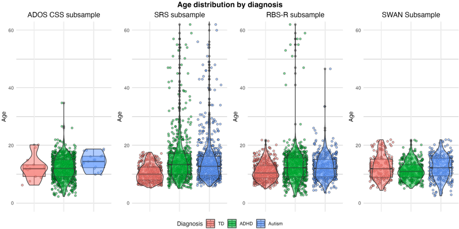

## 10.3 Sensitivity analysis using SRS T-scores

Raw total scores were used for the main analysis examining the association between SRS score and cortical measures so as not to obscure any potential sex differences. However, as there is not a clear consensus about which score is best to use for research purposes, we also conducted the same analysis using the SRS total T-score for comparison. The analyses were conducted in exactly the same manner as those in the 'Associations with autistic traits' section in the main paper, except replacing the raw total score for total T-score.

## 11. Age interaction on subsample of age matched controls

We observed a significant age-by-diagnosis interaction for ADHD diagnosis in the sample with age-matched controls between the ages of 5-22 years. We further conducted a sensitivity analysis using the whole sample of control individuals, to assess to what extent the limited age range impacted the results.

We observed a significant age by sex interaction for ADHD diagnosisW to assess to what extent this interaction was driven by the uneven age range in the ADHD (5-22) and control groups, we re-ran this analysis in a subset of controls with the same age range. Any TD participants below the age of 5 and over the age of 22 were excluded, and the identical analysis was then run.

## 12. Autism+ADHD comparison and replication analyses

## 12.1 Autism+ADHD subsample demographics and sites

Supplementary Table S12.1.1: Characteristics of, and significant differences between, diagnostic groups including Autism+ADHD and Autism and ADHD only groups (post QC)

|                     | Autism +  ADHD                   | Autism          | ADHD         | TD                                 | Test statistic  with df (p-value)  Autism + ADHD  vs Autism   | Test statistic  with df (p-value)  Autism + ADHD  vs ADHD                    | Test statistic with  df (p-value)  Autism + ADHD  vs TD   |
|---------------------|----------------------------------|-----------------|--------------|------------------------------------|---------------------------------------------------------------|------------------------------------------------------------------------------|-----------------------------------------------------------|
| FSQC , mean  (sd)   | 1.24  (0.38)  1.25  (0.36)       | 1.27 (0.4)      | 1.23  (0.36) | t (df = 265.02) =  0.47 (p = 0.64) | t (df = 304.53)  = 1.19 (p =  0.24)                           | t (df = 242.57) =  -0.27 (p = 0.79)                                          |                                                           |
| Euler , mean  (sd)  | 120.21  (66.64)  125.06  (97.86) | 114.73  (71.88) |              | 108.84  (79.57)                    | t (df = 361.89) =  0.89 (p = 0.37)                            | t (df = 312.14) =  -1.05 (p = 0.3)                                           | t (df = 268.7) = - 2.26 (p = 0.02) *                      |
| % Excluded  24.54 % | 18.96 %                          |                 | 19.19 %      | 11.0 %                             | -                                                             | -                                                                            | -                                                         |
| 13.8 %              | 21.6 %                           | 27.8 %          |              | 36.8 %                             | 𝜒𝜒 2  (df =1) = 6.6  (p= 0.01) *                              | 𝜒𝜒 2  (df =1) =  17.3  (p < 0.0001) *  𝜒𝜒 2  (df =1) = 42.7  (p < 0.001) *   | Sex:      Female (%)                                      |
| 99.2  (19.68)       | 103.88  (18.72)                  | 101.06  (15.78) |              | 113.09  (13.24)                    | t (df = 229.27) =  2.89 (p < 0.01) *                          | t (df = 237.63) =  1.14 (p = 0.26)  t (df = 188.13) =  9.04 (p < 0.0001)  *  | FIQ , mean (sd)                                           |
| 11.37  (4.51)       | 15.21  (9.18)                    | 11.14  (3.12)   |              | 15 (7.9)                           | t (df = 528.34) =  9.36 (p < 0.0001)  *                       | t (df = 245.48) =  -0.71 (p = 0.48)  t (df = 354.81) =  9.92 (p < 0.0001)  * | Age , mean (sd)                                           |

Supplementary Table S12.1.2: Autism+ADHD sample site and sex distribution

| Site          | N Female   |   N Male |
|---------------|------------|----------|
| CMI Site-CBIC | 4          |       28 |
| CMI Site-RU   | 7          |       33 |
| CMI Site-SI   | 4          |       16 |
| POND SickKids | 3          |       29 |
| abide EMC     | 1          |        6 |
| abide IP      | 2          |        4 |
| abide KKI     | NA         |        4 |
| abide NYU     | 4          |       39 |
| abide OHSU    | 3          |       11 |
| abide ONRC    | NA         |        1 |
| abide SBL     | NA         |        1 |
| abide UCD     | NA         |        3 |

## 12.2 Correlation and overlap of brain maps between diagnostic groups

To examine similarity and overlap between the autism, ADHD and autism+ADHD groups, we performed pairwise spearman correlations between the effect sizes across brain regions, for each cortical  phenotype.  Correlations  were  plotted  for  each  cortical  phenotype  and  each  pairwise comparison. Brain regions were assigned to a lobe based on the division in [16], and colour coded according to their corresponding lobe in the correlation plots, in order to visualise whether some lobes show more similar effects across conditions. Next, in order to visualise these effects across the cortex, we plotted the pairwise overlap of effect size direction and significance in ggseg [6]. For each pair, regions were selected that had effect sizes in the same direction in both conditions (ie. positive or negative), and colour coded accordingly. We also identified regions that displayed a positive effect in both conditions. Spin permutation testing was used to assess significance with appropriate control of the potentially confounding effect of spatial autocorrelation of each map  118 .

## 12.3 Sensitivity analysis controlling for GMV, total SA and mean CT

We  have  also  re-run  these  analyses  for  the  autism+ADHD  group  while  controlling  for  the respective  global  measure:  total  grey  matter  volume,  total  surface  area,  or  mean  cortical thickness. Analyses were identical to the main analyses for group differences, sex by diagnosis interaction, and sex-stratified analyses, other than the addition of these measures in the model.

## 12.4 Replication in subset based on dimensional clinical measures

Secondary diagnosis data was not available for all datasets, and can be unreliable; thus there are likely  many  individuals  with  co-occurring  diagnoses  who  were  therefore  not  included  in  this analysis. Due to this, we attempted to replicate this result using continuous clinical measures. For this analysis, we used the SWAN inattentive and hyperactivity/impulsivity subscale scores in the POND  and  HBN  datasets,  which  both  had  this  measure  available.  We  created  a  second autism+ADHD subgroup of autistic individuals who also met the clinical cut off of scoring 6 or higher on either the Inattentive or Hyperactive/Impulsive SWAN subscales (N=118 post QC), and repeated the same analysis described in the 'Co-occurring autism and ADHD' methods section. We  compared  the  effect  size  maps  for  the  overall  main  effect  to  the  original  autism+ADHD analysis  results  by  conducting  spearman  correlations  between  maps,  and  using  spin  tests  to assess significance.

## Supplementary results

## 1. Comparison with in-sample centile scores and non-ComBat harmonised centiles

## 1.1 Comparison of in-sample and out-of-sample centiles

In  our  sensitivity  analysis  re-running the main analyses using the original model ('in-sample') centiles for any sites that were included in the original BrainCharts sample, and out-of-sample centiles  only  for  those  that  are  new,  we  showed  that  the  results  are  very  similar  and  highly correlated  (in  particular  for  cortical  volume  and  surface  area,  with  some  slight  differences  in cortical thickness) and thus using out-of-sample centiles does not seem to substantially impact the results. Given this and the results from the Bethlehem et al. 2022 paper showing correlations of 0.99 between in-sample and out-of-sample centiles, we believe that any slight differences in results  are  due  to  the  more  appropriate  site  harmonisation  in  generating  the  out-of-sample centiles.

Figure S 1.1.1 Correlations of Cohen's d effect sizes between analyses with only out-of-sample centiles, and analyses with original model centiles (for those sites available) combined with outof-sample  centiles  for  new  data,  for  main  autism  and  ADHD  analyses,  coloured  by  cortical measure. All analyses were highly correlated, indicating that results changed very little.

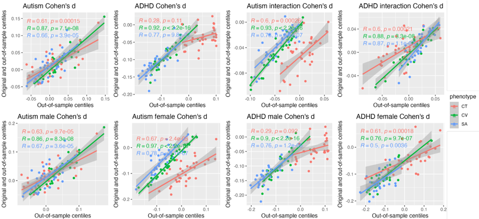

## 1.2 Comparison with non-ComBat harmonised centiles

Results of the analyses of non-ComBat harmonised centiles were almost identical to those using ComBat,  indicating  that,  despite  some  sites  having  small  sample  sizes  in  some  groups,  the models were largely stable and batch correction using ComBat did not improve that done by GAMLSS. Effect size maps looked visually almost identical, with the exception of a couple of differences in which regions reached significance. Correlations of unthresholded effect size maps between the two analyses were extremely high; the lowest was for CV for the main effect of autism in males only, where rho = 0.90, for all other analyses rho = 0.95 - 0.99. Analyses are displayed side by side to demonstrate the similarity between maps (Figure S1.2.1-S1.2.2)

Autism main

ct o&gt;

@

&gt;@

«

effect

## With ComBat Harmonisation (original result)

ADHD

main effect

OSE

Sex by

diagnosis interaction:

Autism ct

cv

DBS

~«

eo

## Without ComBat Harmonisation

-0.2-0.10

0.102

Figure S1.2.1. Side by side comparison of original result using ComBat harmonised centile scores (top), and results of sensitivity analysis without ComBat harmonisation, for main and interaction effects. Results are almost identical.

Sex by

diagnosis interaction:

ct cv

ADHD

@

SA

Bs

## With ComBat Harmonisation (original result)

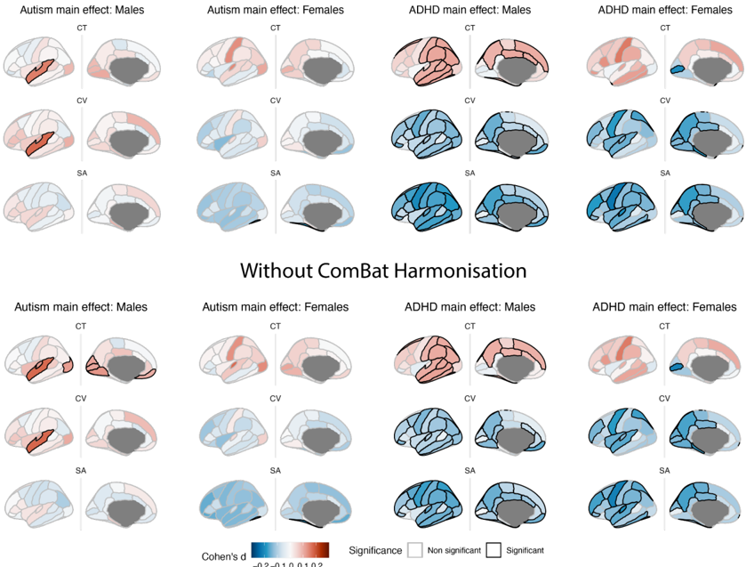

~0.2-0.100102

Figure S1.2.2. Side by side comparison of original result using ComBat harmonised centile scores (top), and results of sensitivity analysis without ComBat harmonisation, for sex stratified main effects. Results are almost identical.

We also compared 'raw' GMV values across sites, before and after ComBat, and note that even here, the differences are more apparent than for the centile scores. The GAMLSS model used for centile scoring also further normalises data across sites. While there were still some site effects remaining, it is impossible to know whether this is due to scanner differences or true biological variation and differences between study samples.

To examine the impact of ComBat site harmonisation we conducted an ANOVA to test the effect of  site  on  grey  matter  volume  and  found  that  while  the  effect  of  site  was  still  significant  after ComBat, the F value decreased substantially from F = 15.64 to F = 5.92. The effect of site was slightly  further  diminished  after  centilisation  using  GAMLSS,  but  was  essentially  the  same  if centiles were generated with (F = 3.90) or without (F = 3.64) ComBat, indicating that while ComBat does  attenuate  site  effects  in  the  raw  data,  it  does  not  seem  to  provide  additional  site harmonisation above and beyond the harmonisation provided with GAMLSS. This effect appears to be similar for other randomly selected regions (figure S1.2.3-S1.2.6).

This is still an experimental and active field of research investigating how phenotypic and clinical variability interacts with site differences and harmonisation procedures, and newer versions of ComBat will further examine how to better retain biological variation, for example due to sex. In our  case,  there  is  no  evidence  that  it  has  limited  or  impacted  our  results;  however,  it  is  an important topic of future investigation.

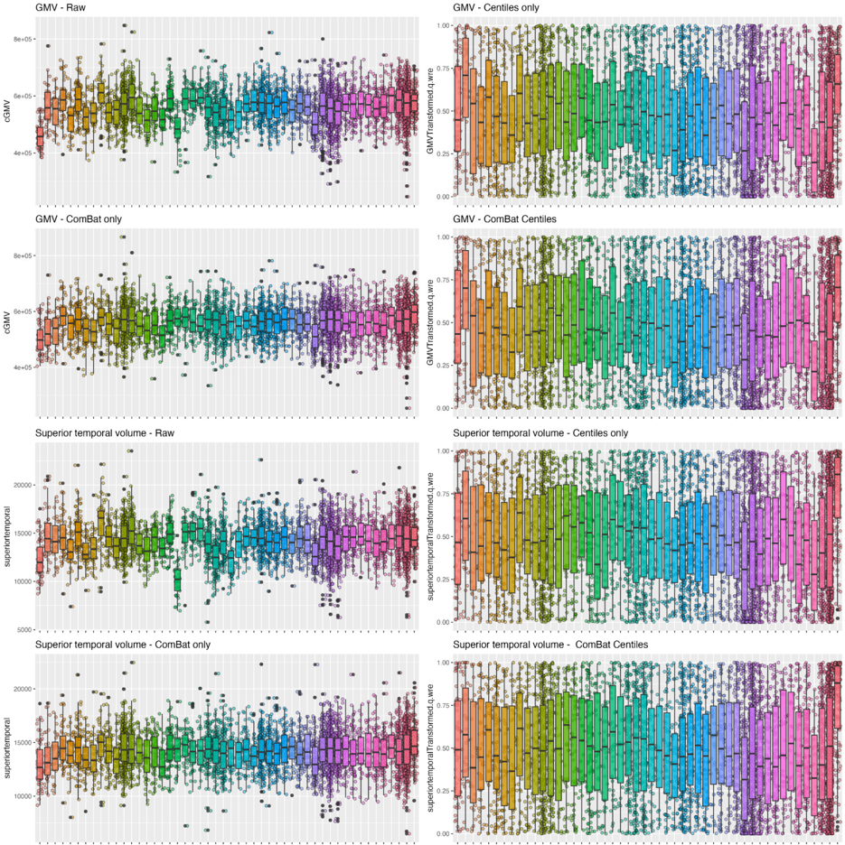

Figure S1.2.3-1.2.6. Total GMV, superior temporal volume, caudal middle frontal CT, and frontal pole SA values, plotted by site, both raw data and centiles, before and after ComBat harmonisation. ComBat harmonisation has a clear effect on raw data, but only minimal on the centile scores.

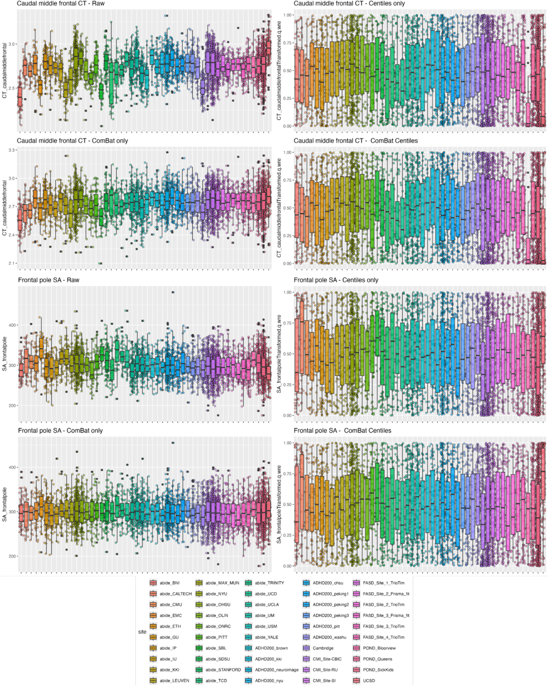

Across studies, ComBat-harmonised centile scores of TDs were largely quite consistent in our sample, with the exception of UCSD, which were somewhat higher than the other studies. This may be due to the fact that this is also a small site, the sample is very young (3-5 years of age), and  there  may  have  been  significant  differences  in  scanning  sequences.  There  was  still  a significant effect of site; however, this is to be expected and could also be, at least in part, due to sampling and age differences between studies.

Figure S1.2.7. Box and violin plots of ComBat-harmonised centiles for GMV, WMV, sGMV, and ventricular volume, plotted by study.

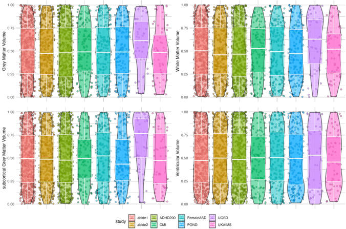

When re-running the main models after removing any participants with &lt;5 per group at a given site, we showed that these results were unchanged, and thus the small sample sizes at some sites  did  not  seem  to  be  impacting  the  results  (figure  S1.8).  We  also  note  that  in  the  main analyses, and when applying ComBat, diagnosis was modelled based on primary diagnosis only (i.e., autism, ADHD, or no diagnosis), thus autism+ADHD was not modelled in ComBat and the small sizes of this group at some sites should not impact the harmonisation.

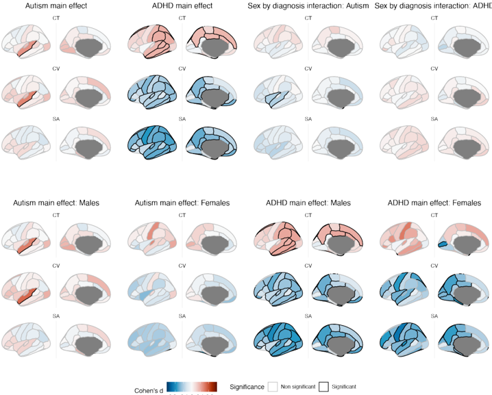

02-010

0402

Figure S1.2.8. Results of the main analyses after removing any participants with &lt;5 per group at a given site.

## 2. Regional overlap of participants with 'extreme' centile scores

Autistic individuals showed the highest degree of both negative and positive 'extreme' centile overlap, as was apparent both in the overlap maps and the overlap difference maps, showing the difference compared to TD individuals. The highest proportion of overlap at any given region was 5.8% for  autistic,  3.3%  for  ADHD,  and  2.2%  for  the  TD  group.  However,  we  note  that  these proportions will, by definition, be small as they are based on the top and bottom percentile of the dataset.  Autistic  individuals  showed  the  highest  degree  of  overlap  of  positive  'extreme' divergences in the STG for CV and CT, mirroring the group difference results; however, they also showed a high degree of overlap of negative divergences in CT, where there were no significant differences in the case-control analyses. The ADHD group showed a relatively high degree of overlap in positive divergences for CT, somewhat aligned with the case-control analysis finding of increased thickness in ADHD, but at a maximum of 3%. Overlap in CV and SA were very low. These results suggest that the case-control differences in autism may have been driven by a few individuals with more extreme phenotypes, whereas in ADHD they appeared to be more uniform.

Figure  S2.1. Proportion  of  individuals  in  each  group  who  showed  extreme  divergences  in neuroanatomy at a given cortical region.

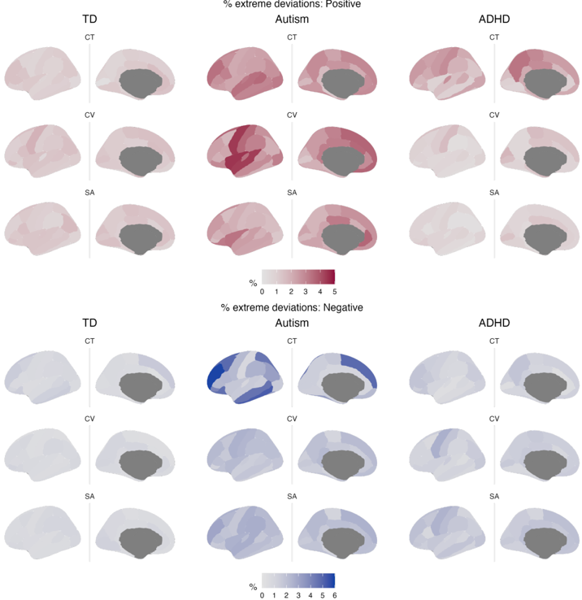

Figure S2.2. Overlap difference map between autism/ADHD and TD controls of proportion of individuals who showed extreme divergences in neuroanatomy at a given cortical region.

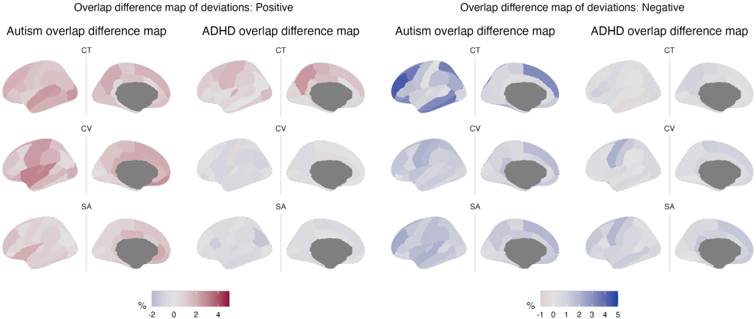

## 3. Controlling for GMV, total SA and mean CT

As there is no clear consensus on controlling for global measures, we present both sets of results, while prioritising the analyses not controlling for global measures because we believe the absolute differences are more informative and easier to interpret, in particular when comparing the autism and  ADHD  results.  These  results  capture  absolute,  rather  than  relative,  differences  between groups, and capture global as well as local changes in the same analysis: as shown by the results of the principal analysis, it is clear that the effects in autism are very localised, but far more global in  ADHD, which is not obvious in the results of the analyses controlling for global measures. Controlling  for  these  measures  can  also  change  the  apparent  direction  of  the  effect  due  to correlations between regional and global measures (Voevodskaya et al. 2014), which is what we observe here in ADHD, where after controlling for global measures, we observe some regions of apparent  greater  CV  and  SA  relative  to  controls,  when  in  fact  they  demonstrate  an  absolute decrease (ADHD &lt; controls).

## Main effect: controlling for global brain measures

Figure S3.1. Main effect of autism and ADHD after controlling for global brain measures. The results of the main effect of autism for cortical thickness and volume did not substantially change, though  significant  results  were  also  observed  for  SA,  which  were  not  observed  in  principal analyses.  These  effects  were  similar  to  those  seen  in  CT  and  CV,  with  increased  SA  in  the superior temporal gyrus, as well as in the superior frontal gyrus and inferior temporal cortex. In ADHD, the results for CT disappeared entirely. Results for CV and SA were also dramatically altered. No significant regions of decrease were observed after controlling for total cortical GMV or SA, and instead increased CV and SA were observed in frontal regions, highlighting the more global nature of the alterations in ADHD.

Interaction effects for autism were altered slightly, such that no regions remained significant after controlling for global measures. However, subthreshold effect size maps looked largely similar. ADHD again showed more differences for CV and SA, but still no regions reached significance. In the sex stratified analyses, male analyses were again very similar to those in the whole sample, with effects in autism having been less impacted than those in ADHD. Results for females were also slightly altered for both autism and ADHD, with only the temporal pole and occipital lobe regions reaching significance in ADHD (for CT and CV) after controlling for global measures, and for autism the post central gyrus and bank of the superior temporal gyrus became significant for CT (autism&gt;TD).

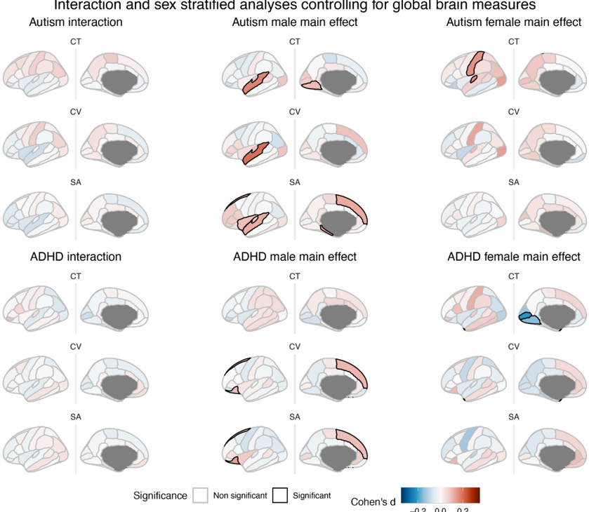

-0.2

00

02

Figure S3.2. Interaction and sex stratified effects of autism and ADHD after controlling for global brain measures.

## 4. Sensitivity analysis with different QC methods

QC method and combination did not substantially impact results, in particular for main effects. There  were  some  differences  in  which  regions  reached  significance  in  each  analysis;  most notably, when thresholding by both FSQC and Euler number, there were no significant effects for the  autism  diagnosis  by  sex  interaction,  and  when  thresholding  by  Euler  only,  there  was  a significant  interaction  between  sex  and  autism  diagnosis  for  SA  as  well  as  CV.  However,  all subthreshold effect size maps looked almost identical across QC conditions (figure S2.1-2.3).

Whereas before excluding participants due to QC (FSQC &gt; 2.5), both the autism and ADHD groups  significantly  differed  from  controls  on  both  FSQC  and  Euler  number,  after  QC  these differences were attenuated. They remained significant only for ADHD vs TD for FSQC, and for Euler number for autism vs TD and ADHD vs autism, and the differences were quite small (see table S1.2.5). We also examined correlations between QC metrics with measures of RRBs and

ADHD  traits,  as  per  the  RBS-R  and  the  SWAN,  and  found  only  very  minimal  correlations (significant only for RBS-R and SWAN Inattentive subscale; rho = 0.06-0.12). This is unsurprising given multiple studies demonstrating that individuals with neurodevelopmental conditions tend to move more in the scanner. The same was true for the three main global cortical phenotypes (total GMV, mean CT and total SA), with only very minimal correlations (rho = -0.10-0.05).

QC is an ongoing issue in the field of developmental neuroimaging, with no gold standard or consensus solution yet. While no method is perfect, we have tried to strike a balance between stringency (such that we can be confident in our results) and maintaining power in our sample and not excluding too large a percentage of participants.

FSQC

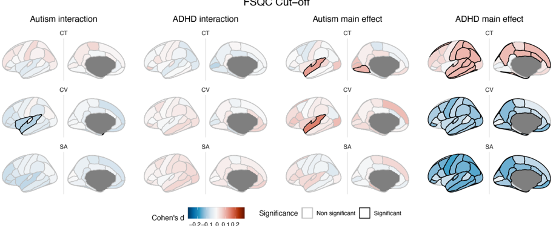

Cut-off

Figure  S4.1. Sex-by-diagnosis  interactions  and  main  effects  for  autism  and  ADHD  when thresholding by FSQC only. Results were extremely similar to the original analysis.

Figure  S4.2. Sex  by  diagnosis  interactions  and  main  effects  for  autism  and  ADHD  when thresholding by FSQC and Euler number. Results were extremely similar to the original analysis, however no regions reached significance in the interaction between autism diagnosis and sex.

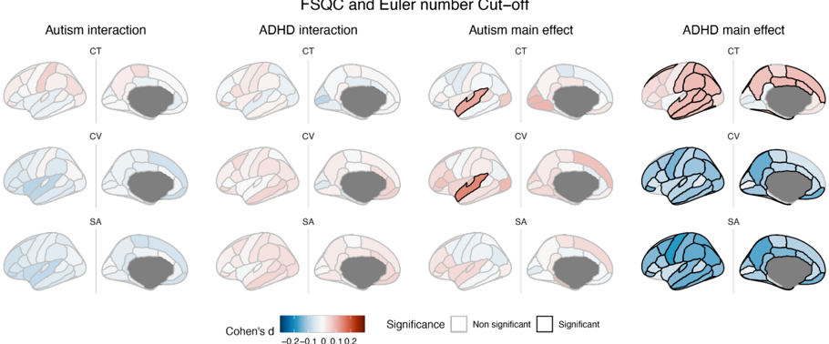

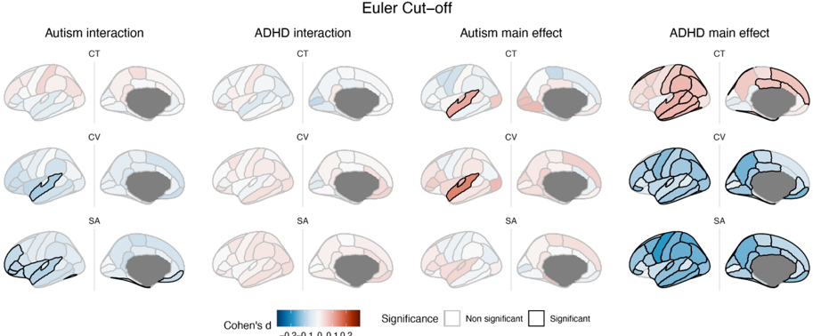

-0.2-0.1

0

0.10.2

Figure  S4.3. Sex  by  diagnosis  interactions  and  main  effects  for  autism  and  ADHD  when thresholding  by  Euler  number  only,  at  2  median  absolute  deviations.  Results  were  extremely similar to the original analysis, however regions reached significance in the interaction between autism diagnosis and sex for surface area, which they did not in the other analyses.

## 5. Spatial comparison of male and female diagnosis effect size maps

Figure S5.1. Correlations between male and female effect size maps for main effect of autism (left) and ADHD (right) diagnosis, for cortical thickness (top), volume (middle) and surface area (bottom). Regional effect size maps for ADHD diagnosis were extremely similar between males and females, and all cortical phenotypes were significantly correlated even based on the more conservative spin permutation test. The same is true of autism diagnosis effect size maps only for cortical thickness; surface area and cortical volume maps differed between males and females and were not significantly correlated.

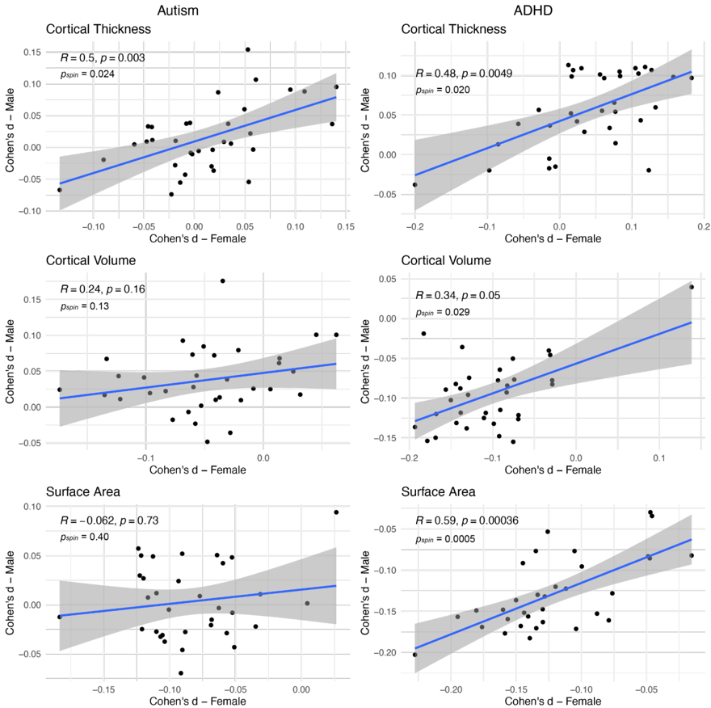

## 6. Sensitivity analysis on subsample of matched male data

Results examining the main effects of diagnosis in the full sample were largely similar in terms of spatial mapping of effect sizes, but with some differences in which regions met significance. For autism, the superior temporal gyrus remained significant only for CV, but subthreshold effect size maps were largely the same. For ADHD, more regions reached significance for CT (ADHD&gt;TD), though for CV almost no regions remained significant; significance and effect sizes were slightly attenuated for SA as well, though not to the same extent (Figure S4.1). Correlations between effect size maps of the original sample and the new sex-matched sample revealed significant, positive correlations of rho=0.57-0.78 for autism and rho=0.73-0.89 for ADHD (all pspin&lt;0.001).

Figure S6.1. Main effect of autism (left) and ADHD (right) diagnosis in a sex matched subsample with  equal  numbers  of  males  and  females.  Results  are  largely  unchanged  from  the  original analyses, though with fewer regions reaching significance.

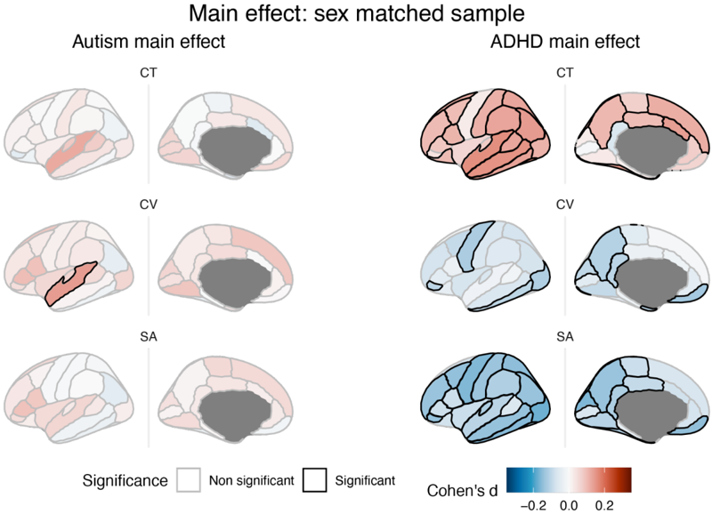

No regions reached significance for the interaction between either diagnosis and sex. Again, subthreshold effect size maps for an interaction with sex looked similar and correlations with maps from the full sample were rho=0.72-0.87 for ADHD and rho=0.78-0.87 for autism (pspin&lt;0.001). In the male only analysis, results were essentially the same as for the whole group, though with fewer still significant regions for SA in ADHD, and no significant regions for CV. Correlations with previous maps for the male analysis were rho=0.73-0.91 for ADHD and rho=0.60-0.81 for autism (all pspin&lt;0.001). Female results are unchanged as the sample remained the same, but they are shown below for the sake of comparison (Figure S4.2).

Figure S6.2. Interaction with sex, and sex-stratified analyses for autism (top) and ADHD (bottom) in  a  sex  matched  subsample  with  equal  numbers  of  males  and  females.  Results  are  largely unchanged from the original analyses, though with fewer regions reaching significance.

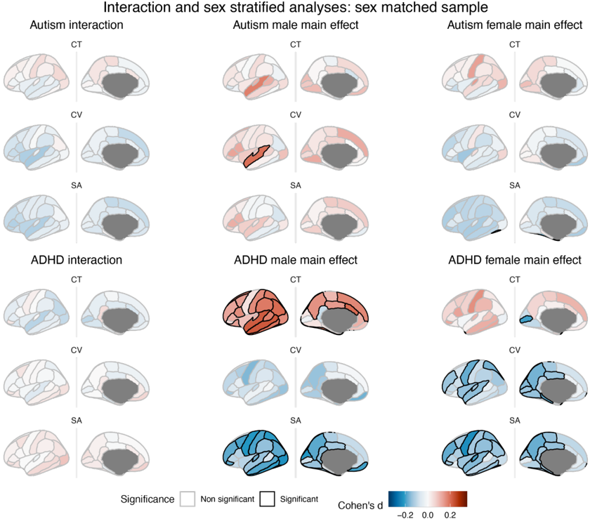

Conducting the analyses in multiple matched subsamples also yielded largely consistent results, demonstrating a robust pattern. In the analysis in five subsamples, correlations between effect size maps of subsamples were high, with the exception of SA for autism (where r = 0.26-0.74), in particular for subsample 2. Correlations for autism for CV and CT were r  = 0.59-0.85, and for ADHD r = 0.65-0.87 (Figure S6.3). For the male main effect, for autism, r = 0.27-0.85 and for ADHD r = 0.58-0.85 (Figure S6.4). The effect size maps of average Cohen's d effect sizes across 100 samples were also highly similar to the original analyses (Figure S6.5).

Figure  S6.3. Main  effect:  Correlation  matrix  of  regional  Cohen's  d  effect  sizes  between  five random subsamples of sex-matched data, for the main effect of autism (top) and ADHD (bottom), for each cortical measure. Correlation values are largely high, with the exception of SA for autism, which showed lower correlations for subsample 2 .

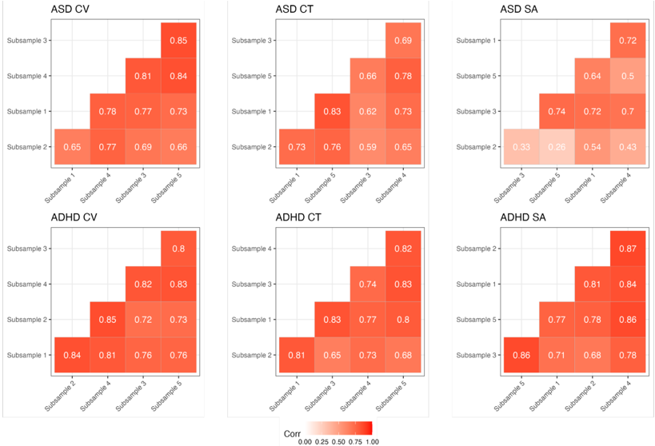

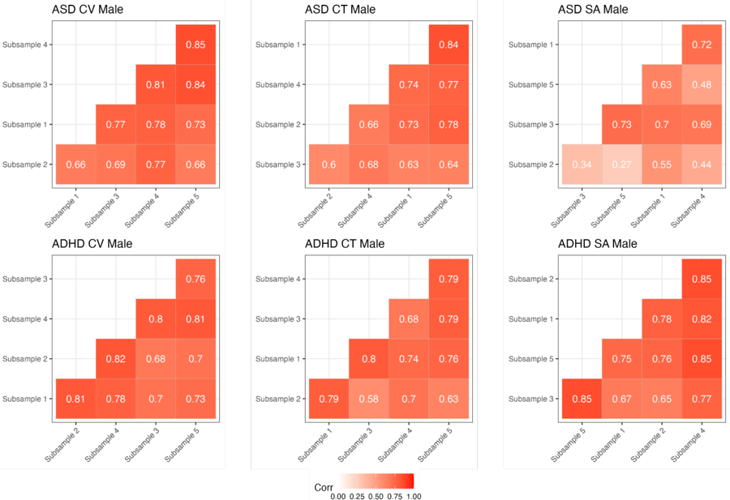

0.00

0.25

Figure S6.4. Male main effect: Correlation matrix of regional sex-stratified Cohen's d effect sizes between five random subsamples of sex-matched data, for the effect of autism (top) and ADHD (bottom)  in  males,  for  each  cortical  measure.  Correlation  values  are  largely  high,  with  the exception of SA for autism, which showed lower correlations for subsample 2.

Figure S6.5. Mean Cohen's d effect size for autism and ADHD regional effects, averaged across 100 randomly selected sex-matched subsamples, in the whole sample (left), and in the male-only sample (right). Effect size maps highly resemble those in the original analyses.

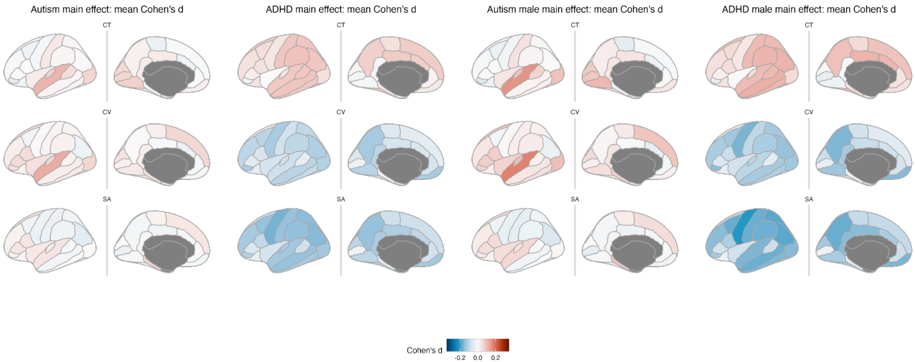

## 7. Multimodality of data

Hartigan dip test analyses revealed that most regions did not reach significance for multimodality, even if they were deemed to have multiple peaks. Autism had the most regions with a multimodal distribution,  with  the  majority  being  significant  for  all  three  cortical  phenotypes  (Figure  S7.1), suggesting that autism is far more likely than the other two groups to comprise multiple, distinct subgroups. In ADHD, only a few regions for CT were significant, and for controls there was only one or two regions for each phenotype. We also plotted box and raincloud plots showing group differences in distributions for each cortical measure and region. Raincloud plots show the density distribution of centiles per group (Supplementary Figures S7.2 - S7.5).

Figure S7.1. Significance of multimodality and number of peaks in the probability density function across  cortical  regions  and  phenotypes  for  each  diagnosis.  Colour  represents  the  number  of peaks in the distribution (darker colours represent higher numbers). Significance of multimodality is signified by the black outline.

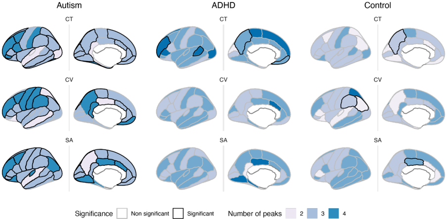

Figure S7.2. Box-plots and raincloud plots showing group differences in regional cortical volume measures. Raincloud plots show the density distribution of centiles per group.

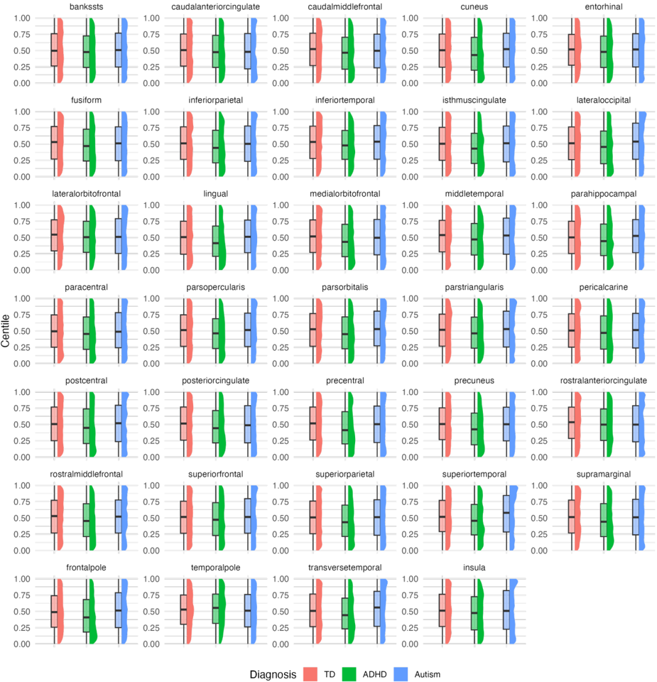

Figure S7.3. Box-plots and raincloud plots showing group differences in regional cortical thickness measures. Raincloud plots show the density distribution of centiles per group.

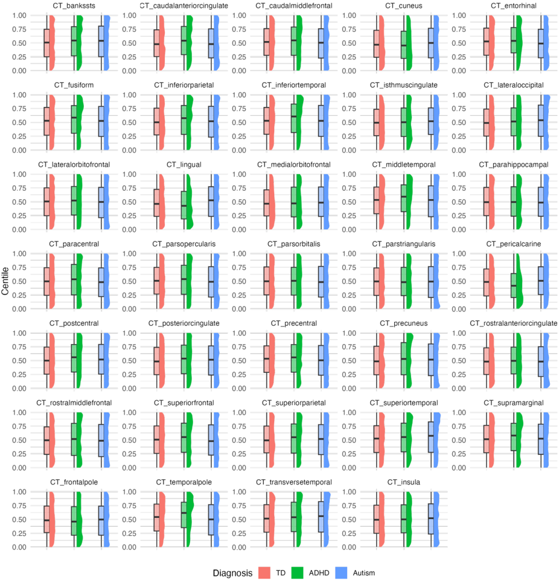

Figure S7.4. Box-plots and raincloud plots showing group differences in regional cortical surface  area  measures.  Raincloud  plots  show  the  density  distribution  of  centiles  per group.

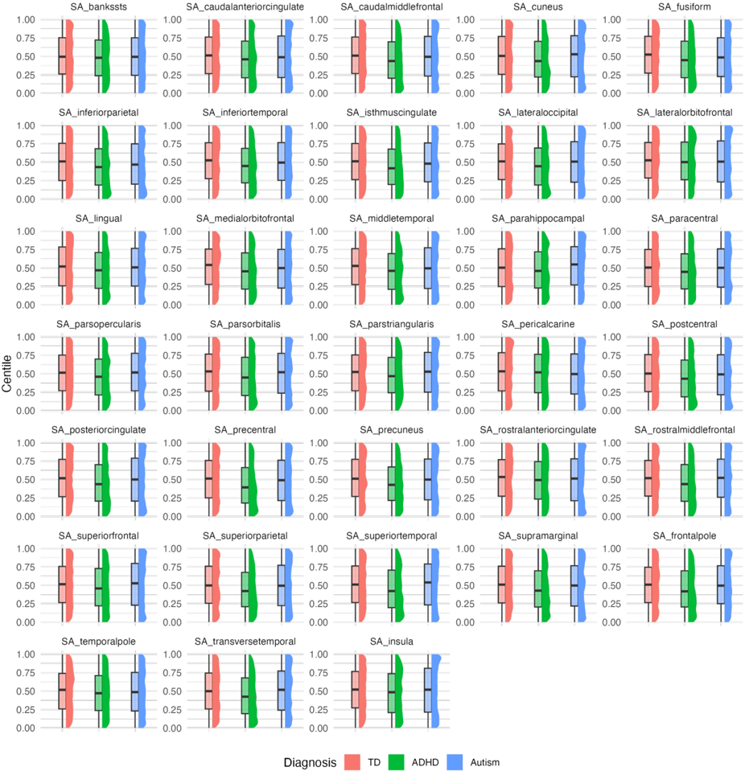

We did  not  observe  any  significant  correlation  between  multimodality  and  model  uncertainty across all regions and participants ( rho = 0.12, P = 0.22). There was slightly higher variability in the autism group, but the differences were minimal, and this was not related to the degree of multimodality.

We chose three  regions  to  investigate  that  were  highly  significantly  multimodal,  one  each  of cortical volume, thickness and surface area: caudal anterior cingulate cortex (ACC) volume and inferior temporal gyrus thickness both had three peaks and thus three subgroups, and precuneus surface area had two. For the caudal ACC volume, subgroups significantly differed on IQ, which was highest in subgroup 3, and RBS-R total, which was highest in subgroup 1. For the inferior temporal cortex, subgroups differed on age, which was highest in subgroup 2. For the precuneus SA, subgroups differed on IQ and SRS total, which were both higher in subgroup 2. There was no consistent pattern across regions, indicating a complex pattern of heterogeneity that warrants further investigation, both in this and other datasets that have more complete and deep clinical phenotyping.

Figure  S7.5. Box-plots  showing  significant  differences  between  subgroups  on  clinical  and demographic variables. There was no consistent pattern of differences between subgroups based on different cortical measures.

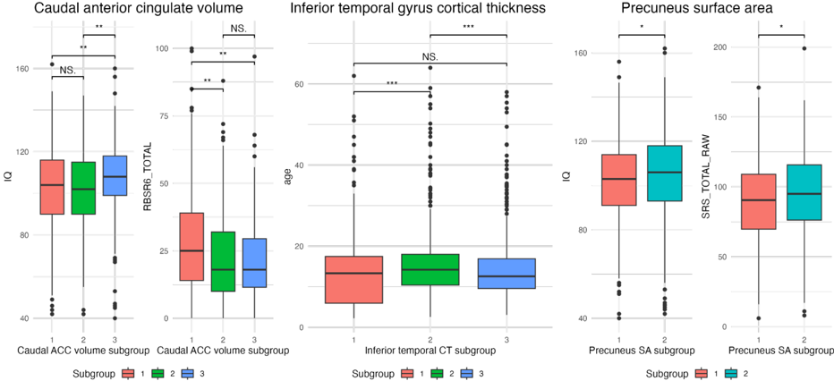

## 8. Dimensional analyses of autistic traits

## 8.1 Distribution of scores by group

We  examined  the  means  and  distributions  of  each  measures'  scores,  plotted  separately  by diagnostic  group.  There  was  a  significant  difference  between  each  pairwise  combination  of groups, for every measure. ADOS was primarily available for autistic participants, with a limited number of control participants and participants with ADHD available. For all measures, including the  SWAN  which  is  a  measure  of  ADHD  behaviours,  individuals  with  ADHD  displayed  an intermediate phenotype in which they showed elevated traits on both scales relative to controls, but less than the autistic group (though we note that for the ADOS the small number of TD and ADHD participants limits interpretability).

Figure S8.1.1. Score  distributions  for  ADOS,  SRS  (raw  total)  and  RBS,  shown  by  diagnostic group.  For  all  measures,  individuals  with  ADHD  display  an  intermediate  phenotype  between controls and autistic participants.

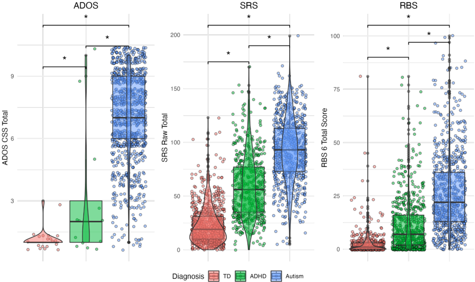

Figure  S8.1.2. Score  distributions  for  SWAN  Hyperactivity/Impulsivity  (HI)  and  Inattentive  (I) subscales, shown by diagnostic group. Even for these measures, autistic individuals had higher scores than the ADHD group (though the difference was only significant for the I scale), and both groups had significantly higher scores than the control group.

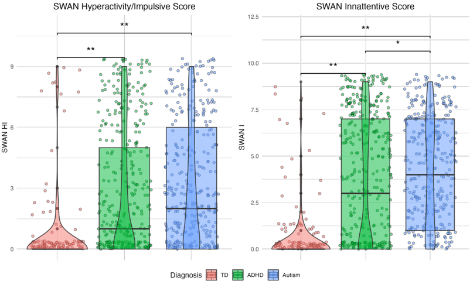

## 8.2 Associations between autistic/ADHD traits and cortical measures

## Associations with autistic traits

The ADHD group displayed an intermediate phenotype between the control and autistic groups for all scores (Figure S6.1.1-6.1.2). Males had significantly higher levels of autistic traits as per the ADOS CSS ( d = 0.29), SRS raw ( d = 0.21) and RBS-R scores ( d = 0.25), and the SWAN HI ( d = 0.31) and SWAN I ( d = 0.30; all P &lt; 0.0001).

There were no significant cortical associations with ADOS CSS, but RBS-R showed weak but significant negative correlations with cortical surface area and volume (partial r = -0.06 - -0.12), and SRS with surface area only (partial r = -0.06 - -0.10; Figure S6.2.1). No measure-by-sex interactions were significant. Associations with cortical measures were similar for SRS T-scores, though fewer regions reached significance for SA (Figure S6.5).

Figure  S8.2.1. Association  between  autistic  traits  and  cortical  measures.  Maps  show  partial correlation for each measure (ADOS, SRS, RBS-R), with significant regions (passing 5% FDR) outlined  in  black.  Red  represents  positive  correlations  (increasing  cortical  measure  with increasing levels of autistic traits), and blue represents negative effect sizes (decreasing cortical measure with increasing levels of autistic traits).

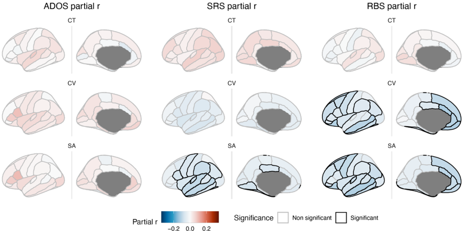

## Associations with ADHD traits

As with the autistic trait measures, significant but weak associations between SWAN subscale scores and cortical measures were observed. A significant positive association was observed between both the SWAN HI and I scales and CT in the STG and transverse temporal gyrus (partial

r = 0.10-0.14), as well as a significant negative association in the frontal pole for CV (partial r = 0.12- -0.14). For the SWAN I scale, a significant positive association was also observed for CT in the lingual gyrus (partial r =0.12), as well as significant negative associations with SA in frontal, temporal and occipital regions (partial r = -0.10- 0 0.13). No measure-by-sex interactions were significant.

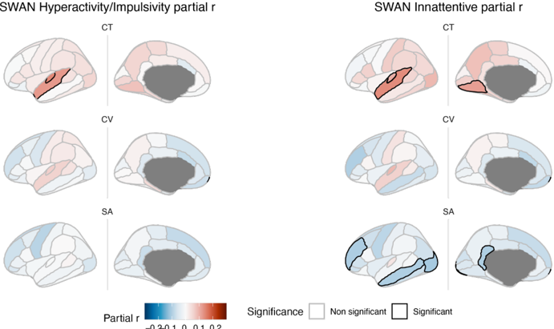

0.2010

0.102

Figure  S8.2.2. Association  between  ADHD  traits  and  cortical  measures.  Maps  show  partial correlation  for  SWAN  Hyperactivity/Impulsivity  and  Inattentive  scales,  with  significant  regions (passing  5%  FDR)  outlined  in  black.  Red  represents  positive  correlations  (increasing  cortical measure  with  increasing  levels  of  ADHD  traits),  and  blue  represents  negative  effect  sizes (decreasing cortical measure with increasing levels of ADHD traits).

## 8.3  Associations  between  autistic/ADHD  traits  and  cortical  measures controlling for global brain measures

No associations for autistic traits (ADOS, SRS or RBS) remained significant after controlling for global cortical measures (total GMV, mean CT or total SA). However, associations with ADHD traits  (SWAN subscales) were less impacted. Associations with SA were no longer significant after  controlling  for  total  SA;  however,  CT  results  were  unchanged,  and  additional  regions  of significance were observed for CV, with the STG  and transverse temporal gyrus again also a significant positive relationship, and a negative relationship in the prefrontal cortex.

## SWAN analyses controlling for global measures

Figure S8.3.1. Associations between ADHD traits and regional cortical measures, controlling for global cortical measures.

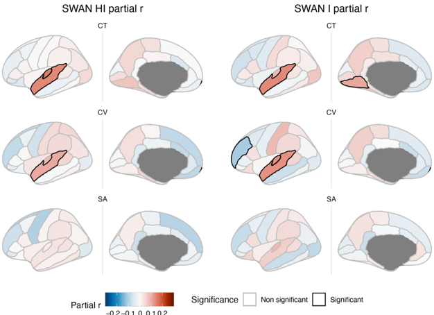

## 8.4 Relationship by group in significant regions

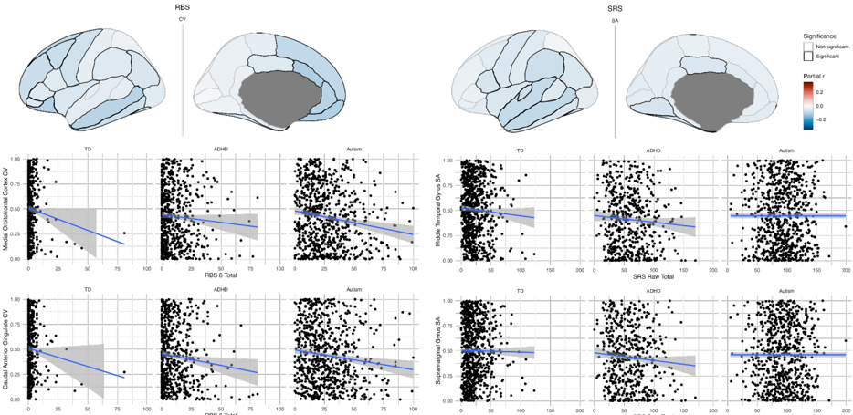

ao.

meu sus

wo.

9

sau

Figure S8.4.1. Maps showing associations between CV and RBS total (left) and SA and SRS total (right).  Scatterplots  show  the  relationship  between  significant  cortical  regions  and  total  score, separately by diagnostic group.

Figure S8.4.2. Maps showing association between CT (left two) SWAN H/I and I scales, and SA and SWAN I scale (top) and scatterplots showing the relationship between significant cortical regions and score, separately by diagnostic group.

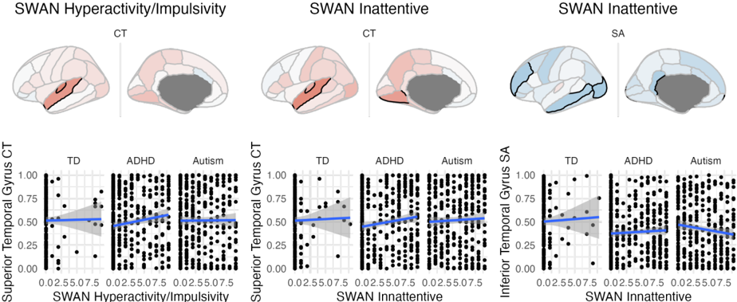

Figure S8.4.3. Association between autistic traits and cortical measures in autism (right) and ADHD (left)  separately.  Maps  show  partial  correlation  for  each  measure  (ADOS,  SRS,  RBS-R),  with significant regions (passing 5% FDR) outlined in black. Note that there were not enough individuals with ADHD who had ADOS scores to complete this analysis.

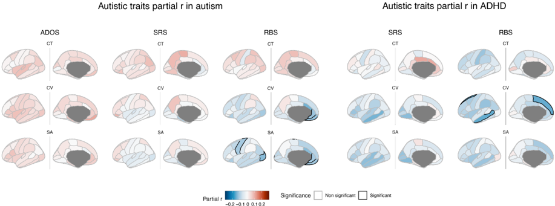

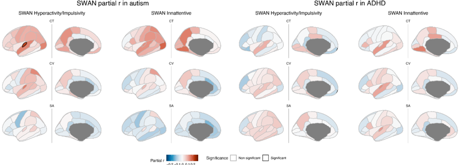

02-010

Figure S8.4.4. Association between ADHD traits and cortical measures in autism (right) and ADHD (left)  separately.  Maps  show  partial  correlation  for  each  measure  (ADOS,  SRS,  RBS-R),  with significant regions (passing 5% FDR) outlined in black.

## 8.5 Sensitivity analysis using SRS T-scores

Figure S8.5. Association between SRS T-score and cortical measures. As in the raw score analyses, only SA showed significant associations, but here fewer regions reached significance. The SRS Tscore, which is scaled by sex, was the only measure that was not significantly different between males and females .

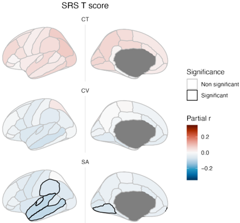

## 9. Age interaction on full sample of controls

Results largely remained consistent with the age-matched analysis for CT, with slightly fewer regions reaching significance for the ADHD diagnosis-by-age interaction when using the whole sample of controls, i.e., with no age restriction. Additionally, some significant differences were also observed for CV in this analysis. Positive interactions were observed in frontal, parietal and some occipital regions, reflecting increased CT/CV with age in the ADHD group, but decreases or no effect in the TD group. Negative interactions were observed in the insula, reflecting a more negative  relationship  between  age  and  CT  in  ADHD  than  the  control  group  (Figure  S9.1). Interestingly, for CV, the regions in which a significant interaction with age was observed were the same regions that displayed a significant effect of ADHD diagnosis when controlling for total GMV (Figure S3.1).

Figure S9.1. Significant interaction between age and ADHD diagnosis in cortical thickness, in full sample (without limited age range).

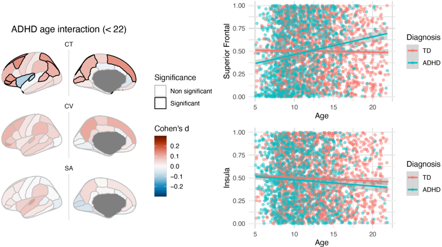

## 10. Autism+ADHD comparison and replication analysis

## 10.1 Correlation and overlap of brain maps between diagnostic groups

Perhaps unsurprisingly, the autism+ADHD group overlapped more with the autism and ADHD alone groups alone than did the autism and ADHD group with each other. Almost all correlations between  the  autism+ADHD  group  and  other  groups,  for  each  phenotype,  were  significant

(p&lt;0.01). Only the correlation between ADHD and autism+ADHD for CT did not survive the more stringent spin test (p spin = 0.05). Only SA effect sizes were significantly correlated between autism and ADHD (Figure S10.1).

Fig  S10.1. Pairwise  correlations  of  Cohen's  d  effect  sizes  between  pairwise  combinations  of autism,  ADHD,  and  autism+ADHD  groups,  across  regions  of  the  brain,  coloured  by  lobe. Significance was tested using the more conservative spin test method.

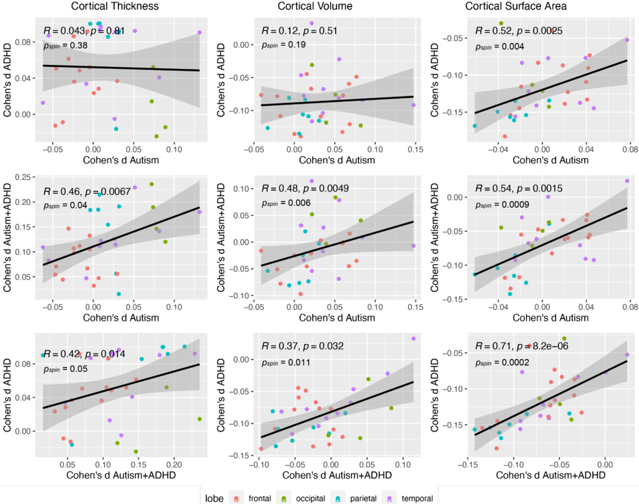

## 10.2 Autism+ADHD analysis controlling for global measures

## Co-occurring autism and ADHD controlling for global measures

Figure S10.2. Cortical alterations (relative to controls) in individuals with co-occurring autism and ADHD controlling for global measures. Main effects of diagnosis relative to controls; interaction with sex; main effects in males, and main effects in females. All maps show Cohen's d effect sizes, with significant regions (passing 5% FDR) outlined in black. Red represents positive effect sizes  (autism+ADHD &gt; controls),  and  blue  represents  negative  effect  sizes  (autism+ADHD  &lt; controls). Only the cuneus and bank of superior temporal sulcus for CT remained significantly different between the autism+ADHD group and controls.

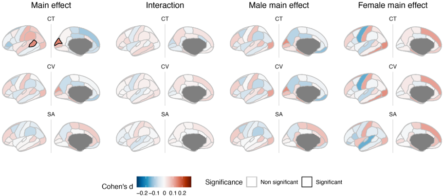

## 10.3 Replication using SWAN subscale cut-off

The  replication  analysis  based  on  the  SWAN  cut-off  yielded  similar  results.  As  in  the  main analysis,  there  were  no  significant  differences  in  CV  centiles,  and  the  autism+ADHD  group displayed increases in CT centiles, and decreases in SA centiles in primarily frontal and parietal regions  (Supplementary  Figure  S10.3).  Slightly  fewer  regions  reached  significance  in  this analysis, but this may be due to a lack of power, as the number of autism+ADHD participants in this analysis was substantially less (N=118), and effect size maps looked similar. For the overall main  effect  across  phenotypes,  effect  size  maps  were  correlated  at  rho  =  0.71.  Maps  were significantly correlated for CT (rho = 0.61; p spin = 0.012) and CV (rho = 0.35; p spin = 0.016), but not SA (rho = 0.21; p spin = 0.2).

The greatest difference between the two analyses is in the female main effect maps, for CV and SA. It should be noted however, that in the SWAN cut off analysis, the female and male effect size  maps  are  more  similar,  with  many  overlapping  regions  in  SA  both  showing  significant decreases. It is possible that the SWAN-based analysis is less impacted by sex biases in clinical

diagnosis  which  cause  females  with  ADHD  to  be  underdiagnosed,  leading  to  more  similarity between the male and female groups.

## Co-occurring autism and ADHD based on SWAN cut offs

Figure S10.3. Cortical alterations (relative to controls) in individuals with co-occurring autism and ADHD  based  on  the  SWAN  subscale  cutoff.  Main  effects  of  diagnosis  relative  to  controls; interaction with sex; main effects in males, and main effects in females. All maps show Cohen's d effect sizes, with significant regions (passing 5% FDR) outlined in black. Red represents positive effect sizes (autism+ADHD &gt; controls), and blue represents negative effect sizes (autism+ADHD &lt; controls).

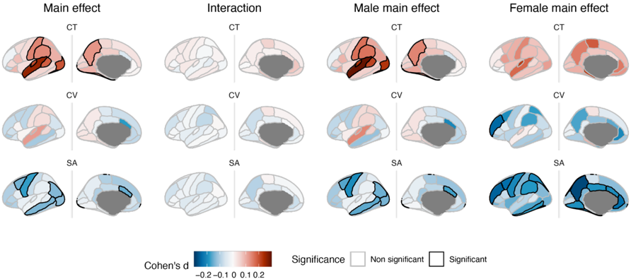

## 11. Effect size tables

Table S11.1. Cohen's d effect sizes and FDR corrected p-values for regional main effects and sex interaction effects for autism and ADHD

| label                       |   Cohen's  d Autism |   p FDR  Autism |   Cohen's  d ADHD |   p FDR  ADHD |   Cohen's d  Autism  Interaction |   p FDR  Autism  Interaction |   Cohen's d  ADHD  Interaction |   p FDR  ADHD  Interaction |
|-----------------------------|---------------------|-----------------|-------------------|---------------|----------------------------------|------------------------------|--------------------------------|----------------------------|
| CV bankssts                 |               0.008 |           0.869 |            -0.046 |         0.147 |                           -0.035 |                        0.505 |                          0.022 |                      0.924 |
| CV  caudalanteriorcingulate |              -0.041 |           0.509 |            -0.077 |         0.018 |                           -0.009 |                        0.835 |                          0.039 |                      0.794 |
| CV caudalmiddlefrontal      |              -0.017 |           0.781 |            -0.109 |         0.001 |                           -0.023 |                        0.639 |                          0.037 |                      0.794 |
| CV cuneus                   |               0.051 |           0.303 |            -0.076 |         0.018 |                           -0.017 |                        0.72  |                         -0.028 |                      0.924 |
| CV entorhinal               |               0.036 |           0.571 |            -0.067 |         0.037 |                           -0.077 |                        0.105 |                          0.007 |                      0.924 |
| CV fusiform                 |               0.012 |           0.854 |            -0.078 |         0.017 |                           -0.074 |                        0.11  |                          0.016 |                      0.924 |

| CV inferiorparietal          |   -0.033 |   0.578 |   -0.127 |     0 |   0.003 |   0.91 |   0.024 |   0.924 |
|------------------------------|----------|---------|----------|-------|---------|--------|---------|---------|
| CV inferiortemporal          |    0.035 |   0.571 |   -0.104 | 0.002 |  -0.048 |  0.271 |   0.026 |   0.924 |
| CV isthmuscingulate          |    0.03  |   0.606 |   -0.116 | 0.001 |  -0.034 |  0.505 |   0.027 |   0.924 |
| CV lateraloccipital          |    0.082 |   0.085 |   -0.123 | 0     |  -0.015 |  0.72  |   0.038 |   0.794 |
| CV  lateralorbitofrontal     |    0.015 |   0.81  |   -0.045 | 0.161 |  -0.063 |  0.156 |   0.023 |   0.924 |
| CV lingual                   |    0.039 |   0.524 |   -0.119 | 0     |  -0.007 |  0.859 |   0.01  |   0.924 |
| CV medialorbitofrontal       |    0.008 |   0.869 |   -0.14  | 0     |  -0.068 |  0.133 |   0.055 |   0.794 |
| CV middletemporal            |    0.022 |   0.738 |   -0.117 | 0.001 |  -0.043 |  0.334 |   0.046 |   0.794 |
| CV parahippocampal           |    0.055 |   0.25  |   -0.022 | 0.471 |  -0.02  |  0.686 |  -0.062 |   0.794 |
| CV paracentral               |    0.021 |   0.738 |   -0.067 | 0.037 |  -0.016 |  0.72  |  -0.016 |   0.924 |
| CV parsopercularis           |    0.06  |   0.226 |   -0.077 | 0.017 |  -0.057 |  0.192 |   0.013 |   0.924 |
| CV parsorbitalis             |    0.059 |   0.226 |   -0.133 | 0     |  -0.058 |  0.192 |   0.042 |   0.794 |
| CV parstriangularis          |    0.067 |   0.159 |   -0.059 | 0.064 |  -0.053 |  0.226 |  -0.002 |   0.981 |
| CV pericalcarine             |    0.022 |   0.738 |   -0.031 | 0.326 |  -0.012 |  0.787 |  -0.044 |   0.794 |
| CV postcentral               |    0.013 |   0.832 |   -0.084 | 0.012 |   0.006 |  0.859 |   0.016 |   0.924 |
| CV posteriorcingulate        |   -0.006 |   0.869 |   -0.081 | 0.014 |  -0.033 |  0.505 |  -0.009 |   0.924 |
| CV precentral                |    0     |   0.997 |   -0.136 | 0     |  -0.025 |  0.612 |   0.002 |   0.981 |
| CV precuneus                 |    0.006 |   0.869 |   -0.135 | 0     |  -0.016 |  0.72  |   0.01  |   0.924 |
| CV  rostralanteriorcingulate |   -0.021 |   0.738 |   -0.078 | 0.017 |  -0.027 |  0.612 |   0.047 |   0.794 |
| CV rostralmiddlefrontal      |    0.033 |   0.578 |   -0.109 | 0.001 |  -0.066 |  0.133 |   0.01  |   0.924 |
| CV superiorfrontal           |    0.077 |   0.105 |   -0.049 | 0.132 |  -0.072 |  0.11  |   0.001 |   0.983 |
| CV superiorparietal          |    0.01  |   0.859 |   -0.106 | 0.001 |  -0.026 |  0.612 |  -0.011 |   0.924 |
| CV  superiortemporal         |    0.147 |   0     |   -0.092 | 0.006 |  -0.099 |  0.017 |  -0.011 |   0.924 |
| CV supramarginal             |    0.017 |   0.781 |   -0.109 | 0.001 |  -0.053 |  0.226 |   0.022 |   0.924 |
| CV frontalpole               |    0.068 |   0.159 |   -0.121 | 0     |  -0.048 |  0.271 |  -0.012 |   0.924 |
| CV temporalpole              |    0.021 |   0.738 |    0.033 | 0.305 |  -0.097 |  0.017 |   0.045 |   0.794 |
| CV transversetemporal        |    0.084 |   0.085 |   -0.084 | 0.012 |  -0.025 |  0.612 |  -0.008 |   0.924 |
| CV insula                    |    0.055 |   0.25  |   -0.081 | 0.014 |  -0.099 |  0.017 |  -0.005 |   0.961 |
| CT bankssts                  |    0.051 |   0.354 |    0.092 | 0.01  |   0.004 |  0.918 |  -0.024 |   0.845 |
| CT  caudalanteriorcingulate  |   -0.024 |   0.718 |    0.086 | 0.013 |   0.008 |  0.918 |  -0.024 |   0.845 |
| CT caudalmiddlefrontal       |   -0.031 |   0.696 |    0.061 | 0.103 |   0.033 |  0.856 |  -0.007 |   0.964 |
| CT cuneus                    |    0.072 |   0.106 |    0.014 | 0.725 |  -0.017 |  0.885 |  -0.051 |   0.549 |
| CT entorhinal                |   -0.062 |   0.21  |    0.013 | 0.725 |   0.021 |  0.856 |   0.028 |   0.845 |
| CT fusiform                  |    0.028 |   0.696 |    0.091 | 0.01  |  -0.031 |  0.856 |  -0.016 |   0.964 |
| CT inferiorparietal          |   -0.004 |   0.932 |    0.1   | 0.01  |   0.042 |  0.856 |  -0.057 |   0.549 |
| CT inferiortemporal          |    0.008 |   0.932 |    0.093 | 0.01  |  -0.004 |  0.918 |   0.002 |   0.964 |
| CT  isthmuscingulate         |    0.028 |   0.696 |   -0.016 | 0.725 |   0.012 |  0.918 |   0.011 |   0.964 |
| CT lateraloccipital          |    0.074 |   0.106 |    0.052 | 0.173 |   0.02  |  0.856 |  -0.048 |   0.582 |
| CT lateralorbitofrontal      |   -0.017 |   0.862 |    0.048 | 0.196 |  -0.025 |  0.856 |  -0.025 |   0.845 |
| CT lingual                   |    0.089 |   0.063 |   -0.014 | 0.725 |  -0.009 |  0.918 |  -0.039 |   0.674 |
| CT medialorbitofrontal       |    0.03  |   0.696 |    0.037 | 0.353 |  -0.007 |  0.918 |  -0.011 |   0.964 |
| CT middletemporal            |    0.01  |   0.932 |    0.097 | 0.01  |  -0.019 |  0.856 |  -0.004 |   0.964 |
| CT parahippocampal           |   -0.009 |   0.932 |    0.034 | 0.387 |   0.001 |  0.964 |  -0.045 |   0.59  |
| CT paracentral               |   -0.046 |   0.421 |    0.051 | 0.178 |   0.058 |  0.856 |   0.001 |   0.964 |
| CT parsopercularis           |   -0.004 |   0.932 |    0.052 | 0.173 |   0.004 |  0.918 |   0.03  |   0.845 |
| CT parsorbitalis             |   -0.047 |   0.421 |   -0.013 | 0.725 |   0.026 |  0.856 |   0.059 |   0.549 |

| CT parstriangularis          |   0.007 |   0.932 |   0.028 |   0.486 |   -0.015 |   0.918 |   -0.005 |   0.964 |
|------------------------------|---------|---------|---------|---------|----------|---------|----------|---------|
| CT pericalcarine             |   0.078 |   0.093 |  -0.024 |   0.558 |    0.008 |   0.918 |   -0.087 |   0.159 |
| CT postcentral               |   0.032 |   0.696 |   0.092 |   0.01  |    0.055 |   0.856 |    0.01  |   0.964 |
| CT posteriorcingulate        |   0.032 |   0.696 |   0.09  |   0.01  |   -0.013 |   0.918 |   -0.041 |   0.674 |
| CT precentral                |  -0.024 |   0.718 |   0.036 |   0.353 |    0.023 |   0.856 |    0.002 |   0.964 |
| CT precuneus                 |   0.018 |   0.854 |   0.086 |   0.013 |    0.024 |   0.856 |   -0.025 |   0.845 |
| CT  rostralanteriorcingulate |   0.001 |   0.98  |   0.023 |   0.561 |   -0.023 |   0.856 |   -0.009 |   0.964 |
| CT rostralmiddlefrontal      |  -0.004 |   0.932 |   0.052 |   0.173 |    0.025 |   0.856 |   -0.008 |   0.964 |
| CT superiorfrontal           |  -0.007 |   0.932 |   0.092 |   0.01  |    0.011 |   0.918 |   -0.008 |   0.964 |
| CT superiorparietal          |   0.006 |   0.932 |   0.1   |   0.01  |    0.02  |   0.856 |   -0.053 |   0.549 |
| CT superiortemporal          |   0.131 |   0.001 |   0.09  |   0.01  |   -0.04  |   0.856 |   -0.052 |   0.549 |
| CT supramarginal             |   0.008 |   0.932 |   0.101 |   0.01  |    0.021 |   0.856 |   -0.019 |   0.964 |
| CT frontalpole               |  -0.038 |   0.625 |  -0.009 |   0.799 |    0.031 |   0.856 |   -0.009 |   0.964 |
| CT temporalpole              |  -0.055 |   0.308 |   0.087 |   0.013 |   -0.036 |   0.856 |    0.028 |   0.845 |
| CT transversetemporal        |   0.081 |   0.091 |   0.041 |   0.298 |    0.023 |   0.856 |    0.023 |   0.845 |
| CT insula                    |   0.026 |   0.696 |  -0.005 |   0.87  |   -0.032 |   0.856 |   -0.003 |   0.964 |
| SA bankssts                  |  -0.019 |   0.782 |  -0.083 |   0.008 |   -0.037 |   0.375 |    0.041 |   0.651 |
| SA                           |  -0.019 |   0.782 |  -0.116 |   0     |   -0.015 |   0.676 |    0.039 |   0.651 |
| SA caudalmiddlefrontal       |  -0.029 |   0.782 |  -0.154 |   0     |   -0.035 |   0.382 |    0.038 |   0.651 |
| SA cuneus                    |   0     |   0.996 |  -0.121 |   0     |   -0.001 |   0.977 |    0.007 |   0.933 |
| SA fusiform                  |  -0.013 |   0.898 |  -0.122 |   0     |   -0.087 |   0.063 |    0.023 |   0.84  |
| SA inferiorparietal          |  -0.061 |   0.733 |  -0.168 |   0     |   -0.017 |   0.627 |    0.049 |   0.651 |
| SA inferiortemporal          |  -0.005 |   0.921 |  -0.141 |   0     |   -0.054 |   0.19  |    0.026 |   0.84  |
| SA  isthmuscingulate         |   0.006 |   0.921 |  -0.134 |   0     |   -0.046 |   0.245 |    0.028 |   0.84  |
| SA lateraloccipital          |   0.006 |   0.921 |  -0.143 |   0     |   -0.022 |   0.547 |    0.057 |   0.651 |
| SA lateralorbitofrontal      |   0.009 |   0.921 |  -0.04  |   0.199 |   -0.066 |   0.12  |    0.016 |   0.84  |
| SA lingual                   |  -0.009 |   0.921 |  -0.113 |   0     |   -0.022 |   0.547 |    0.025 |   0.84  |
| SA medialorbitofrontal       |  -0.021 |   0.782 |  -0.145 |   0     |   -0.06  |   0.14  |    0.056 |   0.651 |
| SA middletemporal            |  -0.025 |   0.782 |  -0.156 |   0     |   -0.048 |   0.244 |    0.054 |   0.651 |
| SA parahippocampal           |   0.077 |   0.4   |  -0.052 |   0.093 |   -0.027 |   0.477 |   -0.019 |   0.84  |
| SA paracentral               |   0.019 |   0.782 |  -0.087 |   0.006 |   -0.061 |   0.138 |   -0.006 |   0.933 |
| SA parsopercularis           |   0.04  |   0.733 |  -0.109 |   0.001 |   -0.054 |   0.19  |    0.016 |   0.84  |
| SA parsorbitalis             |   0.023 |   0.782 |  -0.123 |   0     |   -0.075 |   0.078 |    0.025 |   0.84  |
| SA parstriangularis          |   0.043 |   0.733 |  -0.073 |   0.019 |   -0.067 |   0.116 |    0.004 |   0.933 |
| SA pericalcarine             |  -0.037 |   0.733 |  -0.03  |   0.327 |   -0.007 |   0.839 |    0.002 |   0.953 |
| SA postcentral               |  -0.041 |   0.733 |  -0.149 |   0     |   -0.029 |   0.445 |    0.04  |   0.651 |
| SA posteriorcingulate        |  -0.025 |   0.782 |  -0.135 |   0     |   -0.022 |   0.547 |    0.018 |   0.84  |
| SA precentral                |  -0.034 |   0.734 |  -0.183 |   0     |   -0.035 |   0.382 |    0.013 |   0.875 |
| SA precuneus                 |  -0.015 |   0.866 |  -0.154 |   0     |   -0.031 |   0.43  |    0.02  |   0.84  |
| SA  rostralanteriorcingulate |  -0.004 |   0.926 |  -0.083 |   0.008 |   -0.038 |   0.37  |    0.039 |   0.651 |
| SA rostralmiddlefrontal      |   0.02  |   0.782 |  -0.139 |   0     |   -0.076 |   0.078 |    0.012 |   0.875 |
| SA superiorfrontal           |   0.042 |   0.733 |  -0.09  |   0.004 |   -0.068 |   0.116 |    0.018 |   0.84  |
| SA superiorparietal          |  -0.026 |   0.782 |  -0.161 |   0     |   -0.034 |   0.383 |    0.033 |   0.79  |
| SA superiortemporal          |   0.047 |   0.733 |  -0.145 |   0     |   -0.091 |   0.063 |    0.022 |   0.84  |
| SA supramarginal             |  -0.029 |   0.782 |  -0.156 |   0     |   -0.047 |   0.244 |    0.04  |   0.651 |

| SA frontalpole        |   0.041 |   0.733 |   -0.133 |     0 |   -0.083 |   0.063 |   0.011 |   0.875 |
|-----------------------|---------|---------|----------|-------|----------|---------|---------|---------|
| SA temporalpole       |   0.005 |   0.921 |   -0.077 | 0.014 |   -0.064 |   0.127 |   0.046 |   0.651 |
| SA transversetemporal |   0.034 |   0.734 |   -0.137 | 0     |   -0.048 |   0.244 |  -0.006 |   0.933 |
| SA insula             |   0.039 |   0.733 |   -0.077 | 0.014 |   -0.082 |   0.063 |  -0.004 |   0.933 |

Table S11.2. Cohen's d effect sizes and FDR corrected p values for sex stratified regional main effects and for autism and ADHD

| label                        |   Cohen's d  Autism M |   p FDR  Autism M |   Cohen's d  ADHD M |   p FDR  ADHD M |   Cohen's d  Autism F |   p FDR  Autism F |   Cohen's d  ADHD F |   p FDR  ADHD F |
|------------------------------|-----------------------|-------------------|---------------------|-----------------|-----------------------|-------------------|---------------------|-----------------|
| CV bankssts                  |                 0.01  |             0.843 |              -0.046 |           0.237 |                -0.041 |             0.733 |              -0.031 |           0.615 |
| CV  caudalanteriorcingulate  |                -0.048 |             0.482 |              -0.083 |           0.036 |                -0.048 |             0.717 |              -0.029 |           0.615 |
| CV caudalmiddlefrontal       |                -0.018 |             0.785 |              -0.121 |           0.003 |                -0.077 |             0.657 |              -0.069 |           0.254 |
| CV cuneus                    |                 0.061 |             0.288 |              -0.089 |           0.026 |                 0.013 |             0.866 |              -0.156 |           0.034 |
| CV entorhinal                |                 0.043 |             0.537 |              -0.077 |           0.046 |                -0.123 |             0.217 |              -0.074 |           0.233 |
| CV fusiform                  |                 0.017 |             0.785 |              -0.078 |           0.045 |                -0.135 |             0.214 |              -0.094 |           0.162 |
| CV inferiorparietal          |                -0.036 |             0.615 |              -0.138 |           0.001 |                -0.028 |             0.78  |              -0.131 |           0.051 |
| CV  inferiortemporal         |                 0.044 |             0.537 |              -0.115 |           0.004 |                -0.057 |             0.673 |              -0.091 |           0.162 |
| CV isthmuscingulate          |                 0.039 |             0.582 |              -0.125 |           0.002 |                -0.031 |             0.765 |              -0.111 |           0.104 |
| CV lateraloccipital          |                 0.101 |             0.066 |              -0.132 |           0.001 |                 0.062 |             0.673 |              -0.099 |           0.148 |
| CV lateralorbitofrontal      |                 0.019 |             0.785 |              -0.04  |           0.296 |                -0.097 |             0.433 |              -0.033 |           0.615 |
| CV lingual                   |                 0.05  |             0.482 |              -0.131 |           0.001 |                 0.025 |             0.795 |              -0.144 |           0.042 |
| CV medialorbitofrontal       |                 0.011 |             0.843 |              -0.155 |           0     |                -0.122 |             0.217 |              -0.075 |           0.232 |
| CV middletemporal            |                 0.028 |             0.771 |              -0.126 |           0.002 |                -0.06  |             0.673 |              -0.069 |           0.254 |
| CV  parahippocampal          |                 0.068 |             0.224 |              -0.019 |           0.603 |                 0.014 |             0.866 |              -0.183 |           0.019 |
| CV paracentral               |                 0.026 |             0.771 |              -0.074 |           0.052 |                -0.009 |             0.907 |              -0.128 |           0.051 |
| CV parsopercularis           |                 0.072 |             0.206 |              -0.084 |           0.034 |                -0.042 |             0.733 |              -0.083 |           0.199 |
| CV parsorbitalis             |                 0.073 |             0.206 |              -0.148 |           0     |                -0.06  |             0.673 |              -0.092 |           0.162 |
| CV parstriangularis          |                 0.079 |             0.169 |              -0.064 |           0.095 |                -0.021 |             0.828 |              -0.092 |           0.162 |
| CV pericalcarine             |                 0.025 |             0.771 |              -0.036 |           0.335 |                 0.006 |             0.917 |              -0.137 |           0.043 |
| CV postcentral               |                 0.017 |             0.785 |              -0.093 |           0.021 |                 0.031 |             0.765 |              -0.083 |           0.199 |
| CV posteriorcingulate        |                -0.007 |             0.876 |              -0.088 |           0.027 |                -0.064 |             0.673 |              -0.139 |           0.042 |
| CV precentral                |                 0.002 |             0.96  |              -0.154 |           0     |                -0.053 |             0.699 |              -0.178 |           0.019 |
| CV precuneus                 |                 0.01  |             0.843 |              -0.15  |           0     |                -0.019 |             0.833 |              -0.169 |           0.022 |
| CV  rostralanteriorcingulate |                -0.023 |             0.771 |              -0.078 |           0.045 |                -0.058 |             0.673 |              -0.029 |           0.615 |
| CV rostralmiddlefrontal      |                 0.041 |             0.55  |              -0.118 |           0.003 |                -0.102 |             0.417 |              -0.138 |           0.042 |
| CV superiorfrontal           |                 0.093 |             0.095 |              -0.05  |           0.196 |                -0.069 |             0.673 |              -0.076 |           0.232 |
| CV superiorparietal          |                 0.013 |             0.836 |              -0.12  |           0.003 |                -0.037 |             0.756 |              -0.168 |           0.022 |
| CV  superiortemporal         |                 0.176 |             0     |              -0.103 |           0.011 |                -0.035 |             0.765 |              -0.15  |           0.04  |
| CV supramarginal             |                 0.022 |             0.771 |              -0.119 |           0.003 |                -0.083 |             0.608 |              -0.108 |           0.107 |
| CV frontalpole               |                 0.084 |             0.141 |              -0.136 |           0.001 |                -0.051 |             0.699 |              -0.193 |           0.019 |
| CV temporalpole              |                 0.024 |             0.771 |               0.04  |           0.296 |                -0.173 |             0.078 |               0.138 |           0.042 |
| CV transversetemporal        |                 0.101 |             0.066 |              -0.096 |           0.017 |                 0.045 |             0.729 |              -0.13  |           0.051 |
| CV insula                    |                 0.067 |             0.224 |              -0.082 |           0.036 |                -0.134 |             0.214 |              -0.144 |           0.042 |

| CT bankssts                             | 0.06   | 0.379   | 0.099   | 0.02     | 0.049        | 0.927        | 0.084   | 0.348   |
|-----------------------------------------|--------|---------|---------|----------|--------------|--------------|---------|---------|
| CT                                      | -0.028 | 0.713   | 0.101   | 0.02     | -0.019       | 0.964        | 0.056   | 0.5     |
| caudalanteriorcingulate                 |        |         |         |          |              |              |         |         |
| CT caudalmiddlefrontal                  | -0.037 | 0.631   | 0.066   | 0.163    | 0.019        | 0.964        | 0.076   | 0.364   |
| CT cuneus                               | 0.087  | 0.1     | 0.013   | 0.742    | 0.023        | 0.964        | -0.085  | 0.348   |
| CT entorhinal                           | -0.074 | 0.207   | 0.014   | 0.734    | -0.023       | 0.964        | 0.078   | 0.364   |
| CT fusiform                             | 0.033  | 0.681   | 0.105   | 0.02     | -0.046       | 0.927        | 0.083   | 0.348   |
| CT inferiorparietal                     | -0.004 | 0.923   | 0.113   | 0.02     | 0.058        | 0.927        | 0.012   | 0.853   |
| CT inferiortemporal                     | 0.01   | 0.923   | 0.107   | 0.02     | -0.019       | 0.964        | 0.127   | 0.168   |
| CT isthmuscingulate                     | 0.037  | 0.631   | -0.015  | 0.734    | 0.033        | 0.964        | -0.006  | 0.921   |
| CT lateraloccipital                     | 0.088  | 0.1     | 0.057   | 0.242    | 0.109        | 0.47         | -0.029  | 0.834   |
| CT lateralorbitofrontal                 | -0.02  | 0.876   | 0.052   | 0.26     | -0.09        | 0.644        | 0.016   | 0.853   |
| CT lingual                              | 0.107  | 0.06    | -0.02   | 0.69     | 0.061        | 0.927        | -0.097  | 0.269   |
| CT medialorbitofrontal                  | 0.037  | 0.631   | 0.042   | 0.384    | -0.008       | 0.968        | 0.024   | 0.853   |
| CT middletemporal                       | 0.011  | 0.923   | 0.111   | 0.02     | -0.042       | 0.927        | 0.119   | 0.18    |
| CT parahippocampal                      | -0.011 | 0.923   | 0.039   | 0.423    | -0.002       | 0.968        | -0.057  | 0.5     |
| CT paracentral                          | -0.055 | 0.418   | 0.054   | 0.245    | 0.054        | 0.927        | 0.077   | 0.364   |
| CT parsopercularis                      | -0.006 | 0.923   | 0.06    | 0.216    | 0.004        | 0.968        | 0.133   | 0.165   |
| CT parsorbitalis                        | -0.055 | 0.418   | -0.02   | 0.69     | -0.014       | 0.968        | 0.124   | 0.168   |
| CT parstriangularis                     | 0.009  | 0.923   | 0.029   | 0.541    | -0.047       | 0.927        | 0.034   | 0.805   |
| CT pericalcarine                        | 0.091  | 0.1     | -0.038  | 0.423    | 0.095        | 0.644        | -0.2    | 0.015   |
| CT postcentral                          | 0.037  | 0.631   | 0.098   | 0.02     | 0.136        | 0.216        | 0.158   | 0.063   |
| CT posteriorcingulate                   | 0.038  | 0.631   | 0.107   | 0.02     | -0.004       | 0.968        | 0.019   | 0.853   |
| CT precentral                           | -0.03  | 0.7     | 0.034   | 0.464    | 0.017        | 0.964        | 0.069   | 0.419   |
| CT precuneus                            | 0.022  | 0.851   | 0.097   | 0.02     | 0.055        | 0.927        | 0.062   | 0.494   |
| CT  rostralanteriorcingulate            | 0.005  | 0.923   | 0.037   | 0.425    | -0.059       | 0.927        | -0.013  | 0.853   |
| CT rostralmiddlefrontal                 | -0.004 | 0.923   | 0.055   | 0.243    | 0.018        | 0.964        | 0.059   | 0.5     |
| CT superiorfrontal                      | -0.009 | 0.923   | 0.102   | 0.02     | -0.004       | 0.968        | 0.109   | 0.206   |
| CT superiorparietal                     | 0.006  | 0.923   | 0.109   | 0.02     | 0.036        | 0.964        | 0.03    | 0.834   |
| CT superiortemporal                     | 0.154  | 0.001   | 0.099   | 0.02     | 0.053        | 0.927        | 0.017   | 0.853   |
| CT supramarginal                        | 0.009  | 0.923   | 0.109   | 0.02     | 0.029        | 0.964        | 0.105   | 0.219   |
| CT frontalpole                          | -0.043 | 0.631   | -0.017  | 0.722    | -0.009       | 0.968        | -0.014  | 0.853   |
| CT  temporalpole                        | -0.067 | 0.28    | 0.097   | 0.02     | -0.133       | 0.216        | 0.183   | 0.022   |
| CT transversetemporal                   | 0.095  | 0.1     | 0.043   | 0.379    | 0.14         | 0.216        | 0.112   | 0.204   |
| CT insula                               | 0.032  | 0.681   | -0.005  | 0.892    | -0.042       | 0.927        | -0.014  | 0.853   |
| SA bankssts                             | -0.021 | 0.817   | -0.083  | 0.028    | -0.069       | 0.346        | -0.049  | 0.434   |
| SA  caudalanteriorcingulate             | -0.022 | 0.815   | -0.128  | 0.001    | -0.035       | 0.596        | -0.076  | 0.212   |
| SA caudalmiddlefrontal                  | -0.031 | 0.801   | -0.171  | 0        | -0.105       |              | -0.135  | 0.039   |
| SA cuneus                               | 0.001  | 0.969   | -0.137  | 0        | 0.004        | 0.173  0.937 | -0.15   | 0.034   |
| SA fusiform                             | -0.013 | 0.924   | -0.13   | 0.001    | -0.183       | 0.042        | -0.134  | 0.039   |
| SA inferiorparietal                     | -0.07  | 0.74    | -0.183  | 0        | -0.091       | 0.205        | -0.14   | 0.036   |
|                                         | -0.005 | 0.948   | -0.156  | 0        | -0.101       | 0.181        | -0.141  | 0.036   |
| SA inferiortemporal SA isthmuscingulate | 0.009  | 0.924   | -0.147  | 0        | -0.077       | 0.289        | -0.13   | 0.042   |
| SA lateraloccipital                     | 0.011  | 0.924   | -0.153  | 0        | -0.031       | 0.621        | -0.088  | 0.155   |
| SA lingual                              | -0.008 | 0.924   | -0.122  | 0.001    | -0.052       | 0.42         | -0.112  | 0.074   |
| SA medialorbitofrontal                  | -0.025 | 0.801   | -0.161  | 0        | -0.121       | 0.173        | -0.079  | 0.202   |
| SA middletemporal                       | -0.027 | 0.801   | -0.171  |          |              |              | -0.104  | 0.093   |
| SA parahippocampal                      | 0.094  | 0.329   | -0.053  | 0  0.154 | -0.11  0.026 | 0.173  0.661 | -0.126  | 0.045   |

| SA paracentral               |   0.024 |   0.801 |   -0.091 |   0.016 |   -0.093 |   0.205 |   -0.145 |   0.034 |
|------------------------------|---------|---------|----------|---------|----------|---------|----------|---------|
| SA parsopercularis           |   0.048 |   0.74  |   -0.12  |   0.001 |   -0.053 |   0.42  |   -0.12  |   0.055 |
| SA parsorbitalis             |   0.03  |   0.801 |   -0.132 |   0.001 |   -0.123 |   0.173 |   -0.128 |   0.042 |
| SA parstriangularis          |   0.05  |   0.74  |   -0.077 |   0.039 |   -0.064 |   0.371 |   -0.105 |   0.092 |
| SA pericalcarine             |  -0.043 |   0.74  |   -0.03  |   0.416 |   -0.051 |   0.421 |   -0.047 |   0.434 |
| SA postcentral               |  -0.046 |   0.74  |   -0.163 |   0     |   -0.09  |   0.205 |   -0.129 |   0.042 |
| SA posteriorcingulate        |  -0.029 |   0.801 |   -0.152 |   0     |   -0.057 |   0.404 |   -0.144 |   0.034 |
| SA precentral                |  -0.038 |   0.801 |   -0.203 |   0     |   -0.104 |   0.173 |   -0.228 |   0.002 |
| SA precuneus                 |  -0.015 |   0.924 |   -0.169 |   0     |   -0.068 |   0.346 |   -0.176 |   0.016 |
| SA  rostralanteriorcingulate |  -0.003 |   0.956 |   -0.086 |   0.024 |   -0.063 |   0.371 |   -0.047 |   0.434 |
| SA rostralmiddlefrontal      |   0.027 |   0.801 |   -0.149 |   0     |   -0.12  |   0.173 |   -0.181 |   0.016 |
| SA superiorfrontal           |   0.052 |   0.74  |   -0.096 |   0.012 |   -0.09  |   0.205 |   -0.1   |   0.105 |
| SA superiorparietal          |  -0.028 |   0.801 |   -0.177 |   0     |   -0.088 |   0.21  |   -0.159 |   0.028 |
| SA superiortemporal          |   0.057 |   0.74  |   -0.159 |   0     |   -0.124 |   0.173 |   -0.156 |   0.028 |
| SA supramarginal             |  -0.033 |   0.801 |   -0.168 |   0     |   -0.107 |   0.173 |   -0.146 |   0.034 |
| SA frontalpole               |   0.05  |   0.74  |   -0.148 |   0     |   -0.122 |   0.173 |   -0.16  |   0.028 |
| SA temporalpole              |   0.007 |   0.924 |   -0.082 |   0.029 |   -0.116 |   0.173 |   -0.015 |   0.787 |
| SA transversetemporal        |   0.042 |   0.74  |   -0.157 |   0     |   -0.06  |   0.389 |   -0.195 |   0.01  |
| SA insula                    |   0.049 |   0.74  |   -0.077 |   0.039 |   -0.113 |   0.173 |   -0.135 |   0.039 |

Table S11.3. Cohen's d effect sizes and FDR corrected p values for regional main effects and age interaction effects for autism and ADHD

| label                       |   Cohen's  d Autism |   p FDR  Autism |   Cohen's  d ADHD |   p FDR  ADHD |   Cohen's d  Autism  Interaction |   p FDR  Autism  Interaction |   Cohen's d  ADHD  Interaction |   p FDR  ADHD  Interaction |
|-----------------------------|---------------------|-----------------|-------------------|---------------|----------------------------------|------------------------------|--------------------------------|----------------------------|
| CV bankssts                 |               0.008 |           0.869 |            -0.046 |         0.147 |                           -0.035 |                        0.505 |                          0.022 |                      0.924 |
| CV  caudalanteriorcingulate |              -0.041 |           0.509 |            -0.077 |         0.018 |                           -0.009 |                        0.835 |                          0.039 |                      0.794 |
| CV caudalmiddlefrontal      |              -0.017 |           0.781 |            -0.109 |         0.001 |                           -0.023 |                        0.639 |                          0.037 |                      0.794 |
| CV cuneus                   |               0.051 |           0.303 |            -0.076 |         0.018 |                           -0.017 |                        0.72  |                         -0.028 |                      0.924 |
| CV entorhinal               |               0.036 |           0.571 |            -0.067 |         0.037 |                           -0.077 |                        0.105 |                          0.007 |                      0.924 |
| CV fusiform                 |               0.012 |           0.854 |            -0.078 |         0.017 |                           -0.074 |                        0.11  |                          0.016 |                      0.924 |
| CV inferiorparietal         |              -0.033 |           0.578 |            -0.127 |         0     |                            0.003 |                        0.91  |                          0.024 |                      0.924 |
| CV  inferiortemporal        |               0.035 |           0.571 |            -0.104 |         0.002 |                           -0.048 |                        0.271 |                          0.026 |                      0.924 |
| CV isthmuscingulate         |               0.03  |           0.606 |            -0.116 |         0.001 |                           -0.034 |                        0.505 |                          0.027 |                      0.924 |
| CV lateraloccipital         |               0.082 |           0.085 |            -0.123 |         0     |                           -0.015 |                        0.72  |                          0.038 |                      0.794 |
| CV lateralorbitofrontal     |               0.015 |           0.81  |            -0.045 |         0.161 |                           -0.063 |                        0.156 |                          0.023 |                      0.924 |
| CV lingual                  |               0.039 |           0.524 |            -0.119 |         0     |                           -0.007 |                        0.859 |                          0.01  |                      0.924 |
| CV medialorbitofrontal      |               0.008 |           0.869 |            -0.14  |         0     |                           -0.068 |                        0.133 |                          0.055 |                      0.794 |
| CV middletemporal           |               0.022 |           0.738 |            -0.117 |         0.001 |                           -0.043 |                        0.334 |                          0.046 |                      0.794 |
| CV parahippocampal          |               0.055 |           0.25  |            -0.022 |         0.471 |                           -0.02  |                        0.686 |                         -0.062 |                      0.794 |
| CV paracentral              |               0.021 |           0.738 |            -0.067 |         0.037 |                           -0.016 |                        0.72  |                         -0.016 |                      0.924 |
| CV parsopercularis          |               0.06  |           0.226 |            -0.077 |         0.017 |                           -0.057 |                        0.192 |                          0.013 |                      0.924 |
| CV parsorbitalis            |               0.059 |           0.226 |            -0.133 |         0     |                           -0.058 |                        0.192 |                          0.042 |                      0.794 |
| CV parstriangularis         |               0.067 |           0.159 |            -0.059 |         0.064 |                           -0.053 |                        0.226 |                         -0.002 |                      0.981 |
| CV pericalcarine            |               0.022 |           0.738 |            -0.031 |         0.326 |                           -0.012 |                        0.787 |                         -0.044 |                      0.794 |

| CV postcentral               |   0.013 |   0.832 |   -0.084 |   0.012 |   0.006 |   0.859 |   0.016 |   0.924 |
|------------------------------|---------|---------|----------|---------|---------|---------|---------|---------|
| CV posteriorcingulate        |  -0.006 |   0.869 |   -0.081 |   0.014 |  -0.033 |   0.505 |  -0.009 |   0.924 |
| CV precentral                |   0     |   0.997 |   -0.136 |   0     |  -0.025 |   0.612 |   0.002 |   0.981 |
| CV precuneus                 |   0.006 |   0.869 |   -0.135 |   0     |  -0.016 |   0.72  |   0.01  |   0.924 |
| CV  rostralanteriorcingulate |  -0.021 |   0.738 |   -0.078 |   0.017 |  -0.027 |   0.612 |   0.047 |   0.794 |
| CV  rostralmiddlefrontal     |   0.033 |   0.578 |   -0.109 |   0.001 |  -0.066 |   0.133 |   0.01  |   0.924 |
| CV superiorfrontal           |   0.077 |   0.105 |   -0.049 |   0.132 |  -0.072 |   0.11  |   0.001 |   0.983 |
| CV superiorparietal          |   0.01  |   0.859 |   -0.106 |   0.001 |  -0.026 |   0.612 |  -0.011 |   0.924 |
| CV superiortemporal          |   0.147 |   0     |   -0.092 |   0.006 |  -0.099 |   0.017 |  -0.011 |   0.924 |
| CV supramarginal             |   0.017 |   0.781 |   -0.109 |   0.001 |  -0.053 |   0.226 |   0.022 |   0.924 |
| CV frontalpole               |   0.068 |   0.159 |   -0.121 |   0     |  -0.048 |   0.271 |  -0.012 |   0.924 |
| CV temporalpole              |   0.021 |   0.738 |    0.033 |   0.305 |  -0.097 |   0.017 |   0.045 |   0.794 |
| CV  transversetemporal       |   0.084 |   0.085 |   -0.084 |   0.012 |  -0.025 |   0.612 |  -0.008 |   0.924 |
| CV insula                    |   0.055 |   0.25  |   -0.081 |   0.014 |  -0.099 |   0.017 |  -0.005 |   0.961 |
| CT bankssts                  |   0.051 |   0.354 |    0.092 |   0.01  |   0.004 |   0.918 |  -0.024 |   0.845 |
| CT  caudalanteriorcingulate  |  -0.024 |   0.718 |    0.086 |   0.013 |   0.008 |   0.918 |  -0.024 |   0.845 |
| CT caudalmiddlefrontal       |  -0.031 |   0.696 |    0.061 |   0.103 |   0.033 |   0.856 |  -0.007 |   0.964 |
| CT cuneus                    |   0.072 |   0.106 |    0.014 |   0.725 |  -0.017 |   0.885 |  -0.051 |   0.549 |
| CT entorhinal                |  -0.062 |   0.21  |    0.013 |   0.725 |   0.021 |   0.856 |   0.028 |   0.845 |
| CT fusiform                  |   0.028 |   0.696 |    0.091 |   0.01  |  -0.031 |   0.856 |  -0.016 |   0.964 |
| CT inferiorparietal          |  -0.004 |   0.932 |    0.1   |   0.01  |   0.042 |   0.856 |  -0.057 |   0.549 |
| CT inferiortemporal          |   0.008 |   0.932 |    0.093 |   0.01  |  -0.004 |   0.918 |   0.002 |   0.964 |
| CT isthmuscingulate          |   0.028 |   0.696 |   -0.016 |   0.725 |   0.012 |   0.918 |   0.011 |   0.964 |
| CT lateraloccipital          |   0.074 |   0.106 |    0.052 |   0.173 |   0.02  |   0.856 |  -0.048 |   0.582 |
| CT lateralorbitofrontal      |  -0.017 |   0.862 |    0.048 |   0.196 |  -0.025 |   0.856 |  -0.025 |   0.845 |
| CT lingual                   |   0.089 |   0.063 |   -0.014 |   0.725 |  -0.009 |   0.918 |  -0.039 |   0.674 |
| CT medialorbitofrontal       |   0.03  |   0.696 |    0.037 |   0.353 |  -0.007 |   0.918 |  -0.011 |   0.964 |
| CT middletemporal            |   0.01  |   0.932 |    0.097 |   0.01  |  -0.019 |   0.856 |  -0.004 |   0.964 |
| CT parahippocampal           |  -0.009 |   0.932 |    0.034 |   0.387 |   0.001 |   0.964 |  -0.045 |   0.59  |
| CT paracentral               |  -0.046 |   0.421 |    0.051 |   0.178 |   0.058 |   0.856 |   0.001 |   0.964 |
| CT parsopercularis           |  -0.004 |   0.932 |    0.052 |   0.173 |   0.004 |   0.918 |   0.03  |   0.845 |
| CT parsorbitalis             |  -0.047 |   0.421 |   -0.013 |   0.725 |   0.026 |   0.856 |   0.059 |   0.549 |
| CT parstriangularis          |   0.007 |   0.932 |    0.028 |   0.486 |  -0.015 |   0.918 |  -0.005 |   0.964 |
| CT pericalcarine             |   0.078 |   0.093 |   -0.024 |   0.558 |   0.008 |   0.918 |  -0.087 |   0.159 |
| CT postcentral               |   0.032 |   0.696 |    0.092 |   0.01  |   0.055 |   0.856 |   0.01  |   0.964 |
| CT posteriorcingulate        |   0.032 |   0.696 |    0.09  |   0.01  |  -0.013 |   0.918 |  -0.041 |   0.674 |
| CT precentral                |  -0.024 |   0.718 |    0.036 |   0.353 |   0.023 |   0.856 |   0.002 |   0.964 |
| CT precuneus                 |   0.018 |   0.854 |    0.086 |   0.013 |   0.024 |   0.856 |  -0.025 |   0.845 |
| CT  rostralanteriorcingulate |   0.001 |   0.98  |    0.023 |   0.561 |  -0.023 |   0.856 |  -0.009 |   0.964 |
| CT rostralmiddlefrontal      |  -0.004 |   0.932 |    0.052 |   0.173 |   0.025 |   0.856 |  -0.008 |   0.964 |
| CT superiorfrontal           |  -0.007 |   0.932 |    0.092 |   0.01  |   0.011 |   0.918 |  -0.008 |   0.964 |
| CT superiorparietal          |   0.006 |   0.932 |    0.1   |   0.01  |   0.02  |   0.856 |  -0.053 |   0.549 |
| CT superiortemporal          |   0.131 |   0.001 |    0.09  |   0.01  |  -0.04  |   0.856 |  -0.052 |   0.549 |
| CT supramarginal             |   0.008 |   0.932 |    0.101 |   0.01  |   0.021 |   0.856 |  -0.019 |   0.964 |
| CT frontalpole               |  -0.038 |   0.625 |   -0.009 |   0.799 |   0.031 |   0.856 |  -0.009 |   0.964 |
| CT temporalpole              |  -0.055 |   0.308 |    0.087 |   0.013 |  -0.036 |   0.856 |   0.028 |   0.845 |
| CT transversetemporal        |   0.081 |   0.091 |    0.041 |   0.298 |   0.023 |   0.856 |   0.023 |   0.845 |
| CT insula                    |   0.026 |   0.696 |   -0.005 |   0.87  |  -0.032 |   0.856 |  -0.003 |   0.964 |

| SA bankssts                  |   -0.019 |   0.782 |   -0.083 |   0.008 |   -0.037 |   0.375 |   0.041 |   0.651 |
|------------------------------|----------|---------|----------|---------|----------|---------|---------|---------|
| SA  caudalanteriorcingulate  |   -0.019 |   0.782 |   -0.116 |   0     |   -0.015 |   0.676 |   0.039 |   0.651 |
| SA caudalmiddlefrontal       |   -0.029 |   0.782 |   -0.154 |   0     |   -0.035 |   0.382 |   0.038 |   0.651 |
| SA cuneus                    |    0     |   0.996 |   -0.121 |   0     |   -0.001 |   0.977 |   0.007 |   0.933 |
| SA  fusiform                 |   -0.013 |   0.898 |   -0.122 |   0     |   -0.087 |   0.063 |   0.023 |   0.84  |
| SA inferiorparietal          |   -0.061 |   0.733 |   -0.168 |   0     |   -0.017 |   0.627 |   0.049 |   0.651 |
| SA inferiortemporal          |   -0.005 |   0.921 |   -0.141 |   0     |   -0.054 |   0.19  |   0.026 |   0.84  |
| SA isthmuscingulate          |    0.006 |   0.921 |   -0.134 |   0     |   -0.046 |   0.245 |   0.028 |   0.84  |
| SA lateraloccipital          |    0.006 |   0.921 |   -0.143 |   0     |   -0.022 |   0.547 |   0.057 |   0.651 |
| SA lateralorbitofrontal      |    0.009 |   0.921 |   -0.04  |   0.199 |   -0.066 |   0.12  |   0.016 |   0.84  |
| SA lingual                   |   -0.009 |   0.921 |   -0.113 |   0     |   -0.022 |   0.547 |   0.025 |   0.84  |
| SA medialorbitofrontal       |   -0.021 |   0.782 |   -0.145 |   0     |   -0.06  |   0.14  |   0.056 |   0.651 |
| SA middletemporal            |   -0.025 |   0.782 |   -0.156 |   0     |   -0.048 |   0.244 |   0.054 |   0.651 |
| SA parahippocampal           |    0.077 |   0.4   |   -0.052 |   0.093 |   -0.027 |   0.477 |  -0.019 |   0.84  |
| SA paracentral               |    0.019 |   0.782 |   -0.087 |   0.006 |   -0.061 |   0.138 |  -0.006 |   0.933 |
| SA parsopercularis           |    0.04  |   0.733 |   -0.109 |   0.001 |   -0.054 |   0.19  |   0.016 |   0.84  |
| SA parsorbitalis             |    0.023 |   0.782 |   -0.123 |   0     |   -0.075 |   0.078 |   0.025 |   0.84  |
| SA parstriangularis          |    0.043 |   0.733 |   -0.073 |   0.019 |   -0.067 |   0.116 |   0.004 |   0.933 |
| SA pericalcarine             |   -0.037 |   0.733 |   -0.03  |   0.327 |   -0.007 |   0.839 |   0.002 |   0.953 |
| SA postcentral               |   -0.041 |   0.733 |   -0.149 |   0     |   -0.029 |   0.445 |   0.04  |   0.651 |
| SA posteriorcingulate        |   -0.025 |   0.782 |   -0.135 |   0     |   -0.022 |   0.547 |   0.018 |   0.84  |
| SA precentral                |   -0.034 |   0.734 |   -0.183 |   0     |   -0.035 |   0.382 |   0.013 |   0.875 |
| SA precuneus                 |   -0.015 |   0.866 |   -0.154 |   0     |   -0.031 |   0.43  |   0.02  |   0.84  |
| SA  rostralanteriorcingulate |   -0.004 |   0.926 |   -0.083 |   0.008 |   -0.038 |   0.37  |   0.039 |   0.651 |
| SA rostralmiddlefrontal      |    0.02  |   0.782 |   -0.139 |   0     |   -0.076 |   0.078 |   0.012 |   0.875 |
| SA superiorfrontal           |    0.042 |   0.733 |   -0.09  |   0.004 |   -0.068 |   0.116 |   0.018 |   0.84  |
| SA superiorparietal          |   -0.026 |   0.782 |   -0.161 |   0     |   -0.034 |   0.383 |   0.033 |   0.79  |
| SA superiortemporal          |    0.047 |   0.733 |   -0.145 |   0     |   -0.091 |   0.063 |   0.022 |   0.84  |
| SA supramarginal             |   -0.029 |   0.782 |   -0.156 |   0     |   -0.047 |   0.244 |   0.04  |   0.651 |
| SA frontalpole               |    0.041 |   0.733 |   -0.133 |   0     |   -0.083 |   0.063 |   0.011 |   0.875 |
| SA temporalpole              |    0.005 |   0.921 |   -0.077 |   0.014 |   -0.064 |   0.127 |   0.046 |   0.651 |
| SA transversetemporal        |    0.034 |   0.734 |   -0.137 |   0     |   -0.048 |   0.244 |  -0.006 |   0.933 |
| SA insula                    |    0.039 |   0.733 |   -0.077 |   0.014 |   -0.082 |   0.063 |  -0.004 |   0.933 |

Table S11.4. Cohen's d effect sizes and FDR corrected p values for regional main effects and sex interaction effects for the autism+ADHD group

| label                      |   Cohen's d  Autism+ADHD |   p FDR  Autism+ADHD |   Cohen's d  Autism+ADHD  Interaction |   p FDR  Autism+ADHD  Interaction |
|----------------------------|--------------------------|----------------------|---------------------------------------|-----------------------------------|
| CV bankssts                |                    0.031 |                0.858 |                                 0.011 |                             0.841 |
| CV caudalanteriorcingulate |                   -0.016 |                0.901 |                                 0.009 |                             0.843 |
| CV caudalmiddlefrontal     |                   -0.078 |                0.397 |                                 0.028 |                             0.841 |
| CV cuneus                  |                    0.084 |                0.397 |                                -0.028 |                             0.841 |

| CV entorhinal                      | 0.027        | 0.896        | 0.019         | 0.841        |
|------------------------------------|--------------|--------------|---------------|--------------|
| CV fusiform                        | -0.034       | 0.839        | -0.01         | 0.841        |
| CV  inferiorparietal               | -0.054       | 0.646        | 0.028         | 0.841        |
| CV inferiortemporal                | -0.017       | 0.901        | 0.06          | 0.841        |
| CV isthmuscingulate                | -0.003       | 0.986        | 0.014         | 0.841        |
| CV lateraloccipital                | 0.04         | 0.761        | 0.046         | 0.841        |
| CV lateralorbitofrontal            | -0.046       | 0.695        | 0.029         | 0.841        |
| CV lingual                         | -0.004       | 0.986        | 0.012         | 0.841        |
| CV medialorbitofrontal             | -0.097       | 0.397        | 0.068         | 0.841        |
| CV middletemporal                  | -0.054       | 0.646        | 0.033         | 0.841        |
| CV parahippocampal                 | 0.079        | 0.397        | 0.03          | 0.841        |
| CV paracentral                     | -0.021       | 0.901        | 0.021         | 0.841        |
| CV parsopercularis                 | 0            | 0.997        | -0.017        | 0.841        |
| CV parsorbitalis                   | -0.002       | 0.986        | 0.013         | 0.841        |
| CV parstriangularis                | -0.045       | 0.695        | 0.016         | 0.841        |
| CV pericalcarine                   | 0.052        | 0.646        | -0.026        | 0.841        |
| CV postcentral                     | 0.02         | 0.901        | 0.035         | 0.841        |
| CV posteriorcingulate              | -0.081       | 0.397        | 0.026         | 0.841        |
| CV precentral                      | -0.025       | 0.896        | -0.041        | 0.841        |
| CV precuneus                       | -0.077       | 0.397        | 0.045         | 0.841        |
| CV rostralanteriorcingulate        | -0.051       | 0.646        | 0.033         | 0.841        |
| CV rostralmiddlefrontal            | 0.003        | 0.986        | 0.025         | 0.841        |
| CV superiorfrontal                 | -0.035       | 0.839        | 0.058         | 0.841        |
| CV superiorparietal                | -0.024       | 0.896        | 0.025         | 0.841        |
| CV  superiortemporal               | -0.007       | 0.986        | -0.021        | 0.841        |
| CV supramarginal                   | -0.073       | 0.404        | 0.031         | 0.841        |
| CV frontalpole CV temporalpole     | 0.016  0.114 | 0.901        | -0.024  -0.04 | 0.841  0.841 |
| CV transversetemporal              |              | 0.317        | -0.029        | 0.841        |
|                                    | 0.009        | 0.986        |               |              |
| CV insula                          | -0.069       | 0.446        | 0.03          | 0.841        |
| CT bankssts                        | 0.229        | 0            | -0.043        | 0.93         |
| CT caudalanteriorcingulate         | 0.107        | 0.024        | -0.104        | 0.315        |
| CT caudalmiddlefrontal             | 0.147        | 0.003        | -0.03         | 0.93         |
| CT cuneus  CT entorhinal           | 0.236        | 0            | -0.107        | 0.315  0.93  |
| CT fusiform                        | 0.109  0.114 | 0.022        | 0.022  0.036  | 0.93         |
| CT  inferiorparietal               | 0.184        | 0.019        |               | 0.93         |
|                                    |              | 0            | -0.017        |              |
| CT inferiortemporal                | 0.111        | 0.02         | 0.019         | 0.93         |
| CT isthmuscingulate                | 0.056        | 0.249        | -0.054        | 0.93         |
| CT lateraloccipital                | 0.189        | 0            | -0.036        | 0.93         |
| CT lateralorbitofrontal            | 0.112        | 0.02         | -0.048        | 0.93         |
| CT lingual                         | 0.12         | 0.014        | -0.058        | 0.93         |
| CT  medialorbitofrontal            | 0.056        | 0.249        | -0.01         | 0.93         |
| CT middletemporal                  | 0.122        | 0.012        | 0.018         | 0.93         |
| CT parahippocampal                 | 0.047        | 0.314        | 0.034         | 0.93         |
| CT paracentral  CT parsopercularis | 0.071  0.105 | 0.147  0.027 | -0.04  0.016  | 0.93  0.93   |
| CT parsorbitalis                   | 0.054        | 0.255        | 0.03          | 0.93         |
| CT parstriangularis                | 0.047        | 0.314        | -0.013        | 0.93         |
| CT pericalcarine                   | 0.146        | 0.003        | -0.083        | 0.504        |

68

| CT postcentral              |   0.191 |     0 |   0.01 |   0.93 |
|-----------------------------|---------|-------|--------|--------|
| CT posteriorcingulate       |   0.015 | 0.725 |  0.003 |  0.97  |
| CT precentral               |   0.098 | 0.039 | -0.071 |  0.712 |
| CT precuneus                |   0.154 | 0.002 |  0.005 |  0.959 |
| CT rostralanteriorcingulate |   0.032 | 0.481 | -0.025 |  0.93  |
| CT rostralmiddlefrontal     |   0.133 | 0.007 | -0.005 |  0.959 |
| CT superiorfrontal          |   0.067 | 0.169 | -0.002 |  0.97  |
| CT superiorparietal         |   0.184 | 0     | -0.027 |  0.93  |
| CT superiortemporal         |   0.18  | 0     | -0.014 |  0.93  |
| CT supramarginal            |   0.215 | 0     | -0.015 |  0.93  |
| CT frontalpole              |   0.044 | 0.334 | -0.022 |  0.93  |
| CT temporalpole             |   0.083 | 0.086 | -0.019 |  0.93  |
| CT transversetemporal       |   0.141 | 0.004 | -0.033 |  0.93  |
| CT insula                   |   0.126 | 0.011 | -0.083 |  0.504 |
| SA bankssts                 |  -0.03  | 0.55  |  0.004 |  0.933 |
| SA caudalanteriorcingulate  |  -0.055 | 0.317 |  0.031 |  0.771 |
| SA caudalmiddlefrontal      |  -0.134 | 0.038 |  0.034 |  0.771 |
| SA cuneus                   |  -0.049 | 0.376 |  0.019 |  0.841 |
| SA fusiform                 |  -0.068 | 0.256 | -0.017 |  0.857 |
| SA inferiorparietal         |  -0.114 | 0.047 |  0.029 |  0.771 |
| SA inferiortemporal         |  -0.062 | 0.295 |  0.037 |  0.771 |
| SA isthmuscingulate         |  -0.039 | 0.475 |  0.031 |  0.771 |
| SA lateraloccipital         |  -0.037 | 0.49  |  0.054 |  0.771 |
| SA lateralorbitofrontal     |  -0.083 | 0.153 |  0.026 |  0.771 |
| SA lingual                  |  -0.072 | 0.237 |  0.03  |  0.771 |
| SA medialorbitofrontal      |  -0.118 | 0.047 |  0.053 |  0.771 |
| SA  middletemporal          |  -0.093 | 0.118 |  0.027 |  0.771 |
| SA parahippocampal          |   0.024 | 0.604 |  0.027 |  0.771 |
| SA paracentral              |  -0.033 | 0.51  |  0.04  |  0.771 |
| SA parsopercularis          |  -0.034 | 0.51  | -0.029 |  0.771 |
| SA parsorbitalis            |  -0.06  | 0.295 | -0.012 |  0.903 |
| SA parstriangularis         |  -0.055 | 0.317 |  0.005 |  0.933 |
| SA pericalcarine            |  -0.045 | 0.409 |  0.038 |  0.771 |
| SA postcentral              |  -0.105 | 0.073 |  0.077 |  0.771 |
| SA posteriorcingulate       |  -0.086 | 0.143 |  0.027 |  0.771 |
| SA precentral               |  -0.118 | 0.047 |  0.027 |  0.771 |
| SA precuneus                |  -0.126 | 0.047 |  0.048 |  0.771 |
| SA rostralanteriorcingulate |  -0.047 | 0.387 |  0.051 |  0.771 |
| SA rostralmiddlefrontal     |  -0.062 | 0.295 |  0.02  |  0.841 |
| SA superiorfrontal          |  -0.059 | 0.295 |  0.062 |  0.771 |
| SA superiorparietal         |  -0.116 | 0.047 |  0.065 |  0.771 |
| SA superiortemporal         |  -0.092 | 0.118 | -0.013 |  0.901 |
| SA  supramarginal           |  -0.142 | 0.038 |  0.044 |  0.771 |
| SA frontalpole              |  -0.026 | 0.595 | -0.005 |  0.933 |
| SA temporalpole             |   0.001 | 0.989 | -0.045 |  0.771 |
| SA transversetemporal       |  -0.071 | 0.237 | -0.009 |  0.93  |
| SA insula                   |  -0.091 | 0.118 |  0.067 |  0.771 |

69

1. Lai MC, Lombardo MV, Suckling J, Ruigrok ANV, Chakrabarti B, Ecker C, et al. Biological sex affects the neurobiology of autism. Brain. 2013;136: 2799-2815.
2. Ecker C, Andrews DS, Gudbrandsen CM, Marquand AF, Ginestet CE, Daly EM, et al. Association Between the Probability of Autism Spectrum Disorder and Normative SexRelated Phenotypic Diversity in Brain Structure. JAMA Psychiatry. 2017;74: 329.
3. Zeestraten EA, Gudbrandsen MC, Daly EM, De Schotten MT, Catani M, Dell 'acqua F, et al. Sex differences in frontal lobe connectivity in adults with autism spectrum conditions. Transl Psychiatry. 2017;7: e1090.
4. R Core Team (2013) R A Language and Environment for Statistical Computing. R Foundation for Statistical Computing, Vienna. - References - Scientific Research Publishing. [cited 30 Jun 2023]. Available: https://www.scirp.org/(S(i43dyn45teexjx455qlt3d2q))/reference/ReferencesPapers.aspx?Re ferenceID=1787696
5. Maechler M. Package 'diptest.' 2022. Available: https://cran.rproject.org/web/packages/diptest/diptest.pdf
6. Mowinckel AM, Vidal-Piñeiro D. Visualization of Brain Statistics With R Packages ggseg and ggseg3d. Advances in Methods and Practices in Psychological Science. 2020;3: 466483.
7. Forbes S. PupillometryR: An R package for preparing and analysing pupillometry data. J Open Source Softw. 2020;5: 2285.
8. Lord C, Rutter M, Goode S, Heemsbergen J, Jordan H, Mawhood L, et al. Austism diagnostic observation schedule: A standardized observation of communicative and social behavior. J Autism Dev Disord. 1989;19: 185-212.
9. Hus V, Gotham K, Lord C. Standardizing ADOS domain scores: Separating severity of social affect and restricted and repetitive behaviors. J Autism Dev Disord. 2014;44: 24002412.
10.  Hammill C, Lerch JP, Taylor MJ, Ameis SH, Chakravarty MM, Szatmari P, et al. Quantitative and Qualitative Sex Modulations in the Brain Anatomy of Autism. Biol Psychiatry Cogn Neurosci Neuroimaging. 2021;6: 898-909.
11.  Lam KSL, Aman MG. The repetitive behavior scale-revised: Independent validation in individuals with autism spectrum disorders. J Autism Dev Disord. 2007;37: 855-866.
12.  Bodfish JW, Symons FJ, Parker DE, Lewis MH. Varieties of repetitive behavior in autism: comparisons to mental retardation. J Autism Dev Disord. 2000;30: 237-243.
13.  Constantino JN, Davis SA, Todd RD, Schindler MK, Gross MM, Brophy SL, et al. Validation of a brief quantitative measure of autistic traits: comparison of the social responsiveness scale with the autism diagnostic interview-revised. J Autism Dev Disord. 2003;33: 427-433.
14.  Swanson JM, Schuck S, Porter MM, Carlson C, Hartman CA, Sergeant JA, et al. Categorical and Dimensional Definitions and Evaluations of Symptoms of ADHD: History of the SNAP and the SWAN Rating Scales. Int J Educ Psychol Assess. 2012;10: 51-70.

15.  Brites C, Salgado-Azoni CA, Ferreira TL, Lima RF, Ciasca SM. Development and applications of the SWAN rating scale for assessment of attention deficit hyperactivity disorder: a literature review. Braz J Med Biol Res. 2015;48: 965-972.
