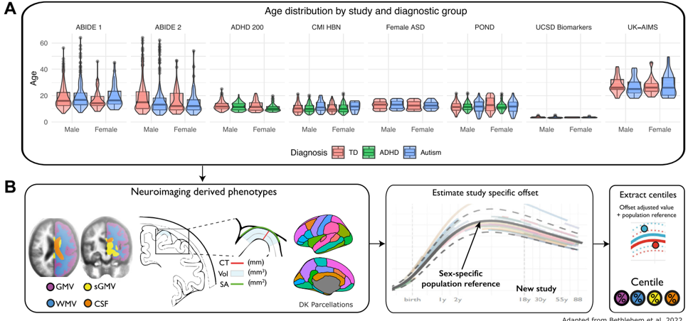
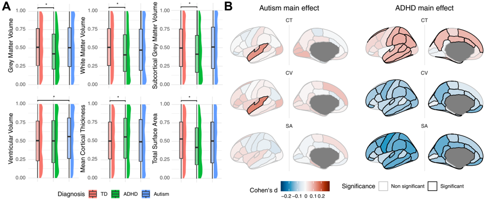
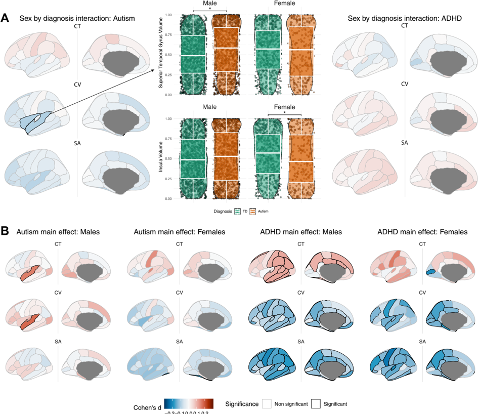
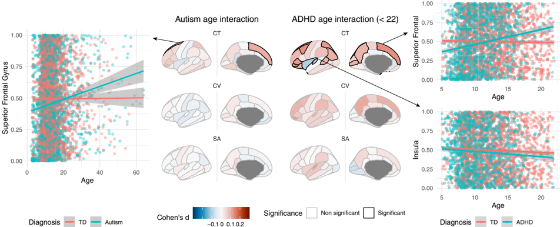
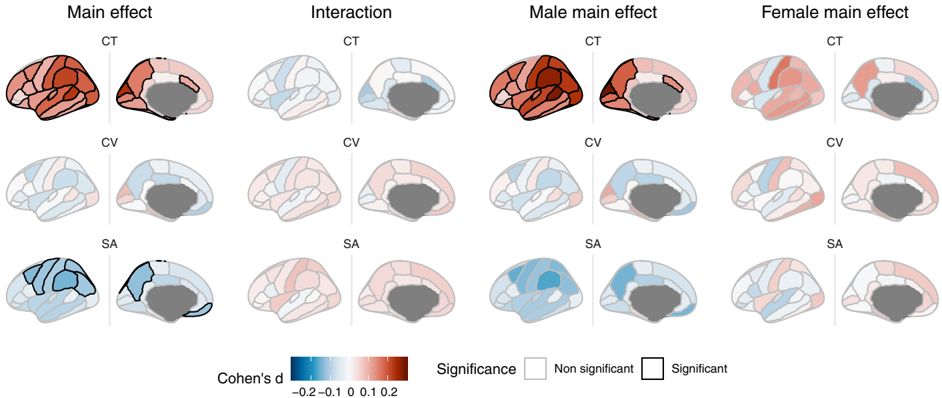
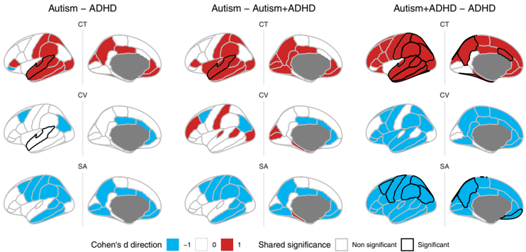

## Archival Report

## Brain-Charting Autism and Attention-De /uniFB01 cit/ Hyperactivity Disorder Reveals Distinct and Overlapping Neurobiology

Saashi A. Bedford, Meng-Chuan Lai, Michael V. Lombardo, Bhismadev Chakrabarti, Amber Ruigrok, John Suckling, Evdokia Anagnostou, Jason P. Lerch, Margot Taylor, Rob Nicolson, Georgiades Stelios, Jennifer Crosbie, Russell Schachar, Elizabeth Kelley, Jessica Jones, Paul D. Arnold, Eric Courchesne, Karen Pierce, Lisa T. Eyler, Kathleen Campbell, Cynthia Carter Barnes, Jakob Seidlitz, Aaron F. Alexander-Bloch, Edward T. Bullmore, Simon Baron-Cohen, and Richard A.I. Bethlehem, for the MRC AIMS Consortium and Lifespan Brain Chart Consortium

## ABSTRACT

BACKGROUND: Autism and attention-de /uniFB01 cit/hyperactivity disorder (ADHD) are heterogeneous neurodevelopmental conditions with complex underlying neurobiology that is still poorly understood. Despite overlapping presentation and sex-biased prevalence, autism and ADHD are rarely studied together and sex differences are often overlooked. Population modeling, often referred to as normative modeling, provides a uni /uniFB01 ed framework for studying agespeci /uniFB01 c and sex-speci /uniFB01 c divergences in brain development.

METHODS: Here, we used population modeling and a large, multisite neuroimaging dataset ( N = 4255 after quality control) to characterize cortical anatomy associated with autism and ADHD, benchmarked against models of average brain development based on a sample of more than 75,000 individuals. We also examined sex and age differences and relationship with autistic traits and explored the co-occurrence of autism and ADHD.

RESULTS: We observed robust neuroanatomical signatures of both autism and ADHD. Overall, autistic individuals showed greater cortical thickness and volume that was localized to the superior temporal cortex, whereas individuals with ADHD showed more global increases in cortical thickness but lower cortical volume and surface area across much of the cortex. The co-occurring autism 1 ADHD group showed a unique pattern of widespread increases in cortical thickness and certain decreases in surface area. We also found that sex modulated the neuroanatomy of autism but not ADHD, and there was an age-by-diagnosis interaction for ADHD only.

CONCLUSIONS: These results indicate distinct cortical differences in autism and ADHD that are differentially affected by age and sex as well as potentially unique patterns related to their co-occurrence.

https://doi.org/10.1016/j.biopsych.2024.07.024

Neurodevelopmental conditions such as autism and attentionde /uniFB01 cit/hyperactivity disorder (ADHD) are the products of altered neurodevelopmental trajectories (1), but their speci /uniFB01 c neurobiological underpinnings remain poorly understood. Both display signi /uniFB01 cant variability in trajectory, associated traits, and neurobiology (2 -8), which can hamper efforts to better understand these conditions. Sex and gender modulations of presentation, prevalence, and neuroanatomy (9 -15) and clinical and etiological overlap (16 -19) add complexity. Importantly, most studies have been based on male-dominant samples and may not be representative (15).

One of the most commonly reported /uniFB01 ndings is increased total brain volume in young autistic children (20 -22), although evidence suggests that this may only hold true for a subset of autistic children (23 -25) and for boys (26,27). Increased cortical thickness (CT) has often been associated with autism (28 -31), although reductions have been reported (32,33), as well as alterations in cortical surface area (SA) and volume (34 -36). Alterations, including both increases and decreases, have been reported in the superior temporal gyrus (STG), inferior and prefrontal cortex, sensory and motor regions (29 -38), cerebellum, and subcortex (39 -42) and seem to be moderated by age, sex, and co-occurring conditions or traits (31,43 -48). Complementary work has suggested multiple subgroups with distinct patterns of neuroanatomical alterations and clinical characteristics (40,48 -50). Sex differences in particular have been reported on multiple cortical measures and associations (31,44,51 -57).

Recent meta-analyses have highlighted a similar lack of convergent /uniFB01 ndings in ADHD (58,59). Reduced total brain

## SEE COMMENTARY ON PAGE 422

volume, gray matter volume (GMV), and cortical SA have been reported consistently (59 -65). However, while earlier studies reported decreases in CT (66 -70), more recent, larger studies have found no or very minimal differences (60 -64,71 -73). Cortical alterations have most commonly been reported in prefrontal and orbitofrontal, parietal, anterior cingulate, and occipital cortices (59,71). Volumetric reductions of subcortical structures and the cerebellum have also been reported (59,65,74), in particular the basal ganglia (75,76), likely related to atypicality in the frontostriatal network (77 -79). Again, differences are highly dependent on age, sex, and co-occurring conditions (66,69,80 -82).

The few studies that have examined structural and functional differences in autism and ADHD together have reported that they are largely distinct, with some overlapping, alterations (83 -92). A recent review (93) highlighted the challenges of comparing these groups, including limited sample sizes, heterogeneity, often arbitrary clinical distinctions, and overlap in presentation. Even fewer studies have speci /uniFB01 cally examined the co-occurrence of autism and ADHD, with both similarities and differences being observed compared with individuals with only one diagnosis (47,88,94) and evidence that an ADHD diagnosis modulates the effect of autism on neuroanatomy (90).

While this variability in the literature is likely due in part to differences in methodology and sample size, another signi /uniFB01 -cant contributor is the heterogeneity within and overlap between the conditions. To identify average patterns of alterations, large datasets are needed along with techniques to harmonize multisite data. Critically, these alterations must be contextualized in light of typical brain development given the neurodevelopmental nature of autism and ADHD (95 -97).

Population modeling, often referred to as normative modeling, has proven effective for characterizing age-dependent variation in brain development (98,99) and has recently been employed in studying autism and ADHD (48,54,89,100). Population modeling provides a framework for studying diverse conditions in reference to a common baseline, which allows us to better quantify individual differences and address heterogeneity and multisite datasets. Population modeling also provides a potential route toward clinical and translational applications of neuroimaging (101). Similar to the use of pediatric growth charts, by characterizing typical brain development, we can identify individually speci /uniFB01 c alterations from these trajectories that may be associated with neurodevelopmental conditions even before associated traits manifest clinically.

Here, we leveraged models of average brain development previously characterized by our group (98) to quantify alterations related to autism and ADHD. To our knowledge, this is the /uniFB01 rst study to use population modeling to investigate gray matter alterations related to these conditions in comparison to a common reference sample. We examined sources of variability related to sex, age, and measures of autistic and ADHD traits. Finally, we examined whether a subset of individuals with cooccurring autism and ADHD presented with distinct alterations.

## METHODS AND MATERIALS

## Sample and Datasets

T1-weighted scans were combined from 49 sites across 7 datasets, including the ABIDE (Autism Brain Imaging Data

Exchange) (102,103), the POND (Province of Ontario Neurodevelopmental) Network, the HBN (Healthy Brain Network) at the Child Mind Institute (104), the ADHD200 Consortium, the Multimodal Developmental Neurogenetics of Females with ASD dataset from the National Institute of Mental Health Data Archive, the UK MRC-AIMS (Medical Research Council Autism Imaging Multi-centre Study), and the University of California San Diego Biomarkers of Autism study. The /uniFB01 nal dataset after quality control (QC) included 4255 individuals (1869 typically developing control participants [687 female, 1182 male], 987 individuals with ADHD [270 female, 717 male], and 1399 autistic individuals [288 female, 1111 male], ages 2 -64 years [mean 14.0, median 12.4]) (Figure 1). For details of each dataset, demographics before and after QC, and group differences, see Supplemental Methods Section 1. It is important to note the distinction between biological sex and gender identity, both of which may in /uniFB02 uence presentation (12). Here, we refer to sex assigned at birth, but we acknowledge the overlap with and in /uniFB02 uence of gender socialization and the lack of data available to examine gender identity effects. Individuals with magnetic resonance imaging data and a primary diagnosis of autism or ADHD or no diagnosis were included. Individuals were initially included in the group of their primary diagnosis. A subset of individuals with documented cooccurring autism and ADHD were examined in further analyses.

Ethical approval and informed consent were obtained for each primary study. The Cambridge Psychology Research Ethics Committee (PRE.2020.104) deemed that secondary analysis of deidenti /uniFB01 ed data did not require ethical oversight.

## Data Processing

FreeSurfer and Cortical Parcellations. T1 images from each dataset were processed using FreeSurfer, version 6.0.1 (105). Regional estimates of each cortical measure were extracted based on the Desikan-Killiany atlas (106). For computational ef /uniFB01 ciency and because BrainChart models for separate hemispheres were not available at the time of analysis, measures were averaged across hemispheres for each parcellation.

Quality Control. All scans underwent manual QC of raw image and FreeSurfer surface reconstructions using our FSQC tool (107), which allows for the evaluation of both surface reconstruction and raw scan quality, including motion artifacts (108). A cutoff of 2.5 was used for FSQC (107). Because even small variations in quality can bias downstream analyses (108,109), we also included the FreeSurfer-derived Euler number (110) as a covariate in all analyses.

## Generation of Centile Scores Using Generalized Ad-

ditive Models of Location Scale and Shape. Our previous work (98) generated reference models using generalized additive models of location scale and shape to map neuroanatomical developmental trajectories across the life span, using a sample of 75,241 TD individuals, for total GMV, subcortical GMV (sGMV), white matter volume (WMV), ventricular volume, total SA, mean CT, regional CT, regional cortical volume (CV), and regional SA, while accounting for

Figure 1. Study demographics and methods overview. (A) Box and violin plots representing the age distribution of each study by diagnostic group and sex. (B) Methods overview. Global cortical and subcortical gray matter volume (sGMV), white matter volume (WMV), and ventricular cerebrospinal /uniFB02 uid (CSF) volume and regional cortical thickness (CT), volume (Vol), and surface area (SA) based on the Desikan-Killiany (DK) parcellations were estimated for each participant. Sex-speci /uniFB01 c life span developmental trajectories for each neuroanatomical measure were estimated using generalized additive models of location scale and shape (GAMLSS) for a sample of 75,241 typically developing (TD) individuals, accounting for site- and scanner-speci /uniFB01 c variables (98). Out-of-sample estimates for the study sample used here were generated based on these reference models, resulting in a (per)centile score for each measure of each participant, indicating where they fall within the sample range (0 -1). ABIDE, Autism Brain Imaging Data Exchange; ADHD, attention-de /uniFB01 cit/hyperactivity disorder; CMI HBN, Child Mind Institute -Healthy Brain Network; POND, Province of Ontario Neurodevelopmental; UCSD, University of California San Diego; UK-AIMS, UK Medical Research Council Autism Imaging Multi-centre Study.

effects of age, sex, and site/scanner. Models for subcortical structures and the cerebellum were not available at the time of analysis. Out-of-sample centile scores for our study sample were generated based on these reference models using Brent ' s maximum likelihood estimation [Supplemental Methods Section 2 (98)]. Centile scores quantify variation in brain development and range from 0 to 1, with 0.5 representing the average of the reference sample.

ComBat and Accounting for Site Variability. Generalized additive models of location scale and shape has been shown to adequately account for batch effects related to differences between siteand scanner-speci /uniFB01 c variables (98). However, we previously (98) noted the relatively lower stability of the out-of-sample models for n , 100. Due to the smaller sample sizes of some sites in our dataset and higher variability in the clinical samples, we /uniFB01 rst harmonized our data using ComBat (111), consistent with previous work (112). ComBat was applied to the entire dataset across all global and regional measures, with each site treated as a batch and with covariates of age, sex, and diagnosis to preserve related biological variation. ComBat-harmonized data were used as inputs to the out-of-sample maximum likelihood estimation to generate centile scores. We also conducted sensitivity analyses on non -ComBat-harmonized centiles and compared in-sample and out-of-sample centiles (Supplemental Methods Sections 2 and 3).

## Statistical Analysis

Group Differences and Sex Modulation Effects. Separate multiple linear regressions were used to examine diagnostic group differences in centile scores for all global volumes and regional measures. Sex-by-diagnosis interactions were examined, and given previous evidence of sexspeci /uniFB01 c neurobiological correlates in autism and ADHD (31,40,52,66,82,113 -115), a priori sex-strati /uniFB01 ed analyses were also used to examine diagnostic differences in males and females separately and to compare sex-speci /uniFB01 c pro /uniFB01 les of casecontrol differences. We assessed the similarity of sex-speci /uniFB01 c effect size maps by calculating Spearman correlations and using spin permutation testing to assess signi /uniFB01 cance (Supplemental Methods Section 4).

All analyses included Euler number as a covariate, as well as age, to account for potential systematic age deviations in clinical groups. Multiple comparisons were controlled for using the false discovery rate correction (116), separately for each analysis and cortical measure. Cohen ' s d effect sizes were calculated using the ' t\_to\_d ' function in the ' effectsize ' package in R (117).

We also examined the amount of regional overlap in participants in each group with the greatest divergences from the average centile score [as in (118)]. Other sensitivity analyses included controlling for global brain measures, using different QC methods, analysis of equal sex-matched subsamples, and examining differences in the level of multimodality of the

distributions between groups, potentially suggesting the existence of subgroups and investigating dimensional associations between cortical measures and autistic and ADHD traits (Supplemental Methods Sections 5 -9).

Age Modulation Effects. An age-by-diagnosis interaction was conducted for global and regional measures to assess age-dependent diagnostic differences. Due to the narrower age range of the ADHD sample (5 -21 years), for ADHD, we only included typically developing individuals in the same age range, supported by a sensitivity analysis with the full sample (Supplemental Methods Section 11).

Co-occurring Autism and ADHD. We conducted an exploratory analysis to examine whether individuals with cooccurring autism and ADHD had unique neuroanatomical pro /uniFB01 les. We compared a subgroup of 203 individuals with recorded clinical diagnoses of both conditions (autism 1 ADHD) to the control group and examined interactions with sex and sex-speci /uniFB01 c effects. We also compared the correlation [using spin tests (119)] and overlap of brain maps between each pair of diagnostic groups (Supplemental Methods Section 10.2). Data on secondary diagnosis were not available for all datasets and can be unreliable. While secondary diagnoses at some sites were con /uniFB01 rmed by clinician consensus [e.g., Healthy Brain Network (104)], they were community based at other sites. There are likely individuals missed in this analysis; thus, this analysis was exploratory, and we attempted to replicate it in a subset of autistic individuals who also met the clinical cutoff criteria on a measure of ADHD traits ( n = 118) (see

Supplemental Methods Section 10.2 for sensitivity analyses and demographics).

## RESULTS

## Differences in Global Brain Measures

Impacted global brain features were largely distinct in autism and ADHD. Autistic individuals had signi /uniFB01 cantly greater ventricular volume centiles than control participants (Figure 2). Individuals with ADHD had signi /uniFB01 cantly lower total cortical and subcortical GMV, total WMV, and total cortical SA centile scores overall but greater mean CT centiles than control participants.

For autism, we observed trend-level signi /uniFB01 cant interactions for total sGMV and ventricular volume (neither survived false discovery rate correction); autistic males had greater sGMV and ventricular volume than male control participants, but females showed no difference. There were no signi /uniFB01 cant diagnosis-by-sex interactions for ADHD. There was a trend toward a signi /uniFB01 cant interaction between autism diagnosis and age for total WMV, sGMV, and SA and for sGMV for ADHD, but none survived false discovery rate correction (Table 1).

## Regional Differences

Main Effects. Signi /uniFB01 cant group differences in regional centiles were much less widespread in autism than in ADHD (Figure 2). In autistic individuals, CT and CV, but not SA, centiles were increased in the STG ( d = 0.13 to 0.15) only. Individuals with ADHD had signi /uniFB01 cantly lower CV and SA centiles across most cortical regions ( d = 2 0.07 to 2 0.18) but

Figure 2. Case-control differences in global and regional centile scores of structural magnetic resonance imaging metrics. (A) Box and raincloud plots showing group differences in global neuroanatomical measures. Raincloud plots show the density distribution of centiles per group. Autistic individuals had signi /uniFB01 cantly larger ventricles than typically developing (TD) individuals, but no differences were observed on any other measures. Individuals with attentionde /uniFB01 cit/hyperactivity disorder (ADHD) had signi /uniFB01 cantly lower cortical gray, white, and subcortical gray matter volume and total surface area (SA) centiles than control participants but greater mean cortical thickness (CT) centiles. (B) Regional group differences. Brain maps show Cohen ' s d effect sizes, with signi /uniFB01 cant regions (passing 5% false discovery rate [FDR] applied to each analysis and cortical measure separately) outlined in black. Red represents positive effect sizes (autism or ADHD . control group), and blue represents negative effect sizes (autism or ADHD , control group). Overall, autistic individuals had signi /uniFB01 cantly greater cortical volume (CV) and CT in the superior temporal gyrus, whereas individuals with ADHD had signi /uniFB01 cant and widespread decreases in CV and SA and increases in CT. * p FDR , .05.

Table 1. Analysis of Global Brain Measures for Autism and ADHD Main Effects and Interaction Effects

|                     | Autism              | Autism    | Autism      | ADHD      | ADHD      | ADHD        |
|---------------------|---------------------|-----------|-------------|-----------|-----------|-------------|
|                     | p Value             | q Value   | Cohen ' s d | p Value   | q Value   | Cohen ' s d |
| Main Effects        |                     |           |             |           |           |             |
| GMV                 | .329                | .395      | 0.030       | , .0001 a | , .0001 a | 2 0.139     |
| WMV                 | .216                | .395      | 2 0.038     | , .0001 a | , .0001 a | 2 0.156     |
| sGMV                | .044                | .131      | 0.062       | , .0001 a | , .0001 a | 2 0.132     |
| Ventricles          | , .0001 a           | , .0001 a | 0.150       | .412      | .412      | 0.025       |
| Total SA            | .283                | .395      | 2 0.033     | , .0001 a | , .0001 a | 2 0.178     |
| Mean CT             | .558                | .558      | 0.018       | .004 b    | .005 b    | 0.089       |
| Interaction Effects | Interaction Effects |           |             |           |           |             |
| GMV                 | .057                | .113      | 2 0.059     | .376      | .818      | 0.027       |
| WMV                 | .228                | .274      | 2 0.037     | .514      | .818      | 0.020       |
| sGMV                | .009 b              | .054      | 2 0.080     | .961      | .961      | 0.002       |
| Ventricles          | .020 c              | .060      | 2 0.072     | .874      | .961      | 2 0.005     |
| Total SA            | .096                | .144      | 2 0.051     | .200      | .818      | 0.039       |
| Mean CT             | .927                | .927      | 2 0.003     | .546      | .818      | 2 0.019     |

q Values are false discovery rate -corrected p values.

ADHD, attention-de /uniFB01 cit/hyperactivity disorder; CT, cortical thickness; SA, surface area; sGMV, subcortical gray matter volume; WMV, white matter volume.

a p , .001.

b p , .01.

c p , .05.

higher CT centiles ( d = 0.09 to 0.10). Effect sizes were relatively small. Results using in-sample and non-ComBat harmonized data were highly similar. Autistic individuals showed the highest degree of both negative and positive extreme centiles (Supplemental Results Sections 1 and 2). Controlling for global measures drastically altered effects for ADHD but not for autism, highlighting that the ADHD results were driven largely by global effects, but results were more localized for autism. Increases in CT were particularly attenuated, and decreases in CV and SA disappeared, with some increases being observed instead. Different QC methods had very little impact (Supplemental Results Section 4).

## Interaction With Sex and Sex-Strati /uniFB01 ed Results.

A sex-by-diagnosis interaction was observed for autism, but not ADHD, and sex-speci /uniFB01 c maps were far more similar for ADHD. For autism, there was a signi /uniFB01 cant interaction for CV in the STG, insula, and temporal pole (Figure 3A). Importantly, the signi /uniFB01 cant diagnostic main effect on STG CV must be interpreted in light of this interaction effect and seems to apply to autistic males only.

Compared with same-sex control participants, autistic males had signi /uniFB01 cantly greater STG CV and CT centiles ( d = 0.15 to 0.18), whereas autistic females had signi /uniFB01 cantly lower cortical SA centiles in the fusiform gyrus ( d = 2 0.18). Subthreshold effect size maps showed similar spatial patterning in males and females for CT (rho = 0.5, p spin = .024), but they were quite different for CV (rho = 0.24, p spin = .13) and SA (rho = 2 0.06, p spin = .40) (Figure 3B; Supplemental Results Section 5). Males with ADHD had signi /uniFB01 cantly lower CV and SA ( d = 2 0.08 to 2 0.20) and higher CT centiles ( d = 0.10 to 0.11) across much of the cortex than male control participants. Unsurprisingly, given the lack of a signi /uniFB01 cant interaction, females with ADHD had very similar patterns of cortical alterations, although with fewer signi /uniFB01 cant regions (CV and SA: d = 2 0.13 to 2 0.22; CT: d = 0.18). Male and female ADHD subthreshold effect size maps were visually similar, with high spatial overlap for all measures (rho = 0.34 -0.59; p spin = .0005 -.029).

Effect sizes and directions remained largely consistent in the sex-matched subsample analyses (Supplemental Results Section 6). Multimodal distributions of centiles were observed across most of the cortex for the autistic group but not for the ADHD and the control group (Supplemental Results Section 7). Dimensional analyses of autistic and ADHD traits revealed limited signi /uniFB01 cant but weak associations between some clinical and cortical measures (Supplemental Results Section 8).

Interactions With Age. Limited age-by-diagnosis interactions were observed for autism and ADHD. A signi /uniFB01 cant age-by-diagnosis interaction for autism was observed only in the superior frontal gyrus for CT centiles. There was a small positive signi /uniFB01 cant correlation between age and CT centile for the autism group only (partial r = 0.11).

For ADHD, there was a signi /uniFB01 cant interaction for CT centiles primarily in frontal and parietal regions, whereas there was a signi /uniFB01 cant positive correlation with age in the ADHD group (partial r = 0.07 to 0.14) but minimal or no correlation in the control group. In the insula, there was a signi /uniFB01 cant negative correlation in the ADHD group only ( r = 2 0.14 to 2 0.15) (Figure 4). The ADHD analysis in the whole control sample yielded largely similar results (Supplemental Results Section 9).

Co-occurring Autism and ADHD. The autism 1 ADHD group showed a distinct pattern of alterations, with some overlap, compared with individuals with only one diagnosis (Figure 5), with widespread signi /uniFB01 cant increases in CT centiles compared with control participants ( d = 0.10 to 0.24) and decreased SA centiles in frontal and parietal regions ( d = 2 0.11 to 2 0.14). There was no signi /uniFB01 cant interaction with sex. Effects for males resembled those observed in the whole group, but there were no signi /uniFB01 cant differences in females (Figure 5A). Spin tests and overlap analysis revealed the greatest similarity between the autism 1 ADHD and ADHD-only groups, with minimal overlap between the autism and ADHD-only groups (Figure 5B; Supplemental Results Section 10.2). CT and SA both showed widespread homology in effect size direction across all groups, although with little overlap of signi /uniFB01 cance, whereas CV primarily showed overlap between autism 1 ADHD and ADHD only. The STG overlapped in signi /uniFB01 cance between autism and ADHD, but in opposite directions.

Most results were no longer signi /uniFB01 cant after controlling for global measures. The replication analysis based on the ADHD trait cutoff yielded similar results, although with slightly fewer signi /uniFB01 cant regions, and, notably, the male and female autism 1 ADHD effect sizes were more similar between sexes (Supplemental Results Section 10).

## DISCUSSION

Using an aggregated dataset and existing models of brain development, we observed largely distinct, robust neuroanatomical signatures of autism and ADHD, with some overlap. Both conditions presented with greater CT, localized to the

-0.2-0.10.0 0.1 0.2

Figure 3. The effect of interactions between sex and diagnostic group on centile scores of regional magnetic resonance imaging metrics. (A) Brain maps showing effect sizes and signi /uniFB01 cance of interaction per brain region, and box and violin plots showing comparison of values separately by group for 2 signi /uniFB01 cant regions. (B) Sex-strati /uniFB01 ed regional association with diagnosis. All maps show Cohen ' s d effect sizes, with signi /uniFB01 cant regions (passing 5% false discovery rate [FDR] correction) outlined in black. Red represents positive effect sizes (autism or attention-de /uniFB01 cit/hyperactivity disorder [ADHD] . control group), and blue represents negative effect sizes (autism or ADHD , control group). * p FDR , .05. CT, cortical thickness; CV, cortical volume; SA, surface area; TD, typically developing.

STG in autism but widespread in ADHD. In contrast, while autistic individuals also showed STG increases in CV, ADHD was associated with globally decreased CV and SA. This work con/uniFB01 rms and extends previous large-scale and consortium efforts to characterize these conditions (31,54,74,85,90,120), by also identifying sex-speci /uniFB01 c alterations in autism and distinct alterations in individuals with co-occurring diagnoses in this large, carefully and manually QCed sample. Finally, we found evidence for age-speci /uniFB01 c effects that were overlapping but more widespread in ADHD and limited signi /uniFB01 cant associations between neuroanatomy and measures of autistic and ADHD traits.

Previous population modeling studies on a single diagnostic cohort have mainly observed divergence from typical brain development in individualized patterns (45,54,121) or multiple subgroups with distinct patterns of divergence and clinical pro /uniFB01 les (48,50) rather than group differences. We note that our sample size is considerably larger than that of previous studies, so while we also observed individualized patterns of centile scores, we may have had more power to detect average group differences that are consistent across datasets. However, it will be interesting to see in future work whether a population modeling approach is more adept at detecting data-driven subtypes and better parsing the complexities of the underlying neuroanatomy.

We did not observe the greater total GMV or SA in autistic individuals that have been reported previously

Figure 4. Regional interactions between diagnosis and age. Brain maps show interaction between effect sizes and regional signi /uniFB01 cance, and scatter plots show the relationship between cortical thickness (CT) and age in the autism/attention-de /uniFB01 cit/hyperactivity disorder (ADHD) and typically developing (TD) groups in regions where a signi /uniFB01 cant interaction was observed. For the superior frontal gyrus age-by-diagnosis interaction for autism, r autism = 0.11 ( p , .001); r TD = 2 0.008 ( p = .8). For the age-by-diagnosis interaction for ADHD, for the superior frontal gyrus r ADHD = 0.09 ( p = .008), r TD = 2 0.04 ( p = .9); for the insula r ADHD = 2 0.14 ( p , .001); r TD = 2 0.05 ( p = .48). CV, cortical volume; SA, surface area.

(20 -22,35,122,123), although we did not explicitly test the early age range that was the focus of most of these studies. However, we did replicate /uniFB01 ndings of enlarged ventricular volume related to autism (120,122 -127), and our /uniFB01 ndings of signi /uniFB01 -cantly greater localized regional CT and CV are at least partially consistent with the results of recent large-sample studies (30,31,120,128). Increases in the STG, which is known to be involved in cognitive functions often affected in autistic individuals, have been commonly reported in autism (25,31,54,128 -142). We con /uniFB01 rmed previous reports of global GMV, WMV, and SA reductions in ADHD, as well as widespread regional CV and SA decreases (59 -63,65), which seem to be largely a global effect. We also con /uniFB01 rmed recent reports of greater CT, which contradict some earlier studies of ADHD (60 -64,72,73). It will also be important in future work to extend these investigations to the subcortex and cerebellum (74,143 -145).

It is interesting to note the divergent direction of diagnostic effects and cortical measures in autism and ADHD. CT, CV, and SA are related to distinct neurodevelopmental processes and genetic underpinnings (25,146 -154), with CV and SA being more closely related than to CT (155). Thus, these different measures could point to distinct underlying neurobiological mechanisms or processes related to the emergence of each condition.

The overall main effect of autism seemed to be driven by males, who comprise the majority of the sample, with distinct alterations observed for females. Critically, this suggests that inferences drawn from mixed-sex samples may not be applicable to autistic females, although this was not true for ADHD [as was also observed in (156)]. Autistic females differed from neurotypical females only in fusiform gyrus SA, a region in which alterations in asymmetry in autistic females have also been reported (157). In contrast, we did not observe evidence for sex modulation in ADHD. An unanswered question for future research is to what extent sex effects on the cortical measures and clinical presentations are due to underlying differences in sex-related biology (e.g., the so-called female protective effect and neuro-endocrine-immune theories) rather than to gender-related socialization, identity, or diagnostic bias effects (158). For example, in the autism 1 ADHD analysis based on Strengths and Weaknesses of ADHD Symptoms and Normal Behavior Rating Scale ADHD cutoffs (rather than diagnosis), the male and female effect size maps are more similar. It is possible that this analysis was less affected by sex biases in clinical diagnosis, leading to higher similarity between the sexes.

Signi /uniFB01 cant associations between neuroanatomical alterations and autistic traits have also often been reported previously (45,54,159), in contrast to the lack of signi /uniFB01 cant association observed here with the Autism Diagnostic Observation Schedule calibrated severity score despite the large sample size. A signi /uniFB01 cant caveat here is that due to the multisite nature of the data, these analyses were conducted only on a subset of participants, which may partially explain the lack of robust associations in the current study.

The absence of an age-by-diagnosis interaction across global measures and most cortical regions in autism offers limited support for the hypothesis of early brain overgrowth and normalization with age (122,160). However, longitudinal data are needed to properly investigate these relationships. The regional age interaction for ADHD suggests that the nature of these deviations in ADHD is not static across development, at least in some cortical measures.

Finally, the autism 1 ADHD group seemed to be a somewhat distinct subgroup, resembling ADHD more than autism, but with some overlapping features. It may be that these differences in the autism 1 ADHD group represent a synthesized

A

## Co-occurring autism and ADHD

B

## Shared effect size direction

Figure 5. Cortical alterations (compared with control group) in individuals with co-occurring autism and attention-de /uniFB01 cit/hyperactivity disorder (ADHD) and overlap of effect size signi /uniFB01 cance and direction. (A) Main effects of diagnosis compared with control group; interaction with sex; main effects in males, and main effects in females. All maps show Cohen ' s d effect sizes, with signi /uniFB01 cant regions (passing 5% false discovery rate correction) outlined in black. Red represents positive effect sizes (autism 1 ADHD . control group), and blue represents negative effect sizes (autism 1 ADHD , control group). (B) Brain maps showing the pairwise overlap of effect size direction and signi /uniFB01 cance for the autism, ADHD, and autism 1 ADHD groups. Regions that had a positive effect size in both groups ' analysis (in comparison to control group) are shown in red; regions that had a negative effect size in both groups are shown in blue. Regions in white were in different directions in different groups. Regions that were signi /uniFB01 cantly different in both groups from the control group are outlined in black. Note that the superior temporal gyrus showed a signi /uniFB01 cant effect in both autism and ADHD for cortical volume (CV), but in opposite directions. CT, cortical thickness; SA, surface area.

phenotype, but we caution against a simpli /uniFB01 ed interpretation. Previous studies have not identi /uniFB01 ed signi /uniFB01 cant differences in CT between an autism 1 ADHD group and control group; however, the sample sizes have been small (161,162). Notably, secondary diagnoses were not available for all datasets, and even when available, some are likely missed based on known rates of co-occurrence (19,163). For this exploratory analysis, we focused on individuals who had clearly documented secondary diagnoses. Future research could be improved if cooccurring diagnoses and dimensional clinical data were reported consistently across studies. However, these preliminary /uniFB01 ndings provide an interesting direction for future research.

Our results should be interpreted in light of some limitations. First, as is increasingly common, the data come from multiple

sources, with different scanners, protocols, recruitment procedures, and demographic characteristics. We have attempted to address this variability as rigorously as possible: all data were analyzed consistently in house, and data were harmonized in a 2-step process. While it is impossible to fully eliminate site effects, we believe that the size of this dataset and, in particular, the large female sample and availability of both autism and ADHD data, mitigate these issues. However, we note that the effect sizes observed in most analyses were very small and thus may have limited clinical or practical signi /uniFB01 -cance. Additionally, out-of-sample centiles were generated for our dataset, despite some of these being included in the original BrainCharts models, to properly account for site differences. Sensitivity analyses demonstrate the stability of the models; however, we caution that doing so in smaller sites could lead to overestimation of effects. Second, due to the availability of the models, cortical measures were averaged across hemispheres. Both autism and ADHD have been associated with atypical asymmetry (157,164,165); thus, these results should be interpreted in light of the potential limitation that they are based on a symmetrical (unihemispheric average) model of the cerebral hemispheres. Third, the lack of consistent phenotypic and diagnostic information led to limited data in the analyses of clinical measures and co-occurring diagnoses. Partially for this reason, we also did not investigate relationships with IQ, although we note that controlling for IQ may also remove biological variation or confound results (166). Fourth, despite its large size, the representativeness of the sample is still suboptimal. There is still a large imbalance in the number of diagnosed males and females, a substantial lack of participants with lower IQ and/or high support needs, and insuf /uniFB01 cient diversity across racial-ethnic groups. Finally, the lack of longitudinal data limits our ability to draw conclusions about developmental trajectories over time and should be a priority of future studies.

## Conclusions

This study identi /uniFB01 ed distinct pro /uniFB01 les of neuroanatomical divergence associated with autism and ADHD that were differentially modulated by age and sex. These observations offer valuable insights into associated developmental processes and could potentially serve as indicators of biomarkers. We also identi /uniFB01 ed potential differential impacts of co-occurring diagnoses of autism and ADHD, but we note that data on secondary diagnosis are not always reliable. Future work should further investigate individual variability and the existence of subgroups within and across diagnoses.

## ACKNOWLEDGMENTS AND DISCLOSURES

This work was supported by the Trinity College Coutts-Trotter Studentship and the Canadian Centennial Scholarship Foundation (to SAB); the Wellcome Trust (Grant No. 214322\Z\18\Z [to SB-C]); the Autism Centre of Excellence, the Simons Foundation Autism Research Initiative (SFARI), the Templeton World Charitable Foundation, and the Medical Research Council (to SB-C); the National Institute for Health and Care Research (NIHR) Cambridge Biomedical Research Centre and an NIHR Senior Investigator Award (to ETB); the Alberta Innovates Translational Health Chair in Child and Youth Mental Health, the Canadian Institutes of Health Research, Canadian Foundation for Innovation, and the Alberta Children ' s Hospital Foundation, and Biohaven Pharmaceuticals (to PDA); the Academic Scholars Award from the Department of Psychiatry at the University of Toronto, the Discovery Fund from the Centre for Addiction and Mental Health, and the Canadian Institutes of Health Research Sex and Gender Science Chair (Grant No. GSB 171373 [to M-CL]); the Ontario Brain Institute to (EA and JPL); National Institute on Deafness and Other Communication Disorders (Grant No. R01DC016385 [to EC and KP]); and National Institute of Mental Health (NIMH) (Grant Nos. R01MH104446 [to KP] and R01MH133843 [to AFA-B]).

For the purpose of open access, the author has applied a CC BY public copyright license to any Author Accepted Manuscript version that arises from this submission. The work that led to this publication received funding from the Innovative Medicines Initiative 2 Joint Undertaking (Grant No. 777394) for the project AIMS-2-TRIALS. This joint undertaking receives support from the European Union ' s Horizon 2020 research and innovation program and European Federation of Pharmaceutical Industries and Associations and AUTISM SPEAKS, Autistica, and SFARI. All research at the Department of Psychiatry at the University of Cambridge was supported by the NIHR Cambridge Biomedical Research Centre (Grant No. NIHR203312) and the NIHR Applied Research Collaboration East of England. The funders had no role in the design of the study; the collection, analysis, or interpretation of data; the writing of the manuscript; or the decision to publish the results. Any views expressed are those of the author(s) and not necessarily those of the funders, IHU-JU2, the NIHR, or the Department of Health and Social Care.

The Medical Research Council Autism Imaging Multicentre Study Consortium is a UK collaboration between the Institute of Psychiatry, Psychology and Neuroscience (IoPPN) at King ' s College, London; the Autism Research Centre, University of Cambridge; and the Autism Research Group, University of Oxford. Members of the MRC AIMS Consortium include Anthony J. Bailey (Oxford), Simon Baron-Cohen (Cambridge), Patrick F. Bolton (IoPPN), Edward T. Bullmore (Cambridge), Sarah Carrington (Oxford), Marco Catani (IoPPN), Bhismadev Chakrabarti (Cambridge), Michael C. Craig (IoPPN), Eileen M. Daly (IoPPN), Sean C.L. Deoni (IoPPN), Christine Ecker (IoPPN), Francesca Happé (IoPPN), Julian Henty (Cambridge), Peter Jezzard (Oxford), Patrick Johnston (IoPPN), Derek K. Jones (IoPPN), Meng-Chuan Lai (Cambridge), Michael V. Lombardo (Cambridge), Anya Madden (IoPPN), Diane Mullins (IoPPN), Clodagh M. Murphy (IoPPN), Declan G.M. Murphy (IoPPN), Greg Pasco (Cambridge), Amber N.V. Ruigrok (Cambridge), Susan A. Sadek (Cambridge), Debbie Spain (IoPPN), Rose Stewart (Oxford), John Suckling (Cambridge), Sally J. Wheelwright (Cambridge), and Steven C. Williams (IoPPN).

For members of the Lifespan Brain Chart Consortium, refer to https:// docs.google.com/spreadsheets/d/1D8YNDcnhwlv2WcUDhreq3fwrkfpfGiF p0OGFVO5d-es/edit?usp=sharing.

We are extremely grateful to all of the autistic individuals, individuals with ADHD, and their family members who participated in these studies.

ETB reports consultancy work for Boehringer Ingelheim, Sosei Heptares, SR One, and GlaxoSmithKline. ETB, RAIB, JS, and AFA-B are cofounders of Centile Bioscience. PDA receives research support from Biohaven Pharmaceuticals. M-CL has received editorial honorarium from SAGE Publications. RN reported receiving grants from Brain Canada, Hoffman La Roche, Otsuka Pharmaceuticals, and Maplight Therapeutics outside the submitted work. EA reported receiving grants from Roche and Anavex; receiving non /uniFB01 nancial support from AMO Pharma and CRA-Simons Foundation; and receiving personal fees from Roche, Impel, Ono, and Quadrant outside the submitted work. All other authors report no biomedical /uniFB01 nancial interests or potential con /uniFB02 icts of interest.

## ARTICLE INFORMATION

From the Autism Research Centre, Department of Psychiatry, University of Cambridge, Cambridge, United Kingdom (SAB, M-CL, BC, AR, SB-C, RAIB); Brain Mapping Unit, Department of Psychiatry, University of Cambridge, Cambridge, United Kingdom (SAB, JS, ETB, RAIB); Margaret and Wallace McCain Centre for Child, Youth &amp; Family Mental Health and Azrieli Adult Neurodevelopmental Centre, Campbell Family Mental Health Research Institute, Centre for Addiction and Mental Health, Toronto, Ontario, Canada (M-CL); Department of Psychiatry, The Hospital for Sick Children, Toronto, Ontario, Canada (M-CL); Department of Psychiatry, Temerty Faculty of Medicine, University of Toronto, Toronto, Ontario, Canada (M-CL, JC, RS); Department of Psychiatry, National Taiwan University Hospital and College

of Medicine, Taipei, Taiwan (M-CL); Laboratory for Autism and Neurodevelopmental Disorders, Center for Neuroscience and Cognitive Systems, Istituto Italiano di Tecnologia, Rovereto, Italy (MVL); Centre for Autism, School of Psychology and Clinical Language Sciences, University of Reading, Reading, United Kingdom (BC); Division of Psychology and Mental Health, School of Health Sciences, Faculty of Biology, Medicine and Health, University of Manchester, Manchester, Canada (AR); Bloorview Research Institute, Holland Bloorview Kids Rehabilitation Hospital, Toronto, Ontario, Canada (EA); Department of Pediatrics, Temerty Faculty of Medicine, University of Toronto, Toronto, Ontario, Canada (EA); Program in Neurosciences and Mental Health, Research Institute, Hospital for Sick Children, Toronto, Ontario, Canada (JPL, MT, JC, RS); Mouse Imaging Centre, Hospital for Sick Children, Toronto, Ontario, Canada (JPL); Wellcome Centre for Integrative Neuroimaging, FMRIB, Nuf /uniFB01 eld Department of Clinical Neurosciences, University of Oxford, Oxford, United Kingdom (JPL); Department of Diagnostic Imaging, Hospital for Sick Children, Toronto, Ontario, Canada (MT); Department of Psychiatry, University of Western Ontario, London, Ontario, Canada (RN); McMaster University, Hamilton, Ontario, Canada (GS); Genetics &amp; Genome Biology, The Hospital for Sick Children, Toronto, Ontario, Canada (JC, RS); Department of Psychology, Queen ' s University, Kingston, Ontario, Canada (EK, JJ); Centre for Neuroscience Studies, Queen ' s University, Kingston, Ontario, Canada (EK, JJ); Department of Psychiatry, Queen ' s University, Kingston, Ontario, Canada (EK, JJ); Mathison Centre for Mental Health Research &amp; Education, Hotchkiss Brain Institute, Cumming School of Medicine, University of Calgary, Calgary, Alberta, Canada (PDA); Departments of Psychiatry and Medical Genetics, Cumming School of Medicine, University of Calgary, Calgary, Alberta, Canada (PDA); Department of Neurosciences, University of California San Diego, La Jolla, California (EC, KP, KC, CCB); Department of Psychiatry, University of California San Diego, La Jolla, California (LTE); Department of Psychiatry, University of Pennsylvania, Philadelphia, Pennsylvania (JS, AFA-B); Department of Child and Adolescent Psychiatry and Behavioral Science, The Children ' s Hospital of Philadelphia, Philadelphia, Pennsylvania (JS, AFA-B); Lifespan Brain Institute, The Children ' s Hospital of Philadelphia and Penn Medicine, Philadelphia, Pennsylvania (JS, AFA-B); Cambridge Lifetime Autism Spectrum Service, Cambridgeshire and Peterborough NHS Foundation Trust, Cambridge, United Kingdom (SB-C); and the Department of Psychology, University of Cambridge, Cambridge, United Kingdom (RAIB).

Address correspondence to Saashi A. Bedford, M.Sc., at ajb349@cam. ac.uk.

Received Nov 16, 2023; revised May 30, 2024; accepted Jul 11, 2024. Supplementary material cited in this article is available online at https:// doi.org/10.1016/j.biopsych.2024.07.024.

## REFERENCES

1. Shaw P, Gogtay N, Rapoport J (2010): Childhood psychiatric disorders as anomalies in neurodevelopmental trajectories. Hum Brain Mapp 31:917 -925.
2. Luo Y, Weibman D, Halperin JM, Li X (2019): A review of heterogeneity in attention de /uniFB01 cit/hyperactivity disorder (ADHD). Front Hum Neurosci 13:42.
3. Masi A, DeMayo MM, Glozier N, Guastella AJ (2017): An overview of autism spectrum disorder, heterogeneity and treatment options. Neurosci Bull 33:183 -193.
4. Lai M-C, Lombardo MV, Baron-Cohen S (2014): Autism. Lancet 383:896 -910.
5. Ko /uniFB02 er MJ, Sarver DE, Spiegel JA, Day TN, Harmon SL, Wells EL (2017): Heterogeneity in ADHD: Neurocognitive predictors of peer, family, and academic functioning. Child Neuropsychol 23:733 -759.
6. Lenroot RK, Yeung PK (2013): Heterogeneity within autism spectrum disorders: What have we learned from neuroimaging studies? Front Hum Neurosci 7:733.
7. Karalunas SL, Nigg JT (2020): Heterogeneity and subtyping in attention-de /uniFB01 cit/hyperactivity disorder-considerations for emerging research using person-centered computational approaches. Biol Psychiatry 88:103 -110.
8. Ecker C (2017): The neuroanatomy of autism spectrum disorder: An overview of structural neuroimaging /uniFB01 ndings and their translatability to the clinical setting. Autism 21:18 -28.
9. Willcutt EG (2012): The prevalence of DSM-IV attention-de /uniFB01 cit/hyperactivity disorder: A meta-analytic review. Neurotherapeutics 9:490 -499.
10. Christensen DL, Braun KVN, Baio J, Bilder D, Charles J, Constantino JN, et al. (2018): Prevalence and characteristics of autism spectrum disorder among children aged 8 years -Autism and Developmental Disabilities Monitoring Network, 11 sites, United States, 2012. MMWR Surveill Summ 65:1 -23.
11. Loomes R, Hull L, Mandy WPL (2017): What is the male-to-female ratio in autism spectrum disorder? A systematic review and metaanalysis. J Am Acad Child Adolesc Psychiatry 56:466 -474.
12. Lai M-C, Lombardo MV, Auyeung B, Chakrabarti B, Baron-Cohen S (2015): Sex/gender differences and autism: Setting the scene for future research. J Am Acad Child Adolesc Psychiatry 54:11 -24.
13. Mandy W, Chilvers R, Chowdhury U, Salter G, Seigal A, Skuse D (2012): Sex differences in autism spectrum disorder: Evidence from a large sample of children and adolescents. J Autism Dev Disord 42:1304 -1313.
14. Rucklidge JJ (2010): Gender differences in attention-de /uniFB01 cit/ hyperactivity disorder. Psychiatr Clin North Am 33:357 -373.
15. Mo K, Sadoway T, Bonato S, Ameis SH, Anagnostou E, Lerch JP, et al. (2021): Sex/gender differences in the human autistic brains: A systematic review of 20 years of neuroimaging research. NeuroImage Clin 32:102811.
16. Ghirardi L, Brikell I, Kuja-Halkola R, Freitag CM, Franke B, Asherson P, et al. (2018): The familial co-aggregation of ASD and ADHD: A register-based cohort study. Mol Psychiatry 23:257 -262.
17. Miller M, Musser ED, Young GS, Olson B, Steiner RD, Nigg JT (2019): Sibling recurrence risk and cross-aggregation of attention-de /uniFB01 cit/ hyperactivity disorder and autism spectrum disorder. JAMA Pediatr 173:147 -152.
18. Leitner Y (2014): The co-occurrence of autism and attention de /uniFB01 cit hyperactivity disorder in children -What do we know? Front Hum Neurosci 8:268.
19. Hours C, Recasens C, Baleyte J-M (2022): ASD and ADHD comorbidity: What are we talking about? Front Psychiatry 13:837424.
20. Courchesne E, Carper R, Akshoomoff N (2003): Evidence of brain overgrowth in the /uniFB01 rst year of life in autism. JAMA 290:337 -344.
21. Hazlett HC, Poe MD, Gerig G, Styner M, Chappell C, Smith RG, et al. (2011): Early brain overgrowth in autism associated with an increase in cortical surface area before age 2 years. Arch Gen Psychiatry 68:467 -476.
22. Sacco R, Gabriele S, Persico AM (2015): Head circumference and brain size in autism spectrum disorder: A systematic review and meta-analysis. Psychiatry Res 234:239 -251.
23. Ohta H, Nordahl CW, Iosif AM, Lee A, Rogers S, Amaral DG (2016): Increased surface area, but not cortical thickness, in a subset of young boys with autism spectrum disorder. Autism Res 9:232 -248.
24. Amaral DG, Li D, Libero L, Solomon M, Van de Water J, Mastergeorge A, et al. (2017): In pursuit of neurophenotypes: The consequences of having autism and a big brain. Autism Res 10:711 -722.
25. Lombardo MV, Eyler L, Pramparo T, Gazestani VH, Hagler DJ Jr, Chen C-H, et al. (2021): Atypical genomic cortical patterning in autism with poor early language outcome. Sci Adv 7:eabh1663.
26. Nordahl CW, Lange N, Li DD, Barnett LA, Lee A, Buonocore MH, et al. (2011): Brain enlargement is associated with regression in preschoolage boys with autism spectrum disorders. Proc Natl Acad Sci U S A 108:20195 -20200.
27. Lee JK, Andrews DS, Ozonoff S, Solomon M, Rogers S, Amaral DG, Nordahl CW (2021): Longitudinal evaluation of cerebral growth across childhood in boys and girls with autism spectrum disorder. Biol Psychiatry 90:286 -294.
28. Hardan AY, Muddasani S, Vemulapalli M, Keshavan MS, Minshew NJ (2006): An MRI study of increased cortical thickness in autism. Am J Psychiatry 163:1290 -1292.
29. Hyde KL, Samson F, Evans AC, Mottron L (2010): Neuroanatomical differences in brain areas implicated in perceptual and other core features of autism revealed by cortical thickness analysis and voxelbased morphometry. Hum Brain Mapp 31:556 -566.

30. Khundrakpam BS, Lewis JD, Kostopoulos P, Carbonell F, Evans AC (2017): Cortical thickness abnormalities in autism spectrum disorders through late childhood, adolescence, and adulthood: A large-scale MRI study. Cereb Cortex 27:1721 -1731.
31. Bedford SA, Park MTM, Devenyi GA, Tullo S, Germann J, Patel R, et al. (2020): Large-scale analyses of the relationship between sex, age and intelligence quotient heterogeneity and cortical morphometry in autism spectrum disorder. Mol Psychiatry 25:614 -628.
32. Ecker C, Shahidiani A, Feng Y, Daly E, Murphy C, D ' Almeida V, et al. (2014): The effect of age, diagnosis, and their interaction on vertexbased measures of cortical thickness and surface area in autism spectrum disorder. J Neural Transm (Vienna) 121:1157 -1170.
33. Hadjikhani N, Joseph RM, Snyder J, Tager-Flusberg H (2006): Anatomical differences in the mirror neuron system and social cognition network in autism. Cereb Cortex 16:1276 -1282.
34. Mak-Fan KM, Taylor MJ, Roberts W, Lerch JP (2012): Measures of cortical grey matter structure and development in children with autism spectrum disorder. J Autism Dev Disord 42:419 -427.
35. Hazlett HC, Gu H, Munsell BC, Kim SH, Styner M, Wolff JJ, et al. (2017): Early brain development in infants at high risk for autism spectrum disorder. Nature 542:348 -351.
36. Yang DY-J, Beam D, Pelphrey KA, Abdullahi S, Jou RJ (2016): Cortical morphological markers in children with autism: A structural magnetic resonance imaging study of thickness, area, volume, and gyri /uniFB01 cation. Mol Autism 7:11.
37. Valk SL, Di Martino A, Milham MP, Bernhardt BC (2015): Multicenter mapping of structural network alterations in autism. Hum Brain Mapp 36:2364 -2373.
38. Scheel C, Rotarska-Jagiela A, Schilbach L, Lehnhardt FG, Krug B, Vogeley K, Tepest R (2011): Imaging derived cortical thickness reduction in high-functioning autism: Key regions and temporal slope. Neuroimage 58:391 -400.
39. Herrington JD, Maddox BB, Kerns CM, Rump K, Worley JA, Bush JC, et al. (2017): Amygdala volume differences in autism spectrum disorder are related to anxiety. J Autism Dev Disord 47:3682 -3691.
40. Nordahl CW, Iosif A-M, Young GS, Hechtman A, Heath B, Lee JK, et al. (2020): High psychopathology subgroup in young children with autism: Associations with biological sex and amygdala volume. J Am Acad Child Adolesc Psychiatry 59:1353 -1363.e2.
41. Schumann CM, Barnes CC, Lord C, Courchesne E (2009): Amygdala enlargement in toddlers with autism related to severity of social and communication impairments. Biol Psychiatry 66:942 -949.
42. Li D, Karnath H-O, Xu X (2017): Candidate biomarkers in children with autism spectrum disorder: A review of MRI studies. Neurosci Bull 33:219 -237.
43. Zielinski BA, Prigge MBD, Nielsen JA, Froehlich AL, Abildskov TJ, Anderson JS, et al. (2014): Longitudinal changes in cortical thickness in autism and typical development. Brain 137:1799 -1812.
44. Ecker C, Andrews DS, Gudbrandsen CM, Marquand AF, Ginestet CE, Daly EM, et al. (2017): Association between the probability of autism spectrum disorder and normative sex-related phenotypic diversity in brain structure. JAMA Psychiatry 74:329 -338.
45. Bethlehem RAI, Seidlitz J, Romero-Garcia R, Trakoshis S, Dumas G, Lombardo MV (2020): A normative modelling approach reveals ageatypical cortical thickness in a subgroup of males with autism spectrum disorder. Commun Biol 3:486.
46. Lin H-Y, Ni H-C, Lai M-C, Tseng WI, Gau SS-F (2015): Regional brain volume differences between males with and without autism spectrum disorder are highly age-dependent. Mol Autism 6:29.
47. Mizuno Y, Kagitani-Shimono K, Jung M, Makita K, Takiguchi S, Fujisawa TX, et al. (2019): Structural brain abnormalities in children and adolescents with comorbid autism spectrum disorder and attention-de /uniFB01 cit/hyperactivity disorder. Transl Psychiatry 9:332.
48. Zabihi M, Floris DL, Kia SM, Wolfers T, Tillmann J, Arenas AL, et al. (2020): Fractionating autism based on neuroanatomical normative modeling. Transl Psychiatry 10:384.
49. Hong S-J, Valk SL, Di Martino A, Milham MP, Bernhardt BC (2018): Multidimensional neuroanatomical subtyping of autism spectrum disorder. Cereb Cortex 28:3578 -3588.
50. Shan X, Uddin LQ, Xiao J, He C, Ling Z, Li L, et al. (2022): Mapping the heterogeneous brain structural phenotype of autism spectrum disorder using the normative model. Biol Psychiatry 91:967 -976.
51. Schaer M, Kochalka J, Padmanabhan A, Supekar K, Menon V (2015): Sex differences in cortical volume and gyri /uniFB01 cation in autism. Mol Autism 6:42.
52. Hammill C, Lerch JP, Taylor MJ, Ameis SH, Chakravarty MM, Szatmari P, et al. (2021): Quantitative and qualitative sex modulations in the brain anatomy of autism. Biol Psychiatry Cogn Neurosci Neuroimaging 6:898 -909.
53. Van ' t Westeinde A, Cauvet É, Toro R, Kuja-Halkola R, Neufeld J, Mevel K, Bölte S (2020): Sex differences in brain structure: A twin study on restricted and repetitive behaviors in twin pairs with and without autism. Mol Autism 11:1.
54. Zabihi M, Oldehinkel M, Wolfers T, Frouin V, Goyard D, Loth E, et al. (2019): Dissecting the heterogeneous cortical anatomy of autism spectrum disorder using normative models. Biol Psychiatry Cogn Neurosci Neuroimaging 4:567 -578.
55. Bloss CS, Courchesne E (2007): MRI neuroanatomy in young girls with autism: A preliminary study. J Am Acad Child Adolesc Psychiatry 46:515 -523.
56. Chen C, Van Horn JD, GENDAAR Research Consortium (2017): Developmental neurogenetics and multimodal neuroimaging of sex differences in autism. Brain Imaging Behav 11:38 -61.
57. Schumann CM, Bloss CS, Barnes CC, Wideman GM, Carper RA, Akshoomoff N, et al. (2010): Longitudinal magnetic resonance imaging study of cortical development through early childhood in autism. J Neurosci 30:4419 -4427.
58. Samea F, Soluki S, Nejati V, Zarei M, Cortese S, Eickhoff SB, et al. (2019): Brain alterations in children/adolescents with ADHD revisited: A neuroimaging meta-analysis of 96 structural and functional studies. Neurosci Biobehav Rev 100:1 -8.
59. Albajara Sáenz A, Villemonteix T, Massat I (2019): Structural and functional neuroimaging in attention-de /uniFB01 cit/hyperactivity disorder. Dev Med Child Neurol,. 61 399 -405). Oxford: Blackwell Publishing Ltd, 399 -405.
60. Ambrosino S, de Zeeuw P, Wierenga LM, van Dijk S, Durston S (2017): What can cortical development in attention-de /uniFB01 cit/ hyperactivity disorder teach us about the early developmental mechanisms involved? Cereb Cortex 27:4624 -4634.
61. Wolosin SM, Richardson ME, Hennessey JG, Denckla MB, Mostofsky SH (2009): Abnormal cerebral cortex structure in children with ADHD. Hum Brain Mapp 30:175 -184.
62. Sarabin E, Harkness K, Murias K (2023): The relationship between cortical thickness and executive function measures in children with and without ADHD. J Atten Disord 27:1263 -1271.
63. Lin H, Haider SP, Kaltenhauser S, Mozayan A, Malhotra A, Constable RT, et al. (2023): Population level multimodal neuroimaging correlates of attention-de /uniFB01 cit hyperactivity disorder among children. Front Neurosci 17:1138670.
64. Maier S, Philipsen A, Perlov E, Runge K, Matthies S, Ebert D, et al. (2023): Left insular cortical thinning differentiates the inattentive and combined subtype of adult attention-de /uniFB01 cit/hyperactivity disorder. J Psychiatr Res 159:196 -204.
65. Kasparek T, Theiner P, Filova A (2015): Neurobiology of ADHD from childhood to adulthood: Findings of imaging methods. J Atten Disord 19:931 -943.
66. Almeida Montes LG, Prado Alcántara H, Martínez García RB, De La Torre LB, Ávila Acosta D, Duarte MG (2013): Brain cortical thickness in ADHD: Age, sex, and clinical correlations. J Atten Disord 17:641 -654.
67. Silk TJ, Beare R, Malpas C, Adamson C, Vilgis V, Vance A, Bellgrove MA (2016): Cortical morphometry in attention de /uniFB01 cit/hyperactivity disorder: Contribution of thickness and surface area to volume. Cortex 82:1 -10.
68. Shaw P, Lerch JP, Greenstein D, Sharp W, Clasen LS, Evans AC, et al. (2006): Longitudinal mapping of cortical thickness and clinical outcome in children and adolescents with attention-de /uniFB01 cit/ hyperactivity disorder. Arch Gen Psychiatry 63:540 -549.

69. Shaw P, Eckstrand K, Sharp W, Blumenthal J, Lerch JP, Greenstein D, et al. (2007): Attention-de /uniFB01 cit/hyperactivity disorder is characterized by a delay in cortical maturation. Proc Natl Acad Sci U S A 104:19649 -19654.
70. Narr KL, Woods RP, Lin J, Kim J, Phillips OR, Del ' Homme M, et al. (2009): Widespread cortical thinning is a robust anatomical marker for attention-de /uniFB01 cit/hyperactivity disorder. J Am Acad Child Adolesc Psychiatry 48:1014 -1022.
71. Hoogman M, Muetzel R, Guimaraes JP, Shumskaya E, Mennes M, Zwiers MP, et al. (2019): Brain imaging of the cortex in ADHD: A coordinated analysis of large-scale clinical and population-based samples. Am J Psychiatry 176:531 -542.
72. Dall ' Aglio L, Kim HH, Lamballais S, Labrecque J, Muetzel RL, Tiemeier H (2022): Attention-de /uniFB01 cit hyperactivity disorder symptoms and brain morphology: Examining confounding bias. eLife 11: e78002.
73. Bernanke J, Luna A, Chang L, Bruno E, Dworkin J, Posner J (2022): Structural brain measures among children with and without ADHD in the Adolescent Brain and Cognitive Development Study cohort: A cross-sectional US population-based study. Lancet Psychiatry 9:222 -231.
74. Boedhoe PSW, van Rooij D, Hoogman M, Twisk JWR, Schmaal L, Abe Y, et al. (2020): Subcortical brain volume, regional cortical thickness, and cortical surface area across disorders: Findings from the ENIGMA ADHD, ASD, and OCD working groups. Am J Psychiatry 177:834 -843.
75. Shaw P, De Rossi P, Watson B, Wharton A, Greenstein D, Raznahan A, et al. (2014): Mapping the development of the basal ganglia in children with attention-de /uniFB01 cit/hyperactivity disorder. J Am Acad Child Adolesc Psychiatry 53:780 -789.e11.
76. Hoogman M, Bralten J, Hibar DP, Mennes M, Zwiers MP, Schweren LSJ, et al. (2017): Subcortical brain volume differences in participants with attention de /uniFB01 cit hyperactivity disorder in children and adults: A cross-sectional mega-analysis. Lancet Psychiatry 4:310 -319.
77. Emond V, Joyal C, Poissant H (2009): Structural and functional neuroanatomy of attention-de /uniFB01 cit hyperactivity disorder (ADHD). Encéphale 35:107 -114.
78. Krain AL, Castellanos FX (2006): Brain development and ADHD. Clin Psychol Rev 26:433 -444.
79. Rubia K, Alegria A, Brinson H (2014): Imaging the ADHD brain: Disorder-speci /uniFB01 city, medication effects and clinical translation. Expert Rev Neurother 14:519 -538.
80. Adisetiyo V, Tabesh A, Di Martino A, Falangola MF, Castellanos FX, Jensen JH, Helpern JA (2014): Attention-de /uniFB01 cit/hyperactivity disorder without comorbidity is associated with distinct atypical patterns of cerebral microstructural development. Hum Brain Mapp 35:2148 -2162.
81. Mahone EM, Ranta ME, Crocetti D, O ' Brien J, Kaufmann WE, Denckla MB, Mostofsky SH (2011): Comprehensive examination of frontal regions in boys and girls with attention-de /uniFB01 cit/hyperactivity disorder. J Int Neuropsychol Soc 17:1047 -1057.
82. Dirlikov B, Shiels Rosch K, Crocetti D, Denckla MB, Mahone EM, Mostofsky SH (2015): Distinct frontal lobe morphology in girls and boys with ADHD. NeuroImage Clin 7:222 -229.
83. Baribeau DA, Dupuis A, Paton TA, Hammill C, Scherer SW, Schachar RJ, et al. (2019): Structural neuroimaging correlates of social de /uniFB01 cits are similar in autism spectrum disorder and attentionde /uniFB01 cit/hyperactivity disorder: Analysis from the POND Network. Transl Psychiatry 9:72.
84. Dougherty CC, Evans DW, Myers SM, Moore GJ, Michael AM (2016): A comparison of structural brain imaging /uniFB01 ndings in autism spectrum disorder and attention-de /uniFB01 cit hyperactivity disorder. Neuropsychol Rev 26:25 -43.
85. Hoogman M, van Rooij D, Klein M, Boedhoe P, Ilioska I, Li T, et al. (2022): Consortium neuroscience of attention de /uniFB01 cit/hyperactivity disorder and autism spectrum disorder: The ENIGMA adventure. Hum Brain Mapp 43:37 -55.
86. Ray S, Miller M, Karalunas S, Robertson C, Grayson DS, Cary RP, et al. (2014): Structural and functional connectivity of the human brain
19. in autism spectrum disorders and attention-de /uniFB01 cit/hyperactivity disorder: A rich club-organization study. Hum Brain Mapp 35:6032 -6048.
87. Bethlehem RAI, Romero-Garcia R, Mak E, Bullmore ET, BaronCohen S (2017): Structural covariance networks in children with autism or ADHD. Cereb Cortex 27:4267 -4276.
88. Kangarani-Farahani M, Izadi-Najafabadi S, Zwicker JG (2022): How does brain structure and function on MRI differ in children with autism spectrum disorder, developmental coordination disorder, and/or attention de /uniFB01 cit hyperactivity disorder? Int J Dev Neurosci 82:680 -714.
89. Tung Y-H, Lin H-Y, Chen C-L, Shang C-Y, Yang L-Y, Hsu Y-C, et al. (2021): Whole brain white matter tract deviation and idiosyncrasy from normative development in autism and ADHD and unaffected siblings link with dimensions of psychopathology and cognition. Am J Psychiatry 178:730 -743.
90. Berg LM, Gurr C, Leyhausen J, Seelemeyer H, Bletsch A, Schaefer T, et al. (2023): The neuroanatomical substrates of autism and ADHD and their link to putative genomic underpinnings. Mol Autism 14:36.
91. Aoki Y, Yoncheva YN, Chen B, Nath T, Sharp D, Lazar M, et al. (2017): Association of white matter structure with autism spectrum disorder and attention-de /uniFB01 cit/hyperactivity disorder. JAMA Psychiatry 74:1120 -1128.
92. Di Martino A, Zuo X-N, Kelly C, Grzadzinski R, Mennes M, Schvarcz A, et al. (2013): Shared and distinct intrinsic functional network centrality in autism and attention-de /uniFB01 cit/hyperactivity disorder. Biol Psychiatry 74:623 -632.
93. Rommelse N, Buitelaar JK, Hartman CA (2017): Structural brain imaging correlates of ASD and ADHD across the lifespan: A hypothesisgenerating review on developmental ASD -ADHD subtypes. J Neural Transm (Vienna) 124:259 -271.
94. Chen Y, Luo J, Chen S, Lin Q, Kuang C, Rao Y, et al. (2023): Altered cortical gyri /uniFB01 cation, sulcal depth, and fractal dimension in the autism spectrum disorder comorbid attention-de /uniFB01 cit/hyperactivity disorder than the autism spectrum disorder. NeuroReport 34:93 -101.
95. Misaki M, Wallace GL, Dankner N, Martin A, Bandettini PA (2012): Characteristic cortical thickness patterns in adolescents with autism spectrum disorders: Interactions with age and intellectual ability revealed by canonical correlation analysis. Neuroimage 60:1890 -1901.
96. Raznahan A, Toro R, Daly E, Robertson D, Murphy C, Deeley Q, et al. (2010): Cortical anatomy in autism spectrum disorder: An in vivo MRI study on the effect of age. Cereb Cortex 20:1332 -1340.
97. Wallace GL, Eisenberg IW, Robustelli B, Dankner N, Kenworthy L, Giedd JN, Martin A (2015): Longitudinal cortical development during adolescence and young adulthood in autism spectrum disorder: Increased cortical thinning but comparable surface area changes. J Am Acad Child Adolesc Psychiatry 54:464 -469.
98. Bethlehem RAI, Seidlitz J, White SR, Vogel JW, Anderson KM, Adamson C, et al. (2022): Brain charts for the human lifespan. Nature 604:525 -533.
99. Marquand AF, Rezek I, Buitelaar J, Beckmann CF (2016): Understanding heterogeneity in clinical cohorts using normative models: Beyond case-control studies. Biol Psychiatry 80:552 -561.
100. Wolfers T, Doan NT, Kaufmann T, Alnæs D, Moberget T, Agartz I, et al. (2018): Mapping the heterogeneous phenotype of schizophrenia and bipolar disorder using normative models. JAMA Psychiatry 75:1146 -1155.
101. Bedford SA, Seidlitz J, Bethlehem RAI (2022): Translational potential of human brain charts. Clin Transl Med 12:e960.
102. Di Martino A, Yan CG, Li Q, Denio E, Castellanos FX, Alaerts K, et al. (2014): The autism brain imaging data exchange: Towards a largescale evaluation of the intrinsic brain architecture in autism. Mol Psychiatry 19:659 -667.
103. Di Martino A, O ' Connor D, Chen B, Alaerts K, Anderson JS, Assaf M, et al. (2017): Enhancing studies of the connectome in autism using the autism brain imaging data exchange II. Sci Data 4:170010.
104. Alexander LM, Escalera J, Ai L, Andreotti C, Febre K, Mangone A, et al. (2017): An open resource for transdiagnostic research in pediatric mental health and learning disorders. Sci Data 4:170181.

105. Fischl B, Dale AM (2000): Measuring the thickness of the human cerebral cortex from magnetic resonance images. Proc Natl Acad Sci U S A 97:11050 -11055.
106. Desikan RS, Ségonne F, Fischl B, Quinn BT, Dickerson BC, Blacker D, et al. (2006): An automated labeling system for subdividing the human cerebral cortex on MRI scans into gyral based regions of interest. Neuroimage 31:968 -980.
107. Bedford SA, Ortiz-Rosa A, Schabdach JM, Costantino M, Tullo S, Piercy T, et al. (2023): The impact of quality control on cortical morphometry comparisons in autism. Imaging Neurosci (Camb) 1:1 -21.
108. Pardoe HR, Kucharsky Hiess R, Kuzniecky R (2016): Motion and morphometry in clinical and nonclinical populations. Neuroimage 135:177 -185.
109. Reuter M, Tisdall MD, Qureshi A, Buckner RL, van der Kouwe AJW, Fischl B (2015): Head motion during MRI acquisition reduces gray matter volume and thickness estimates. Neuroimage 107:107 -115.
110. Rosen AFG, Roalf DR, Ruparel K, Blake J, Seelaus K, Villa LP, et al. (2018): Quantitative assessment of structural image quality. Neuroimage 169:407 -418.
111. Fortin JP, Cullen N, Sheline YI, Taylor WD, Aselcioglu I, Cook PA, et al. (2018): Harmonization of cortical thickness measurements across scanners and sites. Neuroimage 167:104 -120.
112. Schabdach JM, Schmitt JE, Sotardi S, Vossough A, Andronikou S, Roberts TP, et al. (2023): Brain growth charts for quantitative analysis of pediatric clinical brain MRI scans with limited imaging pathology. Radiology 309(1):e2230096.
113. Seymour KE, Tang X, Crocetti D, Mostofsky SH, Miller MI, Rosch KS (2017): Anomalous subcortical morphology in boys, but not girls, with ADHD compared to typically developing controls and correlates with emotion dysregulation. Psychiatry Res Neuroimaging 261:20 -28.
114. Lai MC, Lerch JP, Floris DL, Ruigrok ANV, Pohl A, Lombardo MV, Baron-Cohen S (2017): Imaging sex/gender and autism in the brain: Etiological implications. J Neurosci Res 95:380 -397.
115. Lee JK, Andrews DS, Ozturk A, Solomon M, Rogers S, Amaral DG, Nordahl CW (2022): Altered development of amygdala-connected brain regions in males and females with autism. J Neurosci 42:6145 -6155.
116. Benjamini Y, Hochberg Y (1995): Controlling the false discovery rate: A practical and powerful approach to multiple testing. J R Stat Soc B 57:289 -300.
117. RDocumentation (2023): effectsize: Indices of effect size. Available at: https://www.rdocumentation.org/packages/effectsize/versions/0.8.6. Accessed January 4, 2024.
118. Segal A, Parkes L, Aquino K, Kia SM, Wolfers T, Franke B, et al. (2023): Regional, circuit and network heterogeneity of brain abnormalities in psychiatric disorders. Nat Neurosci 26:1613 -1629.
119. Alexander-Bloch AF, Shou H, Liu S, Satterthwaite TD, Glahn DC, Shinohara RT, et al. (2018): On testing for spatial correspondence between maps of human brain structure and function. Neuroimage 178:540 -551.
120. van Rooij D, Anagnostou E, Arango C, Auzias G, Behrmann M, Busatto GF, et al. (2018): Cortical and subcortical brain morphometry differences between patients with autism spectrum disorder and healthy individuals across the lifespan: Results from the ENIGMA ASD working group. Am J Psychiatry 175:359 -369.
121. Wolfers T, Beckmann CF, Hoogman M, Buitelaar JK, Franke B, Marquand AF (2020): Individual differences v. the average patient: Mapping the heterogeneity in ADHD using normative models. Psychol Med 50:314 -323.
122. Yankowitz LD, Herrington JD, Pereira JA, Pandey J, Schultz RT (2020): Evidence against the ' normalization ' prediction of the early brain overgrowth hypothesis of autism. Mol Autism 11:51.
123. Prigge MBD, Lange N, Bigler ED, King JB, Dean DC 3rd, Adluru N, et al. (2021): A 16-year study of longitudinal volumetric brain development in males with autism. Neuroimage 236:118067.
124. Denier N, Steinberg G, van Elst LT, Bracht T (2022): The role of head circumference and cerebral volumes to phenotype male adults with autism spectrum disorder. Brain Behav 12:e2460.
125. Shen MD (2018): Cerebrospinal /uniFB02 uid and the early brain development of autism. J Neurodev Disord 10:39.
126. Shiohama T, Ortug A, Warren JLA, Valli B, Levman J, Faja SK, et al. (2022): Small nucleus accumbens and large cerebral ventricles in infants and toddlers prior to receiving diagnoses of autism spectrum disorder. Cereb Cortex 32:1200 -1211.
127. Kyriakopoulou V, Davidson A, Chew A, Gupta N, Arichi T, Nosarti C, Rutherford MA (2023): Characterisation of ASD traits among a cohort of children with isolated fetal ventriculomegaly. Nat Commun 14:1550.
128. Ecker C, Pretzsch CM, Bletsch A, Mann C, Schaefer T, Ambrosino S, et al. (2022): Interindividual differences in cortical thickness and their genomic underpinnings in autism spectrum disorder. Am J Psychiatry 179:242 -254.
129. Kobayashi A, Yokota S, Takeuchi H, Asano K, Asano M, Sassa Y, et al. (2020): Increased grey matter volume of the right superior temporal gyrus in healthy children with autistic cognitive style: A VBM study. Brain Cogn 139:105514.
130. Jou RJ, Minshew NJ, Keshavan MS, Vitale MP, Hardan AY (2010): Enlarged right superior temporal gyrus in children and adolescents with autism. Brain Res 1360:205 -212.
131. Xiao Y, Wen TH, Kupis L, Eyler LT, Taluja V, Troxel J, et al. (2023): Atypical functional connectivity of temporal cortex with precuneus and visual regions may be an early-age signature of ASD. Mol Autism 14:11.
132. Kim D, Lee JY, Jeong BC, Ahn J-H, Kim JI, Lee ES, et al. (2021): Overconnectivity of the right Heschl ' s and inferior temporal gyrus correlates with symptom severity in preschoolers with autism spectrum disorder. Autism Res 14:2314 -2329.
133. Alaerts K, Woolley DG, Steyaert J, Di Martino A, Swinnen SP, Wenderoth N (2014): Underconnectivity of the superior temporal sulcus predicts emotion recognition de /uniFB01 cits in autism. Soc Cogn Affect Neurosci 9:1589 -1600.
134. Chung S, Son J-W (2020): Visual perception in autism spectrum disorder: A review of neuroimaging studies. Soa Chongsonyon Chongsin Uihak 31:105 -120.
135. Wang H, Ma Z-H, Xu L-Z, Yang L, Ji Z-Z, Tang X-Z, et al. (2022): Developmental brain structural atypicalities in autism: A voxel-based morphometry analysis. Child Adolesc Psychiatry Ment Health 16:7.
136. Nickl-Jockschat T, Habel U, Michel TM, Manning J, Laird AR, Fox PT, et al. (2012): Brain structure anomalies in autism spectrum disorder -A meta-analysis of VBM studies using anatomic likelihood estimation. Hum Brain Mapp 33:1470 -1489.
137. Zoltowski AR, Lyu I, Failla M, Mash LE, Dunham K, Feldman JI, et al. (2021): Cortical morphology in autism: Findings from a cortical shape-adaptive approach to local gyri /uniFB01 cation indexing. Cereb Cortex 31:5188 -5205.
138. Zilbovicius M, Saitovitch A, Popa T, Diamandis L, Chabane N, et al. (2013): Autism, social cognition and superior temporal sulcus. Open J Psychiatry 3:46 -55.
139. Baum SH, Stevenson RA, Wallace MT (2015): Behavioral, perceptual, and neural alterations in sensory and multisensory function in autism spectrum disorder. Prog Neurobiol 134:140 -160.
140. Lombardo MV, Pierce K, Eyler LT, Carter Barnes C, AhrensBarbeau C, Solso S, et al. (2015): Different functional neural substrates for good and poor language outcome in autism. Neuron 86:567 -577.
141. Lombardo MV, Pramparo T, Gazestani V, Warrier V, Bethlehem RAI, Carter Barnes CC, et al. (2018): Large-scale associations between the leukocyte transcriptome and BOLD responses to speech differ in autism early language outcome subtypes. Nat Neurosci 21:1680 -1688.
142. Xiao Y, Wen TH, Kupis L, Eyler LT, Goel D, Vaux K, et al. (2022): Neural responses to affective speech, including motherese, map onto clinical and social eye tracking pro /uniFB01 les in toddlers with ASD. Nat Hum Behav 6:443 -454.
143. Swanson MR, Shen MD, Wolff JJ, Elison JT, Emerson RW, Styner MA, et al. (2017): Subcortical. Biol Psychiatry Cogn Neurosci Neuroimaging 2:664 -672.

144. Zhang W, Groen W, Mennes M, Greven C, Buitelaar J, Rommelse N (2018): Revisiting subcortical brain volume correlates of autism in the ABIDE dataset: Effects of age and sex. Psychol Med 48:654 -668.
145. Schuetze M, Park MTM, Cho IY, MacMaster FP, Chakravarty MM, Bray SL (2016): Morphological alterations in the thalamus, striatum, and pallidum in autism spectrum disorder. Neuropsychopharmacology 41:2627 -2637.
146. Panizzon MS, Fennema-Notestine C, Eyler LT, Jernigan TL, PromWormley E, Neale M, et al. (2009): Distinct genetic in /uniFB02 uences on cortical surface area and cortical thickness. Cereb Cortex 19:2728 -2735.
147. Strike LT, Hansell NK, Couvy-Duchesne B, Thompson PM, de Zubicaray GI, McMahon KL, Wright MJ (2019): Genetic complexity of cortical structure: Differences in genetic and environmental factors in /uniFB02 uencing cortical surface area and thickness. Cereb Cortex 29:952 -962.
148. Grasby KL, Jahanshad N, Painter JN, Colodro-Conde L, Bralten J, Hibar DP, et al. (2020): The genetic architecture of the human cerebral cortex. Science 367(6484):eaay6690.
149. Rakic P (1988): Speci /uniFB01 cation of cerebral cortical areas. Science 241:170 -176.
150. Grotzinger AD, Mallard TT, Liu Z, Seidlitz J, Ge T, Smoller JW (2023): Multivariate genomic architecture of cortical thickness and surface area at multiple levels of analysis. Nat Commun 14:946.
151. Chen C-H, Gutierrez ED, Thompson W, Panizzon MS, Jernigan TL, Eyler LT, et al. (2012): Hierarchical genetic organization of human cortical surface area. Science 335:1634 -1636.
152. Chen C-H, Fiecas M, Gutiérrez ED, Panizzon MS, Eyler LT, Vuoksimaa E, et al. (2013): Genetic topography of brain morphology. Proc Natl Acad Sci U S A 110:17089 -17094.
153. Makowski C, van der Meer D, Dong W, Wang H, Wu Y, Zou J, et al. (2022): Discovery of genomic loci of the human cerebral cortex using genetically informed brain atlases. Science 375:522 -528.
154. Warrier V, Stauffer E-M, Huang QQ, Wigdor EM, Slob EAW, Seidlitz J, et al. (2023): Genetic insights into human cortical organization and development through genome-wide analyses of 2,347 neuroimaging phenotypes. Nat Genet 55:1483 -1493.
155. Winkler AM, Kochunov P, Blangero J, Almasy L, Zilles K, Fox PT, et al. (2010): Cortical thickness or grey matter volume? The importance of selecting the phenotype for imaging genetics studies. Neuroimage 53:1135 -1146.
156. Floris DL, Peng H, Warrier V, Lombardo MV, Pretzsch CM, Moreau C, et al. (2023): The link between autism and sex-related neuroanatomy, and associated cognition and gene expression. Am J Psychiatry 180:50 -64.
157. Floris DL, Wolfers T, Zabihi M, Holz NE, Zwiers MP, Charman T, et al. (2021): Atypical brain asymmetry in autism-A candidate for clinically meaningful strati /uniFB01 cation. Biol Psychiatry Cogn Neurosci Neuroimaging 6:802 -812.
158. Bölte S, Neufeld J, Marschik PB, Williams ZJ, Gallagher L, Lai MC (2023): Sex and gender in neurodevelopmental conditions. Nat Rev Neurol 19:136 -159.
159. Tunç B, Yankowitz LD, Parker D, Alappatt JA, Pandey J, Schultz RT, Verma R (2019): Deviation from normative brain development is associated with symptom severity in autism spectrum disorder. Mol Autism 10:46.
160. Courchesne E (2004): Brain development in autism: Early overgrowth followed by premature arrest of growth. Ment Retard Dev Disabil Res Rev 10:106 -111.
161. Mahajan R, Dirlikov B, Crocetti D, Mostofsky SH (2016): Motor circuit anatomy in children with autism spectrum disorder with or without attention de /uniFB01 cit hyperactivity disorder. Autism Res 9:67 -81.
162. Nickel K, Tebartz van Elst L, Manko J, Unterrainer J, Rauh R, Klein C, et al. (2018): Inferior frontal gyrus volume loss distinguishes between autism and (comorbid) attention-de /uniFB01 cit/hyperactivity disorder-A FreeSurfer analysis in children. Front Psychiatry 9:521.
163. Rong Y, Yang C-J, Jin Y, Wang Y (2021): Prevalence of attentionde /uniFB01 cit/hyperactivity disorder in individuals with autism spectrum disorder: A meta-analysis. Res Autism Spectr Disord 83:101759.
164. He N, Palaniyappan L, Linli Z, Guo S (2022): Abnormal hemispheric asymmetry of both brain function and structure in attention de /uniFB01 cit/ hyperactivity disorder: A meta-analysis of individual participant data. Brain Imaging Behav 16:54 -68.
165. Postema MC, Hoogman M, Ambrosino S, Asherson P, Banaschewski T, Bandeira CE, et al. (2021): Analysis of structural brain asymmetries in attention-de /uniFB01 cit/hyperactivity disorder in 39 datasets. J Child Psychol Psychiatry 62:1202 -1219.
