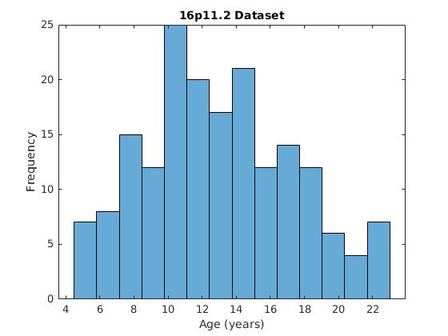
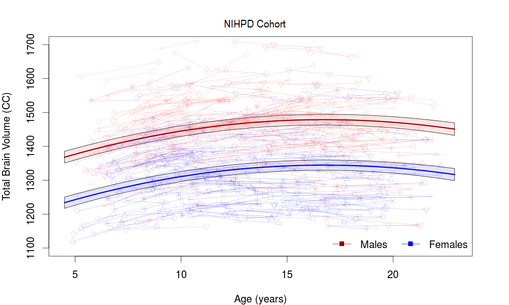
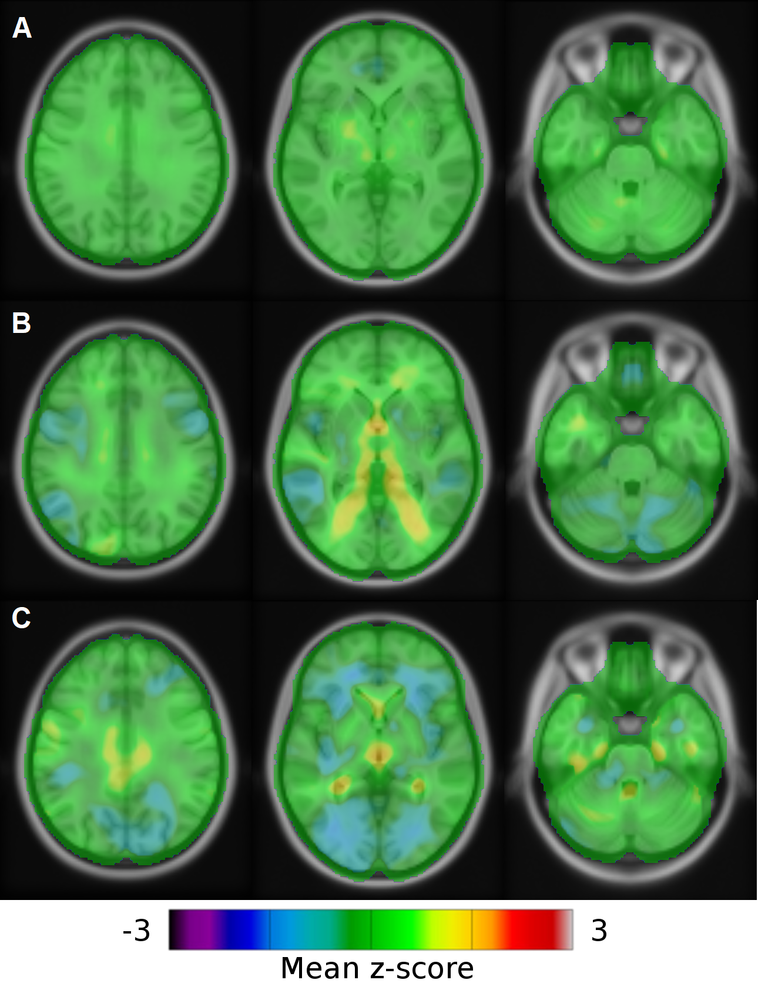

**Supplementary Table 1. Neuropsychiatric diagnoses.**

From the Diagnostic and Statistical Manual of Mental Disorders, DSM-5 (American Psychiatric Association, 2013).

A total of 53 of 56 deletion carriers (95%) had at least one psychiatric diagnosis: 11 had one diagnosis and 42 had several diagnoses; 15 of 19 duplication carriers (79%) had at least one psychiatric diagnosis: 1 had one diagnosis and 14 had several diagnoses; 12 of 34 familial control subjects (35%) had at least one psychiatric diagnosis: 7 had one diagnosis and 5 had two diagnoses.In both cohorts, unrelated control subjects without psychiatric diagnosis were recruited.

|                                                                                 |   DEL | Familial CTRL   | DUP   |
|---------------------------------------------------------------------------------|-------|-----------------|-------|
| N                                                                               |    56 | 34              | 19    |
| Attention-deficit/hyperactivity disorder                                        |    12 | 6               | 5     |
| Intellectual Disabiliy                                                          |     5 | -               | 2     |
| Langage and communication disorders                                             |    14 | 2               | 2     |
| Phonological disorder                                                           |    41 | 1               | -     |
| Learning disorders                                                              |    12 | 1               | 4     |
| Autistic Spectrum Disorder                                                      |     9 | 1               | 3     |
| Developmental coordination disorder                                             |    16 | -               | 5     |
| Enuresis and encopresis disorders                                               |    17 | 1               | 2     |
| Oppositional-defiant-disorder / Disruptive-behavior and other conduct disorders |     5 | -               | 2     |
| Mood disorder                                                                   |     1 | -               | 1     |
| Anxiety Disorders – social phobia                                               |     6 | 4               | 6     |
| Stereotypic Movement disorder                                                   |     1 | -               | -     |
| Tic disorder                                                                    |     2 | 1               | 1     |
| Borderline Intellectual Functioning                                             |     8 | -               | 5     |
| Other disorders (stuttering, trichotillomania, sexual-abuse-of-child)           |     2 | -               | 1     |

**Supplementary Table 2. Image acquisition parameters for the 16p11.2 dataset**

EU European cohort, SVIP Simons VIP cohort, ME-MPRAGE Multi-Echo Magnetization Prepared RApid Gradient Echo, MPRAGE Magnetization Prepared RApid Gradient Echo, TR Repetition Time, TE Echo Time.

| Cohort   | Scanner                         | Echo sequences   | TR      | TE                                                   | Flip angle   |   Field Of View |
|----------|---------------------------------|------------------|---------|------------------------------------------------------|--------------|-----------------|
| EU       | Magnetom TIM Trio  (1 site)     | ME-MPRAGE        | 2530 ms | TE1: 1.64 ms TE2: 3.5 ms  TE3: 5.36 ms TE4 : 7.22 ms | 7°           |             256 |
| EU       | Magnetom Prisma Syngo  (1 site) | MPRAGE           | 2000 ms | 2.39 ms                                              | 9°           |             256 |
| SVIP     | Magnetom TIM Trio  (2 sites)    | ME-MPRAGE        | 2530 ms | 1.64 ms                                              | 7°           |             256 |
| SVIP     | Philips Achieva  (2 sites)      | MPRAGE           | 2300 ms | 3 ms                                                 | 9°           |             256 |
| SVIP     | Magnetom TIM Trio  (1 site)     | MPRAGE           | 2300 ms | 2.98 ms                                              | 9°           |             256 |

**Supplemental Table 3. Coordinates of brain regions with significant differences between genetic groups in Jacobian determinant analyses**

**“Overlap”** refers to the percentage of significant voxels within each brain region. When some brain regions have more than one cluster that overlaps with them, we reported the bigger one. Only regions with a False Discovery Rate FDR correction (q&lt;0.05) and with cluster size &gt;30 voxels are presented.

**(1)** The developmental trajectory of a typical voxel for each of these regions is shown in Figure4.

| A.      Deletion > Control             | Side        | Size (voxels)   | Overlap  (%)   | Z         | Y         | X         | t-score    |
|----------------------------------------|-------------|-----------------|----------------|-----------|-----------|-----------|------------|
| CLUSTER 1                              | CLUSTER 1   | CLUSTER 1       | CLUSTER 1      | CLUSTER 1 | CLUSTER 1 | CLUSTER 1 | CLUSTER 1  |
| Posterior orbital gyrus (1)            | Right  Left | 200  190        | 62  61         | -14  -17  | 21  23    | 40  -31   | 5.58  4.52 |
| Inferior frontal gyrus orbital part    | Left  Right | 73  64          | 49  42         | -8  -9    | 25  23    | -45  41   | 4.39  5.04 |
| Frontal operculum                      | Left        | 95              | 41             | -1        | 27        | -43       | 5.35       |
| Inferior frontal gyrus triangular part | Left        | 150             | 35             | 1         | 29        | -53       | 4.90       |
| Anterior cingulate gyrus (1)           | Right  Left | 212  142        | 33  21         | -4  -1    | 37  41    | 5  -10    | 4.44  3.57 |
| Anterior insula (1)                    | Left  Right | 156  148        | 28  27         | 3  -5     | 25  28    | -33  29   | 3.88  4.47 |
| Temporal pole                          | Left  Right | 93  61          | 8  5           | -26  -22  | 9  9      | -37  39   | 4.80  3.72 |
| CLUSTER 2                              | CLUSTER 2   | CLUSTER 2       | CLUSTER 2      | CLUSTER 2 | CLUSTER 2 | CLUSTER 2 | CLUSTER 2  |
| Transverse temporal gyrus              | Right       | 87              | 60             | 14        | -29       | 43        | 7.77       |
| Parietal operculum                     |             | 174             | 59             | 16        | -33       | 41        | 8.27       |
| Posterior insula                       |             | 87              | 31             | 15        | -25       | 33        | 5.92       |
| Planum temporale                       |             | 44              | 23             | 13        | -33       | 41        | 8.17       |
| Posterior cingulate gyrus              |             | 134             | 22             | 5         | -53       | 21        | 6.76       |
| Middle occipital gyrus                 |             | 133             | 21             | 6         | -81       | 36        | 4.76       |
| Calcarine cortex (1)                   |             | 96              | 17             | 7         | -68       | 25        | 8.75       |
| Lingual gyrus                          |             | 164             | 14             | 3         | -58       | 25        | 7.94       |
| Ventral DC                             |             | 92              | 14             | -14       | -15       | 15        | 3.40       |
| Cuneus                                 |             | 69              | 11             | 13        | -98       | 11        | 5.04       |
| Occipital pole                         |             | 31              | 9              | 11        | -103      | 14        | 2.82       |
| Central operculum                      |             | 33              | 7              | 14        | -19       | 43        | 3.88       |
| Precuneus                              |             | 116             | 6              | 7         | -60       | 25        | 8.16       |
| Lateral ventricle                      |             | 75              | 6              | 6         | -54       | 29        | 7.58       |
| Inferior occipital gyrus               |             | 47              | 6              | 4         | -83       | 33        | 4.07       |
| Thalamus proper                        |             | 41              | 3              | 1         | -35       | 13        | 4.03       |
| CLUSTER 3                              | CLUSTER 3   | CLUSTER 3       | CLUSTER 3      | CLUSTER 3 | CLUSTER 3 | CLUSTER 3 | CLUSTER 3  |
| Calcarine cortex                       | Left        | 260             | 45             | 5         | -67       | -25       | 7.44       |
| Superior occipital gyrus               | Left        | 194             | 43             | 30        | -88       | -12       | 4.15       |
| Cuneus                                 | Left        | 241             | 35             | 13        | -63       | -15       | 4.48       |
| Lingual gyrus                          | Left        | 183             | 15             | 3         | -57       | -19       | 7.04       |
| Posterior cingulate gyrus              | Left        | 95              | 15             | 5         | -51       | -17       | 6.13       |
| Lateral ventricle                      | Left        | 115             | 9              | 8         | -53       | -28       | 6.25       |
| Inferior occipital gyrus               | Left        | 68              | 9              | 3         | -83       | -33       | 4.36       |
| Precuneus                              | Left        | 140             | 8              | 7         | -58       | -20       | 6.97       |
| Middle occipital gyrus                 | Left        | 30              | 5              | 6         | -84       | -31       | 3.71       |
| Thalamus proper                        | Left        | 35              | 3              | 4         | -33       | -11       | 3.80       |
| CLUSTER 4                              | CLUSTER 4   | CLUSTER 4       | CLUSTER 4      | CLUSTER 4 | CLUSTER 4 | CLUSTER 4 | CLUSTER 4  |
| Transverse temporal gyrus              | Left        | 130             | 94             | 7         | -21       | -41       | 9.82       |
| Planum temporale                       | Left        | 128             | 59             | 14        | -33       | -38       | 8.11       |
| Parietal operculum                     | Left        | 162             | 59             | 18        | -31       | -38       | 8.35       |
| Posterior insula                       | Left        | 99              | 35             | 8         | -21       | -35       | 7.74       |
| Superior temporal gyrus                | Left        | 124             | 13             | 9         | -27       | -71       | 4.19       |

| B.      Deletion < Control            | Side        | Size (voxels)   | Overlap  (%)   | Z         | Y         | X         | t-score      |
|---------------------------------------|-------------|-----------------|----------------|-----------|-----------|-----------|--------------|
| CLUSTER 1                             | CLUSTER 1   | CLUSTER 1       | CLUSTER 1      | CLUSTER 1 | CLUSTER 1 | CLUSTER 1 | CLUSTER 1    |
| Pallidum                              | Right  Left | 190  182        | 95  89         | 4  5      | -1  -3    | 23  -24   | -7.12  -8.07 |
| Middle cingulate gyrus                | Right  Left | 543  426        | 81  61         | 42  39    | 9  12     | 1  -3     | -5.12  -5.30 |
| Putamen                               | Right  Left | 480  454        | 77  73         | 5  7      | -1  -3    | 23  -25   | -7.20  -8.60 |
| Accumbens area                        | Left        | 34              | 77             | -7        | 11        | -11       | -6.04        |
| Cerebellum exterior (1)               | Right  Left | 6247  6113      | 70  69         | -53  -54  | -61  -59  | 35  -33   | -8.37  -6.89 |
| Precentral gyrus                      | Left  Right | 924  556        | 56  33         | 61  27    | -13  -1   | -30  55   | -5.06  -4.36 |
| Fusiform gyrus (1)                    | Right  Left | 589  224        | 54  20         | -26  -21  | -45  -50  | 44  -47   | -6.34  -4.43 |
| Middle temporal gyrus                 | Left  Right | 1139  243       | 51  12         | 5  -5     | -45  -29  | -49  50   | -6.05  -3.72 |
| Angular gyrus                         | Left        | 801             | 51             | 47        | -65       | -50       | -5.20        |
| Inferior temporal gyrus               | Left  Right | 715  465        | 40  25         | -17  -19  | -51  -43  | -51  47   | -5.41  -5.41 |
| Supplementary motor cortex            | Left  Right | 258  208        | 36  28         | 45  45    | 11  9     | -3  5     | -4.50  -4.20 |
| Postcentral gyrus                     | Left  Right | 434  167        | 32  12         | 31  21    | -7  -4    | -57  57   | -4.03  -3.70 |
| Caudate                               | Right  Left | 116  77         | 31  21         | 13  -5    | 10  13    | 17  -11   | -5.36  -5.52 |
| Parahippocampal gyrus                 | Left  Right | 90  75          | 30  27         | -29  -30  | -21  -20  | -23  27   | -4.82  -3.66 |
| Thalamus proper                       | Right       | 325             | 27             | 9         | -15       | 9         | -4.56        |
| Hippocampus                           | Left  Right | 121  62         | 25  12         | -2  -7    | -37  -33  | -27  33   | -4.20  -3.41 |
| Central operculum                     | Left  Right | 121  106        | 24  23         | 3  5      | 7  -1     | -43  47   | -4.90  -3.69 |
| Anterior insula                       | Left  Right | 134  37         | 24  7          | 4  1      | 5  1      | -41  45   | -4.90  -3.65 |
| Inferior frontal gyrus opercular part | Right       | 98              | 22             | 29        | 17        | 51        | -4.61        |
| Superior temporal gyrus               | Left  Right | 186  176        | 20  20         | 10  -5    | -43  -25  | -51  49   | -5.18  -3.92 |
| Lingual gyrus                         | Right  Left | 237  208        | 20  17         | -17  -15  | -90  -90  | 7  -3     | -4.99  -4.35 |
| Precentral gyrus medial segment       | Right       | 64              | 18             | 49        | -21       | 3         | -3.58        |
| Brain stem                            |             | 387             | 14             | -47       | -41       | -11       | -5.78        |
| Temporal pole                         | Right       | 136             | 11             | -34       | 15        | 23        | -3.62        |
| Supramarginal gyrus                   | Left        | 146             | 11             | 50        | -51       | -47       | -3.27        |
| Middle frontal gyrus                  | Right  Left | 240  227        | 8  8           | 31  31    | 20  7     | 49  -35   | -5.23  -4.36 |
| Ventral DC                            | Left        | 31              | 5              | -9        | -25       | -25       | -3.77        |
| Superior frontal gyrus                | Left        | 84              | 4              | 59        | -11       | -27       | -4.47        |
| CLUSTER 2                             | CLUSTER 2   | CLUSTER 2       | CLUSTER 2      | CLUSTER 2 | CLUSTER 2 | CLUSTER 2 | CLUSTER 2    |
| Gyrus rectus                          | Left  Right | 182  149        | 55  47         | -25  -25  | 45  43    | -5  1     | -4.68  -4.25 |
| Medial orbital gyrus                  | Left        | 102             | 17             | -26       | 43        | -9        | -4.36        |
| CLUSTER 3                             | CLUSTER 3   | CLUSTER 3       | CLUSTER 3      | CLUSTER 3 | CLUSTER 3 | CLUSTER 3 | CLUSTER 3    |
| Temporal pole                         | Left        | 232             | 19             | -37       | 19        | -25       | -4.34        |
| CLUSTER 4                             | CLUSTER 4   | CLUSTER 4       | CLUSTER 4      | CLUSTER 4 | CLUSTER 4 | CLUSTER 4 | CLUSTER 4    |
| Supramarginal gyrus                   | Right       | 137             | 12             | 27        | -32       | 70        | -3.97        |
| CLUSTER 5                             | CLUSTER 5   | CLUSTER 5       | CLUSTER 5      | CLUSTER 5 | CLUSTER 5 | CLUSTER 5 | CLUSTER 5    |
| Superior parietal lobule              | Left        | 153             | 10             | 66        | -63       | -13       | -3.71        |
| CLUSTER 6                             | CLUSTER 6   | CLUSTER 6       | CLUSTER 6      | CLUSTER 6 | CLUSTER 6 | CLUSTER 6 | CLUSTER 6    |
| Superior parietal lobule              | Right       | 69              | 5              | 60        | -68       | 15        | -3.22        |
| CLUSTER 7                             | CLUSTER 7   | CLUSTER 7       | CLUSTER 7      | CLUSTER 7 | CLUSTER 7 | CLUSTER 7 | CLUSTER 7    |
| Superior frontal gyrus medial segment | Right       | 41              | 4              | 39        | 49        | 2         | -2.99        |

| C.   Duplication > Control   | Side        | Size (voxels)   | Overlap  (%)   | Z         | Y         | X         | t-score    |
|------------------------------|-------------|-----------------|----------------|-----------|-----------|-----------|------------|
| CLUSTER 1                    | CLUSTER 1   | CLUSTER 1       | CLUSTER 1      | CLUSTER 1 | CLUSTER 1 | CLUSTER 1 | CLUSTER 1  |
| Lateral ventricule (1)       | Left  Right | 1038  875       | 77  67         | 14  19    | -37  -33  | -23  23   | 5.29  5.36 |
| Caudate                      | Right  Left | 66  66          | 18  18         | 24  9     | -13  19   | 17  -13   | 4.92  3.98 |
| Thalamus Proper              | Left  Right | 100  70         | 8  6           | 17  19    | -23  -17  | -14  15   | 4.43  4.56 |
| CLUSTER 2                    | CLUSTER 2   | CLUSTER 2       | CLUSTER 2      | CLUSTER 2 | CLUSTER 2 | CLUSTER 2 | CLUSTER 2  |
| Inferior temporal gyrus (1)  | Right       | 91              | 5              | -24       | -53       | 53        | 3.56       |
| CLUSTER 3                    | CLUSTER 3   | CLUSTER 3       | CLUSTER 3      | CLUSTER 3 | CLUSTER 3 | CLUSTER 3 | CLUSTER 3  |
| Posterior cingulate gyrus    | Left        | 70              | 11             | 35        | -35       | -5        | 3.76       |
| CLUSTER 4                    | CLUSTER 4   | CLUSTER 4       | CLUSTER 4      | CLUSTER 4 | CLUSTER 4 | CLUSTER 4 | CLUSTER 4  |
| fusiform gyrus               | Left        | 41              | 4              | -29       | -27       | -39       | 3.67       |

| D.   Duplication < Control   | Side        | Size (voxels)   | Overlap  (%)   | Z         | Y         | X         | t-score      |
|------------------------------|-------------|-----------------|----------------|-----------|-----------|-----------|--------------|
| CLUSTER 1                    | CLUSTER 1   | CLUSTER 1       | CLUSTER 1      | CLUSTER 1 | CLUSTER 1 | CLUSTER 1 | CLUSTER 1    |
| Occipital fusiform gyrus     | Left  Right | 267  46         | 60  12         | -13  -7   | -91  -78  | -25  31   | -4.45  -4.05 |
| Calcarine cortex (1)         | Left  Right | 260  171        | 45  30         | 5  9      | -67  -73  | -17  17   | -3.93  -3.94 |
| Inferior occipital gyrus     | Left        | 300             | 38             | 2         | -85       | -29       | -4.79        |
| Occipital pole               | Left        | 45              | 13             | 3         | -101      | -11       | -3.45        |
| Superior occipital gyrus     | Right       | 58              | 12             | 27        | -78       | 28        | -3.66        |
| Middle occipital gyurs       | Left        | 62              | 10             | 5         | -85       | -29       | -4.72        |
| Cuneus                       | Right       | 52              | 8              | 19        | -71       | 20        | -3.73        |
| Lingual gyrus                | Right  Left | 65  43          | 5  3           | -7  -2    | -90  -65  | 15  -17   | -3.48  -3.77 |
| Cerebellum exterior          | Left        | 219             | 2              | -21       | -81       | -37       | -3.84        |
| CLUSTER 2                    | CLUSTER 2   | CLUSTER 2       | CLUSTER 2      | CLUSTER 2 | CLUSTER 2 | CLUSTER 2 | CLUSTER 2    |
| Anterior insula (1)          | Right       | 187             | 34             | 6         | 15        | 32        | -4.4         |
| Putamen                      |             | 123             | 20             | 3         | 9         | 29        | -4.34        |
| CLUSTER 3                    | CLUSTER 3   | CLUSTER 3       | CLUSTER 3      | CLUSTER 3 | CLUSTER 3 | CLUSTER 3 | CLUSTER 3    |
| Parietal operculum           | Left        | 147             | 53             | 25        | -33       | -45       | -4.69        |
| Posterior insula             |             | 139             | 49             | 8         | -19       | -35       | -5.63        |
| Transverse temporal gyrus    |             | 67              | 49             | 9         | -23       | -37       | -5.36        |
| Planum temporale             |             | 49              | 23             | 23        | -35       | -49       | -4.21        |
| Central operculum            |             | 37              | 7              | 21        | -15       | -37       | -4.1         |
| CLUSTER 4                    | CLUSTER 4   | CLUSTER 4       | CLUSTER 4      | CLUSTER 4 | CLUSTER 4 | CLUSTER 4 | CLUSTER 4    |
| Anterior insula              | Left        | 96              | 17             | 3         | 27        | -29       | -4.08        |
| Putamen                      |             | 105             | 17             | 1         | 9         | -29       | -4.65        |
| CLUSTER 5                    | CLUSTER 5   | CLUSTER 5       | CLUSTER 5      | CLUSTER 5 | CLUSTER 5 | CLUSTER 5 | CLUSTER 5    |
| Thalamus Proper              | Right       | 88              | 7              | 3         | -30       | 15        | -4.05        |
| Posterior cingulate gyrus    | Left        | 43              | 7              | 15        | -43       | 0         | -4.37        |
| CLUSTER 6                    | CLUSTER 6   | CLUSTER 6       | CLUSTER 6      | CLUSTER 6 | CLUSTER 6 | CLUSTER 6 | CLUSTER 6    |
| Medial orbital gyrus         | Left        | 54              | 9              | -19       | 11        | -19       | -4.62        |

**Supplementary Figure 1. Age distribution of the NIHPD cohort.**

**Supplementary Figure 2. Age distribution of the 16p11.2 cohort.**

**Supplementary Figure 3. Mixed Effects fit of Total Brain Volume for NIHPD controls.**

Males are shown in red and females in blue. Individual data points are shown, with each acquisition site represented by a different marker.

**Supplementary Figure 4. Normalization procedure on 16p11.2 controls.**

The top plot shows a simple linear model (age+sex) fit to the original data. The bottom plot shows the results after normalization, where neither sex nor age terms are significantly different than 0. Males are shown in red and females are shown in blue.

**Supplementary Figure 5. Mean Z-scores voxel-based per genetic group**

Results of the mean Z-scores per genetic groups, on the Jacobian determinants voxel-by-voxel.

A. Mean Z-scores for the CTRL; B. Mean Z-scores for the DEL; C. Mean Z-scores for the DUP.

16p11.2 CTRL show similar profile than the baseline of NIHPD controls, with only some deviations in the left putamen and the medial frontal cortex, whereas DEL and DUP show extensive clusters different from NIHPD controls.

*DEL, deletion carriers; CTRL, control individuals; DUP, duplication carriers*

***References***

