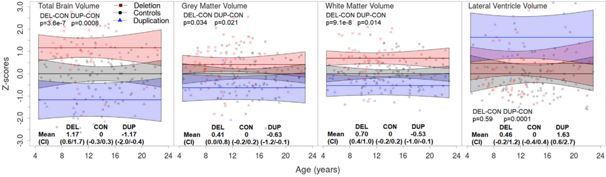
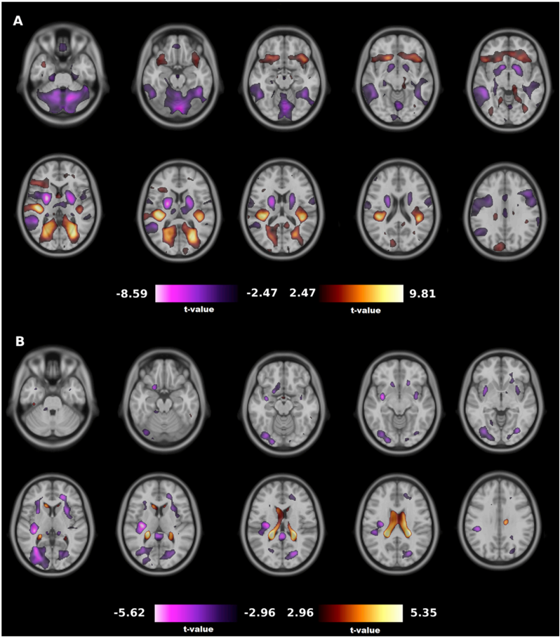
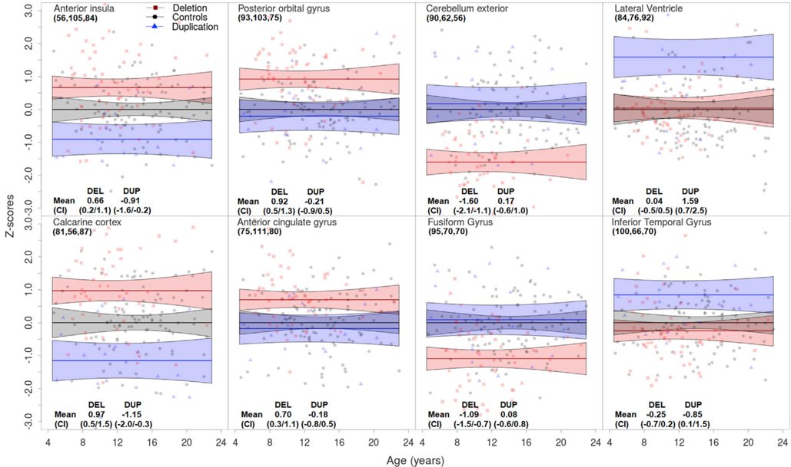

Contents lists available at ScienceDirect

## NeuroImage

journal homepage: www.elsevier.com/locate/neuroimage

## Developmental trajectories of neuroanatomical alterations associated with the 16p11.2 Copy Number Variations

Alonso C /C19 ardenas-de-la-Parra a,1 , Sandra Martin-Brevet b,c,1 , Clara Moreau d , Borja Rodriguez-Herreros b,d , Vladimir S. Fonov a , Anne M. Maillard b,e , Nicole R. Zürcher f , 16p11.2 European Consortium, Nouchine Hadjikhani f, g , Jacques S. Beckmann b , Alexandre Reymond h , Bogdan Draganski c,i , S /C19 ebastien Jacquemont b,d,*,2 , D. Louis Collins a,2

- a Department of Biological and Biomedical Engineering, Montreal Neurological Institute, Montreal, Quebec, Canada
- b Service of Medical Genetics, Centre Hospitalier Universitaire Vaudois and University of Lausanne, Lausanne, Switzerland
- c LREN, D /C19 epartement des neurosciences cliniques, Centre Hospitalier Universitaire Vaudois and University of Lausanne, Lausanne, Switzerland
- d CHU Sainte-Justine Research Center, Universit /C19 e de Montr /C19 eal, Montr /C19 eal, QC, Canada
- e Centre Cantonal Autisme, Centre Hospitalier Universitaire Vaudois and University of Lausanne, Lausanne, Switzerland
- f Athinoula A. Martinos Center for Biomedical Imaging, Department of Radiology, Massachusetts General Hospital, Harvard Medical School, Boston, MA, USA
- g Gillberg Neuropsychiatry Centre, G € oteborg, Sweden
- h Center for Integrative Genomics, University of Lausanne, Lausanne, Switzerland
- i Department of Neurology, Max Planck Institute for Human Cognitive and Brain Sciences, Leipzig, Germany

## A R T I C L E I N F O

## Keywords:

16p11.2 Copy number variants

Neurodevelopmental disorders Genetics Imaging Brain development Normative growth trajectories

## 1. Introduction

Most of human genome is present in two copies (a maternal and paternal copy). However, large segments of the genome can be deleted or duplicated and are therefore present in one or three copies respectively.

A B S T R A C T

Most of human genome is present in two copies (maternal and paternal). However, segments of the genome can be deleted or duplicated, and many of these genomic variations (known as Copy Number Variants) are associated with psychiatric disorders. 16p11.2 copy number variants (breakpoint 4 -5) confer high risk for neurodevelopmental disorders and are associated with structural brain alterations of large effect-size. Methods used in previous studies were unable to investigate the onset of these alterations and whether they evolve with age. In this study, we aim at characterizing age-related effects of 16p11.2 copy number variants by analyzing a group with a broad age range including younger individuals. A large normative developmental dataset was used to accurately adjust for effects of age. We normalized volumes of segmented brain regions as well as volumes of each voxel de /uniFB01 ned by tensor-based morphometry. Results show that the total intracranial volumes, the global gray and white matter volumes are respectively higher and lower in deletion and duplication carriers compared to control subjects at 4.5 years of age. These differences remain stable through childhood, adolescence and adulthood until 23 years of age (range: 0.5 to 1.0 Z-score). Voxel-based results are consistent with previous /uniFB01 ndings in 16p11.2 copy number variant carriers, including increased volume in the calcarine cortex and insula in deletions, compared to controls, with an inverse effect in duplication carriers (1.0 Z-score). All large effect-size voxel-based differences are present at 4.5 years and seem to remain stable until the age of 23. Our results highlight the stability of a neuroimaging endophenotype over 2 decades during which neurodevelopmental symptoms evolve at a rapid pace.

While these genomic variations (known as Copy Number Variants, CNVs) can often be harmless, many have also been associated with neurodevelopmental and psychiatric disorders. The ~600 kb 16p11.2 CNVs (chromosome 16, locus 11.2, breakpoints (BP) 4 -5, 29.6 -30.2 Mb-Hg19) are strongly associated with neurodevelopmental disorders (Weiss et al.,

* Corresponding author. Sainte Justine Hospital Research Center, 3175 Chemin de la C ^ ote-Sainte-Catherine, Montreal, Quebec, H3T 1C5, Canada. E-mail address: Sebastien.jacquemont@umontreal.ca (S. Jacquemont).

1 shared 1st authorship.

2 shared senior authorship.

Received 11 January 2019; Received in revised form 23 August 2019; Accepted 2 September 2019

Available online 5 September 2019

2008). Deletion and duplication carriers have a 10-fold increased risk of developing autism spectrum disorders (ASD) (Moreno-De-Luca et al., 2013), and duplication (but not deletion) carriers a 10-fold increased risk for schizophrenia (Marshall et al., 2017). Genetic variants associated with psychiatric disorders offer unique opportunity to study the effects of the same molecular mechanisms on brain structure and behavior across different neurodevelopmental periods.

Deletion and duplications at the 16p11.2 locus have ' mirror ' effects on head circumference, increasing and decreasing respectively with differences becoming apparent before two years of age (D'Angelo et al., 2016). At the macroscopic level, total gray and white matter volumes correlate negatively with the number of genomic copies (Benjamini and Hochberg, 1995; Qureshi et al., 2014; Maillard et al., 2015), with increased volume in deletion and volume loss in duplication carriers when compared to non-carriers. Previous studies in deletion carriers report regional structural differences in the insula, calcarine cortex and superior, middle, transverse temporal gyri, which are independent of head size alterations. Duplication carriers show differences in the insula, caudate and hippocampus (Martin-Brevet et al., 2018). These /uniFB01 ndings are observed independently of sex and ascertainment (ie. the presence or absence of a psychiatric diagnosis). Alterations are present in adolescents as well as in adults. In the absence of proper normative data we have been unable to accurately adjust for age effects. It is unknown when these alterations appear during brain development or whether they are modi /uniFB01 ed across childhood and adolescence.

Given that genes included in the 16p11.2 interval are expressed throughout early brain development (Lin et al., 2015), we hypothesized that the established pattern of brain alterations associated with 16p11.2 CNVs might appear during early childhood. We aimed to characterize brain growth in 16p11.2 CNVs carriers by comparing global and regional developmental trajectories to those of healthy children. Considering the fact that most of the brain measures do not show linear changes across childhood and adolescence (Giedd et al., 1999), we assume that it is very dif /uniFB01 cult, if not impossible, to properly correct for age based on small control groups. Instead, large normative developmental datasets are required to infer these trajectories. We (Aubert-Broche et al., 2013) have previously developed a longitudinal image processing pipeline and Z-scoring method to adjust for age- and sex effects on brain growth trajectories using the NIH MRI study of normal brain development (NIHPD) (Evans and Brain Development Cooperative, 2006). This normalizing method extended to whole-brain voxel-level data, where all Jacobian determinants of a deformation /uniFB01 eld were used as a surrogate metric of relative local tissue volume. This approach has been successful in the study of pediatric-onset multiple sclerosis (Aubert-Broche et al., 2014). In the present study, we use similar methods to Z-score a cross-sectional 16p11.2 dataset (56 deletion carriers, 19 duplication carriers, 105 control individuals, including data on 8 individuals not analyzed in previous studies) to identify global and voxel-based differences between groups.

## 2. Material and methods

## 2.1. Participants

## 2.1.1. 16p11.2 CNVs cohort

Cross-sectional data was acquired in 2 different cohorts (the European -EU 16p11.2 consortium and the Simons VIP -SVIP study in North America) of 180 individuals (Simons Vip, 2012; Martin-Brevet et al., 2018). In order to be able to normalize with NIHPD data, we only included participants between 4.5 and 23 years of age. This included 56 16p11.2 BP4-5 deletion carriers (DEL) from American (n ¼ 42) and European ( ¼ 14) cohorts; 19 duplication carriers (DUP) from American (n ¼ 15) and European (n ¼ 4) cohorts); and 105 controls (CTRL), from American (n ¼ 75) and European cohorts (n ¼ 30). Four controls, 3 duplication and 1 deletion carriers were not included in our previous publication (Martin-Brevet et al., 2018). CNV carriers were either probands referred for genetic testing or relatives of probands. The controls were recruited among non-carriers /uniFB01 rst-degree relatives of CNV carriers (n ¼ 34) or volunteers from the general population who did not have a relative with a neurodevelopmental disorder (n ¼ 71). The study was approved by the institutional review boards of each consortium, and signed informed consents were obtained from the participants or their legal representatives. Demographics, age distribution and neuropsychiatric diagnoses are detailed in Table 1, Supplementary Fig. 1, Supplementary Table 1. Because our analysis covers a broad age range, there is increased risk of systematic age-dependent motion artefacts. We performed a thorough visual quality control check looking for evidence of motion artefacts.

## 2.1.2. General population -NIHPD cohort

As normative reference data for brain growth, we used the multi-site longitudinal data from Objective 1 (i.e. initial time-point for enrolment from 4.5 to 18.5 years) of the publicly available NIHPD project (Evans and Brain Development Cooperative, 2006). The normative model (Aubert-Broche et al., 2011) used data from 339 children (179 females and 160 males), scanned longitudinally at 2 or 3 time points, with approximately 24 months between scans and mean age at /uniFB01 rst scan of 11.0 years, for a total of 874 scans. Only subjects that passed quality control were included. Supplementary Fig. 2 shows the age distribution of the data for the NIHPD cohort.

The NIHPD and the 16p11.2 cohorts show similar proportions in ancestry composition: Caucasian ( &gt; 70%), African-american (11% for NIHPD, 9.38% for 16p11.2), Asian (2% for NIHPD, 1.56% for 16p11.2) and Other (15% for NIHPD, 10.94% for 16p11.2).

## 2.2. MRI protocol

The MRI data from the 16p11.2 individuals included T1-weighted (T1w) anatomical images acquired at 7 sites using different 3T scanners: Philips Achieva, Siemens Prisma Syngo and Siemens Tim Trio. The MRI protocol included a whole-brain, 3D T1w magnetization prepared rapid gradient echo sequence (MPRAGE) with 1-mm-thick sagittal slices. Three sites used multi-echo sequences for 126 participants (38 DEL, 12 DUP, 76 CTRL with 5 familial and 71 unrelated CTRL), and 4 sites used single-echo sequences for 54 participants (18 DEL, 7 DUP and 29 familial CTRL). Details of the scanners and image acquisition sequences can be found in Supplementary Table 2. Extensive analyses on the potential effect of these scanning sites and protocols were performed in a previous

Table 1

Population characteristics of the 16p11.2 dataset.

|                                                | DEL        | CTRL       | DUP       |
|------------------------------------------------|------------|------------|-----------|
| N                                              | 56         | 105        | 19        |
| Age (years)                                    |            |            |           |
| Mean (SD)                                      | 11.26      | 14.15      | 12.29     |
|                                                | (3.62) a   | (4.24)     | (4.87)    |
| range (min-max)                                | 6.33-22.33 | 4.67-22.92 | 5 - 20.33 |
| Sex (M/F)                                      | 29/27      | 67/38      | 13/6      |
| Scan parameter (Multi/Single echo acquisition) | 38/18      | 76/29      | 12/7      |
| NVIQ                                           | b          |            |           |
| Mean (SD)                                      | 87 (14)    | 108 (12)   | 77 (19) b |
| Ancestry                                       |            |            |           |
| African-American                               | 0          | 12         | 0         |
| Asian                                          | 1          | 1          | 0         |
| Caucasian                                      | 50         | 35         | 15        |
| Mixed and Other                                | 4          | 8          | 2         |

DEL, deletion carriers; CTRL, control individuals; DUP, duplication carriers; N, sample size; SD, standard deviation; M, male; F, female; NVIQ, non-verbal intelligent quotient. Ancestry is unknown for 3 CNV carriers and 49 controls.

a Deletion carriers signi /uniFB01 cantly younger than control individuals (t ¼/C0 4.5272, p ¼ 1.347e-05).

b Mean NVIQ is signi /uniFB01 cantly lower in deletion and duplication carriers than control individuals (respectively t ¼/C0 9.3194, p ¼ 1.0126e-14; t ¼/C0 6.6931, p ¼ 4.18997e-06).

study showing that none of the regions associated with the 16p11.2 deletion or duplication could be attributed to artefacts introduced by the multisite analyses (Martin-Brevet et al., 2018).

Scans of the NIHPD controls were obtained at 6 study centers with 1.5 Tesla MRI scanners from General Electric or Siemens Medical Systems. The MRI protocol included a whole-brain, 3D T1w RF-spoiled gradient echo sequence (1-mm-thick sagittal partitions, TR 22 -25 msec, TE 10 -11 msec, excitation pulse angle 30 /C14 , Field Of View 160 -180 mm). Details on acquisition and participants were previously published (Evans and Brain Development Cooperative, 2006).

## 2.3. Image processing

The longitudinal automatic image processing pipeline, developed for NIHPD analysis (Aubert-Broche et al., 2013), was adapted to the scans from the 16p11.2 dataset as described below. The preprocessing steps applied to the native T1w images were (1) denoising, (2) intensity inhomogeneity correction using the N3 algorithm (Sled et al., 1998), and (3) intensity normalization by histogram matching to the ICBM152 template (Fonov et al., 2011). A hierarchical 9-parameter linear registration based on an intensity cross-correlation similarity measure was performed between the T1w images and the ICBM152 template to align the images with the stereotaxic population template (Collins et al., 1994). Brain extraction was achieved using the Brain Extraction based on nonlocal Segmentation Technique (BEaST) (Eskildsen et al., 2012), a multi-resolution, nonlocal patch-based segmentation technique. Subsequently, images were non-linearly registered using the Automated Nonlinear Image Matching and Anatomical Labelling (ANIMAL) algorithm (Collins et al., 1995), a hierarchical, multi-scale registration algorithm. Whole-brain, individual lobes, thalamus, putamen, caudate, globus pallidus and ventricular volumes were calculated, with the right and left volumes combined for analysis.

To investigate brain alterations beyond a priori speci /uniFB01 ed anatomical regions of interest, we used Tensor Based Morphometry (TBM), which enables a whole-brain voxel-by-voxel statistical analysis while accounting for brain size. TBM uses the deformation /uniFB01 elds resulting from a nonlinear registration to an appropriate template to analyze group differences and quantify changes in morphology (Frackowiak, 2004; (Lau et al., 2008). The non-linear deformation grids for each scan's registration to the ICBM152 template were inverted, effectively yielding a voxel-by-voxel nonlinear mapping from the ICBM152 template reference space to the space of each linearly registered scan. A 3D Gaussian /uniFB01 lter with FWHM of 10 mm was applied to the resulting inverted deformation grids. The Jacobian determinant of the deformation /uniFB01 eld was computed for every voxel, log-transformed and used as a surrogate of the local volume difference between each subject and the ICBM152 template. In general, a log-transformed Jacobian determinant value less than 0 represents shrinking from the template to the native space, a value of 0 indicates that there is no volume change in the voxel and a value of more than 0 indicates enlargement with respect to the template. When Jacobian determinant measures are applied to normative datasets such as the NIHPD study (Aubert-Broche et al., 2011) Frackowiak, 2004), it enables the estimation of voxel-wise trajectories of brain development.

## 2.4. Data analyses

## 2.4.1. Z-scoring for the main effect of age and gender for global and voxelbased volumes

To compute Z-scores that normalize for the effect of growth and sex in a pediatric population, we modeled the effect of those 2 variables in the NIHPD normative dataset. Mixed-effect models were used since it is appropriate to estimate growth in longitudinal studies that take repeated measures from the same individuals over time. It accounts for the withinparticipant correlation and for varying numbers of measurements for each participant.

As we previously described (Aubert-Broche et al., 2013), individual pro /uniFB01 les suggest modeling brain growth as a quadratic function over time: we included both linear and quadratic effects of age in the /uniFB01 xed effects structure. Age was not divided into bins, but was considered as a continuous variable and was centered at 13 years - the mean age of NIHPD cohort. Linear effect of sex was also included in the /uniFB01 xed terms (Aubert-Broche et al., 2013). During model selection, a /uniFB01 xed effect for individual scanner was tested but found to be not signi /uniFB01 cant and the model was associated with a higher Bayesian Information Criterion (BIC).

The mixed-effects model that best /uniFB01 ts the normative data is:

Vol i ¼ β 0 þ γ 0 þ ( β 1 þ γ 1) (Age i -13) þ β 2 (Age i -13) 2 þ β 3 Sex i þ ε i where

- /C15 Vol i is the value of the response variable (global brain volume or voxel) for subject i,
- /C15 Age i , Age 2 i, Sex i are the /uniFB01 xed and random effect explanatory variables for subject i ,
- /C15 β 0, γ 0 are the intercept for the /uniFB01 xed and random terms,
- /C15 β 1, β 2, β 3 are the /uniFB01 xed effects coef /uniFB01 cients and are identical for all subjects,
- /C15 γ 1 is a random effect coef /uniFB01 cient,
- /C15 ε i is the error in subject i. The errors for subject i are assumed to have mean zero and constant independent variance.

Using the mean and the estimated standard deviation of the model we were able to compute Z-scores for the global volumes of the brain as well as for each voxel independently, for the 16p11.2 and control participants using the following formula: z ¼ (x-x)/s. x is the sample value (i.e. the volume or Jacobian of an individual subject), x is the estimated mean from the Mixed Effects model of the NIHPD cohort, and s is an estimate of the standard deviation, calculated from the variance-covariance matrix of the /uniFB01 xed effects along with the residual variance of the random effects. Supplementary Fig. 3 shows the resulting Mixed-Effects /uniFB01 t on Total Brain Volume for the NIHPD population.

## 2.4.2. Correcting for scanning protocol between NIHPD normative data and 16p11.2 case-control data

After normalization of the 16p11.2 controls, we observed that certain regions required small additional corrections attributed to differences in scanning parameters between the NIHPD and the 16p11.2 data (e.g. 1.5 T vs 3T scans). We estimated a linear model that included Age and Intercept (i.e. bias and slope) for the Z-scored segmented volumes and the voxel-wise log-transformed Jacobian determinants of the 16p11.2 control data. The parameters of this linear model were used to adjust the 16p11.2 control dataset in order to obtain a mean Z-score of 0 for all ages. Supplementary Fig. 4 shows a linear /uniFB01 t of the controls before and after normalization. The same adjustment was applied to the CNV carrier groups. This correction shows that there is a simple linear effect of the scanning protocol. This linear effect is the same between the NIHPD and 16p11.2 control data as well as between the NIHPD and 16p11.2 CNV carrier data. The intercepts and the slopes were, respectively /C0 0.68/ /C0 0.04 for the total brain volume; /C0 0.11/ /C0 0.1 for the gray matter volume (GM); 0.42/0.05 for the white matter volume (WM) and /C0 0.32/ /C0 0.02 for the lateral ventricle (LV). Regarding voxel-based mean Z-scores, 16p11.2 CTRL also show deviations from the baseline of NIHPD controls, in particular in the left putamen and the medial frontal cortex (Z-scores between /C0 0.88 and 1.09) (Supplementary Figure 5.A).

## 2.4.3. Analyzing the age-related effects of deletions and duplications on brain structure

We used a linear model introducing genetic status as a covariate to investigate the effect of the DEL and DUP on normalized segmented regional and voxel-level adjusted Z-scores volumes. The following interaction terms were tested: age*sex and age*group.

We extracted the p-values from the linear models. Results for the 4 global volumes are Bonferroni corrected for 8 simultaneous comparisons (4 /C2 DEL vs CTRL and 4 /C2 DUP vs CTRL). Results for the voxel-wise analysis are adjusted using Benjamini-Hochberg False Discovery Rate -FDR correction (q &lt; 0.05) (Benjamini and Hochberg, 1995). Regions with signi /uniFB01 cant differences were anatomically labeled using the neuromorphometric atlas (http://www.neuromorphometrics.com).

All analyses were conducted using R 3.4.0 (The R Project for Statistical Computing; http://www.R-project.org/). The mixed-effect models were built using the nlme package.

## 3. Results

Data was analyzed for 56 DEL, 19 DUP, 105 familial and unrelated CTRL with ages ranging from 4.5 to 23 years. The clinical phenotype description of the participants is provided in Table 1.

## 3.1. Developmental trajectory of total intracranial, global gray and white matter volumes for deletion and duplication carriers

16p11.2 carriers present an inverse gene dosage effect for most of the global metrics. Deletion carriers have higher volume than controls for total brain (mean Z-score ¼ 1.165, p-value &lt; 0.0001), gray (mean Zscore ¼ 0.414, p-value ¼ 0.00433) and white matter volumes (mean Zscore ¼ 0.693, p-value &lt; 0.0001) (Fig. 1). Duplication carriers show the opposite effect, with lower total brain (mean Z-score ¼/C0 1.17, pvalue ¼ 0.0001), gray (mean Z-score ¼/C0 0.631, p-value ¼ 0.00272) and white matter volume (mean Z-score ¼/C0 0.53, p-value ¼ 0.0018) compared to controls. Duplication carriers have larger lateral ventricles, with mean Z-score of 1.629 (p-value &lt; 0.0001).

We do not observe any interaction between the effects of genetic groups and age nor between sex and age. These global brain differences are unchanged across the full age range in our dataset (Fig. 1).

## 3.2. Developmental trajectory of regional voxel-based differences

The TBM analysis identi /uniFB01 es several brain regions associated with an inverse gene dosage effect: Deletion carriers have signi /uniFB01 cantly higher Jacobian determinants than controls, whereas duplication have signi /uniFB01 -cantly lower values (i.e. DEL &gt; CTRL &gt; DUP) in the following regions: bilateral calcarine cortex, insula, left transverse temporal gyrus, planum temporale and parietal operculum. Reciprocal inverse gene dosage effects are also present in the frontal and occipital white matter (Supplemental Table 2 , Fig. 2).

Differences predominantly or speci /uniFB01 cally associated with DEL include increased Jacobian determinants values in the cuneus, anterior cingulate, posterior orbital and inferior frontal gyri. Regions predominantly decreased in DEL compared to controls include the bilateral cerebellum, middle cingulate gyrus, pallidum, putamen, precentral and post-central gyri, fusiform gyrus, middle and inferior temporal gyri, supplementary motor cortex, gyrus rectus, left accumbens area and angular gyrus. The only region predominantly or speci /uniFB01 cally associated with DUP is the occipital fusiform gyrus with a decrease in volume compared to controls as well as the lateral ventricles that are increased in DUP. Additional regions with smaller signi /uniFB01 cant clusters are described in Supplemental Table 2.

We did not identify any effect of age for any of the clusters described above. Fig. 3 shows this complete lack of age-related effects for the top 8 regional differences with the largest effect sizes. Whatever the age, the DEL have volume Z-scores of 0.7 and 1 for the anterior insula and the calcarine cortex respectively, and the DUP have volume Z-scores of /C0 0.9 and /C0 1.2 on the same structures. DEL have volume Z-scores of 0.9 and 0.7 for the posterior orbital and anterior cingulate gyri respectively; they have the most negative volume Z-scores: 1.6 and /C0 1.1 for the cerebellar hemispheres and the fusiform gyrus. DUP have also high volume Z-scores for the lateral ventricle and inferior temporal gyrus, 1.6 and 0.9 respectively.

## 4. Discussion

The main goal of this study is to identify the onset and potential changes through childhood, adolescence, and adulthood of brain differences associated with 16p11.2 CNVs. Our study provides a thorough investigation of the age-related effects of 16p11.2 deletions and duplications on brain anatomy between the ages of 4.5 and 23 years. We do not observe any age-related effects on global and voxel-based volumes in deletions or duplication carriers. These results are in favor of early onset of brain changes that remain stable across childhood, adolescence and early adulthood. Differences related to 16p11.2 CNV carriers are already present at 5 years of age.

Our method allows us to compute normalized values for neuroanatomical regions as well as for each individual voxel despite the fact that the normative data was acquired on a different scanner. Our results corroborate global and voxel-based effects described in our previous

Fig. 1. Developmental trajectory of global brain metricsTrajectory

of the global brain metrics for the 3 genetic groups show an inverse gene dosage effect, the differences between groups are already present at 4.5 years and identical through the development until 23 years of age.

Raw values of each metrics are corrected for age and protocol (i.e. single echo vs multi echo scans) through a linear model, then values from control individuals are centered to 0 for visualization purposes. For each of the genetic groups, /uniFB01 tted lines represent the predicted mean computed per age range of 2.4 months, polygons represent the con /uniFB01 dence interval at each age, the points are normalized subject-level data-points. Mean (minimum/maximum of the con /uniFB01 dence interval) are presented in table. P-values are corrected with Bonferroni correction for 8 simultaneous comparisons (p &lt; 0.05). DEL: deletion carriers; CTRL: control individuals; DUP: duplication carriers.

Fig. 2. Effect of genetic status on brain structures for voxel-based analysesSigni /uniFB01 cant differences on Jacobian determinants highlight the inverse gene dosage effect at the regional voxel-based level on volumes between DEL &gt; CTRL &gt; DUP, as well as some speci /uniFB01 c volume differences between DEL &gt; CTRL, CTRL &gt; DUP and DEL &lt; CTRL. A. DEL versus CTRL, B. DUP versus CTRL. Only regions with a FDR correction (q &lt; 0.05) are presented. Negative t-values represent, respectively, the contrasts DEL &lt; CTRL and DUP &lt; CTRL, positive t-values represent the contrasts DEL &gt; CTRL and DUP &gt; CTRL. DEL: deletion carriers; CTRL: control individuals; DUP: duplica-

tion carriers.

study: insula is affected in both CNVs in a mirror fashion, while calcarine cortex, temporal and precentral gyri are altered in deletion carriers.

## 4.1. Continuous model of normative developmental trajectory

The major contribution of our paper is the use of a model to normalize the non-linear effect of age during typical brain development (Giedd et al., 1999). This allows us to reliably study a sample of mutation carriers and controls spanning a broad age range. Papers studying neuroimaging alterations associated with neurodevelopmental disorders have mostly used narrow age bins because the study-speci /uniFB01 c control groups were too small (less than 100 individuals) to reliably model the effect of age. We show that despite the fact that the NIHPD data has been collected with a 1.5T magnet, the model for the effect of age during typical brain development is robust and applies to data acquired on a 3T after a linear adjustment. However, integrating large normative datasets to correct for complex covariates such as age still requires an additional control group scanned with the same protocol as done here, to be able to match a particular study to the norm.

## 4.2. Developmental trajectories in neurodevelopmental disorders and genetic risk factors

Recently, a large cross-sectional neuroimaging study in idiopathic ASD (van Rooij et al., 2018) identi /uniFB01 ed differences in subcortical volumes that are stable across the entire age range of the study from 2 to 64 years of age. The study also highlighted differences in cortical thickness between the ASD and control groups. The strongest group differences were observed during childhood and adolescence, with normalized or even reversed thickness results in adulthood. However, in the absence of

Fig. 3. Developmental trajectory from typical voxel showing a difference between genetic groupsTrajectory of the Jacobian determinants of 8 representative voxels from regions with signi /uniFB01 cant differences between genetic groups. All of them are from the right hemisphere. Anterior insula and calcarine cortex have some voxels with signi /uniFB01 cantly higher values in deletion and lower values in duplication than control individuals. Posterior orbital gyrus and anterior cingulate gyrus have signi /uniFB01 cantly higher values in deletion carriers compared to controls; on the contrary cerebellum exterior and fusiform gyrus have signi /uniFB01 cantly lower values in deletion carriers than controls. Lateral ventricle and inferior temporal gyrus have signi /uniFB01 cantly higher values in duplication carriers than controls. All these differences are already present at 4.5 years and identical through the development until 23 years of age. Raw values of each voxel are corrected for age and number of echo (i.e. single echo vs multi echo scans) through a linear model, then values from control individuals are centered to 0 for visualization purposes. For each of the genetic groups, /uniFB01 tted lines represent the predicted mean computed per age range of 2.4 months, polygons represent the con /uniFB01 dence interval at each age, the points are normalized subject-level data-points. Mean (minimum/maximum of the con /uniFB01 dence interval) are presented in the table. DEL: deletion carriers; DUP: duplication carriers. P-values are corrected with an FDR correction, q &lt; 0.05.

longitudinal data, it is unknown whether the same mechanisms were underlying ASD symptoms in participants from these different age groups. Indeed, ASD diagnostic boundaries have changed tremendously during the past decade. In contrast, the interpretation of cross-sectional studies is easier in genetically de /uniFB01 ned groups since the inclusion criteria (presence of a speci /uniFB01 c mutation) does not vary across time, clinical sites or age of the participants.

Longitudinal studies in idiopathic ASD showed that subcortical alterations and increased total and regional cortical surface area present at 2 years of age remain stable at the age of 4 years (Hazlett et al., 2011). An increase in growth rate of cortical surface area occurs between 6 and 12 months of age and remains stable between 12 and 24 months of age in high-risk infants who are later diagnosed with ASD compared to low-risk children (Hazlett et al., 2017). The longitudinal investigation of network ef /uniFB01 ciencies also showed that alterations in connectivity of the superior and middle temporal gyrus as well as the insula are present at 6 and 12 months of age (Lewis et al., 2017).

Few developmental studies in carriers of large genetic risk factors for ASD or intellectual disability have been conducted. In Fragile X syndrome, larger brain volumes are stable between 2 and 5 years of age (Hazlett et al., 2012). Similar to observations in ASD, neuroimaging studies of 22q11.2 deletion carriers suggest that alterations in subcortical and surface area are stable from 5 to 65 years while a few cortical thickness measures show age-related differences (Sun et al., 2018). They are the greatest during preadolescence and seem to disappear during adulthood, although much larger studies are required to con /uniFB01 rm this observation (Schaer et al., 2009).

The main limitations of the present study stem from the technical differences in acquisition, which include the aforementioned 1.5 T and 3 T /uniFB01 elds used in the NIHPD and 16p11.2 datasets respectively. In addition, the 16p11.2 is a multi-center database, further increasing the variability in the scans. These acquisition differences can affect the quality of the non-linear registrations from which the Jacobians are calculated.

Future work should look into improving the current normative growth curves by further considering additional potential sources of variation including, but not limited to, ancestry, MRI /uniFB01 eld strength and other demographic variables.

The broad age range could have introduced systematic age-dependent motion artefacts leading to spurious /uniFB01 ndings. This is however unlikely due to the absence of any age-related /uniFB01 ndings in our analysis and the thorough quality check performed on the dataset.

Our power to observe age-related differences was constrained by sample size. We estimate that the smallest detectable change with power ¼ 0.80, and alpha ¼ 0.05 in the duplication carriers for whole brain is 0.16 Z-score per year, for gray matter 0.10/year and 0.09/year for white matter. For deletions, we could detect 0.12 Z-score per year for whole brain, 0.09/year for gray matter and 0.07/year for white matter. There is also uncertainty for the lower age range of our study. A larger sample of younger participants is required to further investigate the presence of these /uniFB01 ndings at 4 years of age.

Results may not generalize to 16p11.2 CNV carriers with extreme obesity or severe ASD symptoms that were unable to complete the scanning session. Nevertheless, our cohort is highly representative of the Intelligence quotient and psychiatric symptoms observed in our broader sample of 16p11.2 CNV carriers (D'Angelo et al., 2016).

Future directions to re /uniFB01 ne the normalization procedure, include normative data acquired with 3T longitudinal scans and investigations of other methods such as splines instead of linear mixed models (Mills et al., 2016).

## 5. Conclusion

Investigating individuals who carry the same genetic mutation is a powerful strategy to study alterations of brain growth trajectories associated with molecular mechanisms underlying neurodevelopmental disorders. Thanks to a continuous voxel-wise model of normative developmental trajectory, we show that 16p11.2 CNV carriers have brain alterations present already at 4.5 years, with comparable effect size from 5 to 20 years of age. The brain differences are reminiscent of MRI studies in several 16p11.2 deletion mice models which have identi /uniFB01 ed alterations in the insula and striatum at 7 days, equivalent to a prenatal period in humans (Portmann et al., 2014). Data in neonates and toddlers will be required to advance our understanding on the onset of these alterations.

## Acknowledgments

The NIHPD cohort: Data from the Pediatric MRI Data Repository, Objective 1, was created by the NIH MRI Study of Normal Brain Development. This is a multi-site, longitudinal study of typically developing children conducted by the Brain Development Cooperative Group and supported by the National Institute of Child Health and Human Development, the National Institute on Drug Abuse, the National Institute of Mental Health, and the National Institute of Neurological Disorders and Stroke (Contract #s N01-HD02-3343, N01-MH9-0002, and N01-NS-9-2314, /C0 2315, /C0 2316, /C0 2317, /C0 2319 and /C0 2320). A listing of the participating sites and a complete listing of the study investigators can be found at http://www.bic.mni.mcgill.ca/nihpd/info/participating\_centers.html.

This manuscript re /uniFB02 ects the views of the authors and may not re /uniFB02 ect the opinions or views of the NIH.

The Simons VIP Consortium: We are grateful to all of the families at the participating Simons Variation in Individuals Project (VIP) sites, as well as the Simons VIP Consortium. We appreciate obtaining access to imaging and phenotypic data on SFARI Base. Approved researchers can obtain the Simons VIP population dataset described in this study by applying at https://base.sfari.org. The 16p11.2 European Consortium: We are grateful to all families who participated in the 16p11.2 European Consortium.

SJ is supported by a Bursary Professor fellowship of the Swiss National Science Foundation, a Canada Research Chair in neurodevelopmental disorders and a chair from the Jeanne and Jean-Louis L /C19 evesque Foundation.

This research was enabled by a MIRI Brain Canada grant (SJ), an IVADO fund: a Canadian Institute of Health Research (201803PJT 400528 BSB) (SJ) (Institut de Valorisation des Donn /C19 ees), Calcul Quebec (http://www.calculquebec.ca) and Compute Canada (http://www .computecanada.ca).

LC is supported by the Canadian Institutes of Health Research (MOP111169) and MIRI Brain Canada grant (3388). AC is supported by the Fonds de Recherche Nature et technologies du Qu /C19 ebec (PBEEE program).

This work was supported by SNSF grants 31003A\_160203 and 31003A\_182632 and the Horizon 2020 Twinning project ePerMed 692145 to AR.

BD is supported by the Swiss National Science Foundation (NCCR Synapsy, project grant Nr 32003B\_159780 and 33CS30-148401) and the Leenaards Foundation. LREN is very grateful to the Roger De Spoelberch and Partridge Foundations for their generous /uniFB01 nancial support.

## Appendix A. Supplementary data

Supplementary data to this article can be found online at https://doi. org/10.1016/j.neuroimage.2019.116155.

## Con /uniFB02 icts of interest

The authors report no biomedical /uniFB01 nancial interests or potential con /uniFB02 icts of interest.

## References

Aubert-Broche, B., et al., 2011. Regional brain atrophy in children with multiple sclerosis. Neuroimage 58 (2), 409 -415.

Aubert-Broche, B., et al., 2014. Onset of multiple sclerosis before adulthood leads to failure of age-expected brain growth. Neurology 83 (23), 2140 -2146.

Aubert-Broche, B., et al., 2013. A new method for structural volume analysis of longitudinal brain MRI data and its application in studying the growth trajectories of anatomical brain structures in childhood. Neuroimage 82, 393 -402.

Benjamini, Y., Hochberg, Y., 1995. Controlling the false discovery rate: a practical and powerful approach to multiple testing. J. R. Stat. Soc. 57 (1), 289 -300.

Collins, D.L., et al., 1995. Automatic 3-D model-based neuroanatomical segmentation. Hum. Brain Mapp. 3 (3), 190 -208.

Collins, D.L., et al., 1994. Automatic 3D intersubject registration of MR volumetric data in standardized talairach space. J. Comput. Assist. Tomogr. 18 (2), 192 -205.

D'Angelo, D., et al., 2016. De /uniFB01 ning the effect of the 16p11.2 duplication on cognition, behavior, and medical comorbidities. JAMA Psychiatr. 73 (1), 20 -30.

Eskildsen, S.F., et al., 2012. BEaST: brain extraction based on nonlocal segmentation technique. Neuroimage 59 (3), 2362 -2373.

Evans, A.C., Brain Development Cooperative, G., 2006. The NIH MRI study of normal brain development. Neuroimage 30 (1), 184 -202.

Fonov, V., et al., 2011. Unbiased average age-appropriate atlases for pediatric studies. Neuroimage 54 (1), 313 -327.

Frackowiak, R.S., 2004. Human Brain Function. Elsevier Academic Press.

Giedd, J.N., et al., 1999. Brain development during childhood and adolescence: a longitudinal MRI study. Nat. Neurosci. 2 (10), 861 -863.

Hazlett, H.C., et al., 2017. Early brain development in infants at high risk for autism spectrum disorder. Nature 542 (7641), 348 -351.

Hazlett, H.C., et al., 2011. Early brain overgrowth in autism associated with an increase in cortical surface area before age 2 years. Arch. Gen. Psychiatr. 68 (5), 467 -476. Hazlett, H.C., et al., 2012. Trajectories of early brain volume development in fragile X

syndrome and autism. J. Am. Acad. Child Adolesc. Psychiatry 51 (9), 921 -933.

Lau, J.C., et al., 2008. Longitudinal neuroanatomical changes determined by deformationbased morphometry in a mouse model of Alzheimer's disease. Neuroimage 42 (1), 19 -27.

Lewis, J.D., et al., 2017. The emergence of network inef /uniFB01 ciencies in infants with autism spectrum disorder. Biol. Psychiatry 82 (3), 176 -185.

Lin, G.N., et al., 2015. Spatiotemporal 16p11.2 protein network implicates cortical late mid-fetal brain development and KCTD13-Cul3-RhoA pathway in psychiatric diseases. Neuron 85 (4), 742 -754.

Maillard, A.M., et al., 2015. The 16p11.2 locus modulates brain structures common to autism, schizophrenia and obesity. Mol. Psychiatry 20 (1), 140 -147.

Marshall, C.R., et al., 2017. Contribution of copy number variants to schizophrenia from a genome-wide study of 41,321 subjects. Nat. Genet. 49 (1), 27 -35.

Martin-Brevet, S., et al., 2018. Quantifying the effects of 16p11.2 copy number variants on brain structure: a multisite genetic/uniFB01 rst study. Biol. Psychiatry 84 (4), 253 -264. Mills, K.L., et al., 2016. Structural brain development between childhood and adulthood: convergence across four longitudinal samples. Neuroimage 141, 273 -281.

Moreno-De-Luca, D., et al., 2013. Using large clinical data sets to infer pathogenicity for rare copy number variants in autism cohorts. Mol. Psychiatry 18 (10), 1090 -1095. Portmann, T., et al., 2014. Behavioral abnormalities and circuit defects in the basal ganglia of a mouse model of 16p11.2 deletion syndrome. Cell Rep. 7 (4), 1077 -1092. Qureshi, A.Y., et al., 2014. Opposing brain differences in 16p11.2 deletion and duplication carriers. J. Neurosci. 34 (34), 11199 -11211.

Schaer, M., et al., 2009. Deviant trajectories of cortical maturation in 22q11.2 deletion syndrome (22q11DS): a cross-sectional and longitudinal study. Schizophr. Res. 115 (2 -3), 182 -190.

Simons Vip, C., 2012. Simons Variation in Individuals Project (Simons VIP): a genetics/uniFB01 rst approach to studying autism spectrum and related neurodevelopmental disorders. Neuron 73 (6), 1063 -1067.

Sled, J.G., et al., 1998. A nonparametric method for automatic correction of intensity nonuniformity in MRI data. IEEE Trans. Med. Imaging 17 (1), 87 -97.

Sun, D., et al., 2018. Large-scale mapping of cortical alterations in 22q11.2 deletion syndrome: convergence with idiopathic psychosis and effects of deletion size. Mol. Psychiatry. https://doi.org/10.1038/s41380-018-0078-5. Epub ahead of print. ISSN 1476-5578.

van Rooij, D., et al., 2018. Cortical and subcortical brain morphometry differences between patients with autism spectrum disorder and healthy individuals across the lifespan: results from the ENIGMA ASD working group. Am. J. Psychiatry 175 (4), 359 -369.

